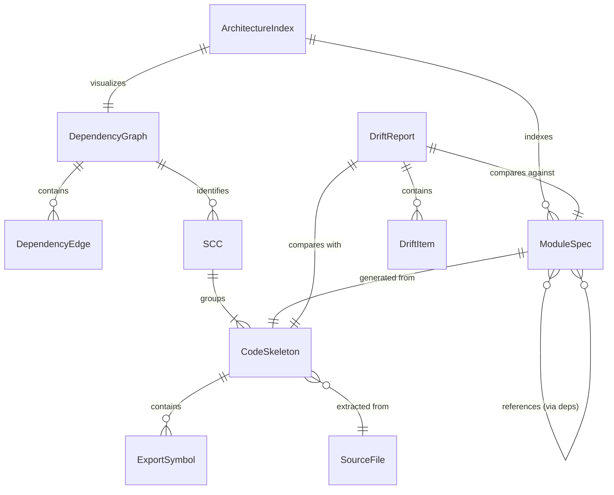
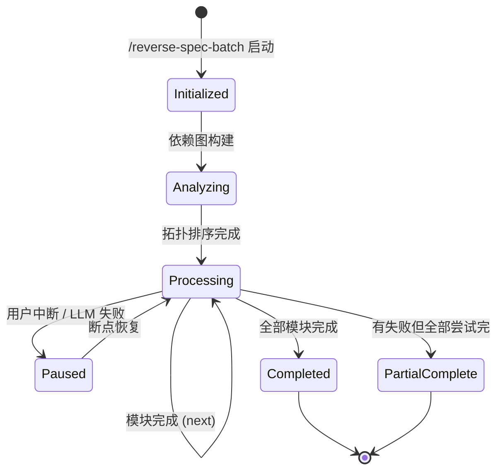
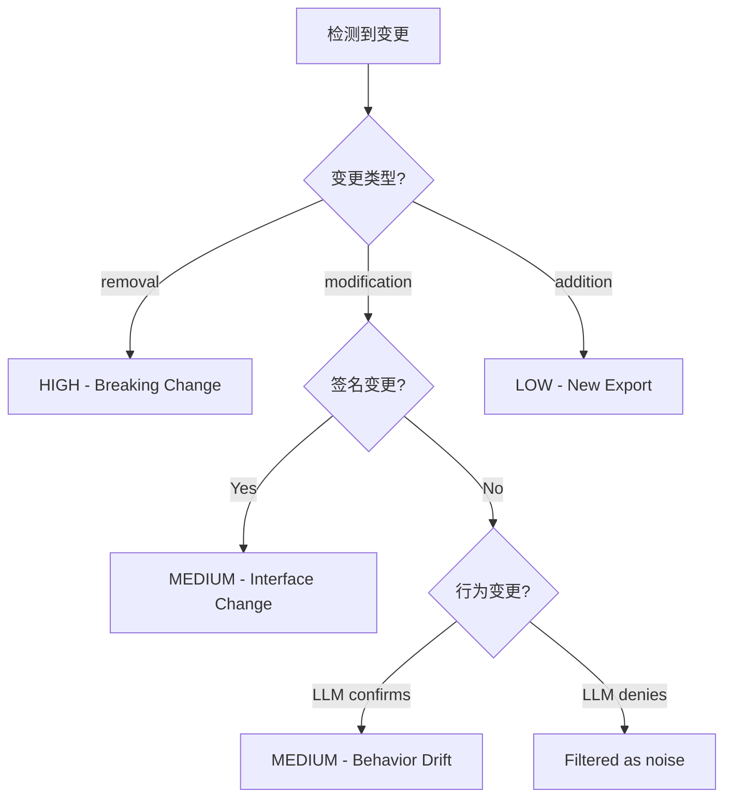

# 数据模型：Reverse-Spec Skill System v2.0

**日期**：2026-02-10 | **Spec**：[spec.md](spec.md) | **Plan**：[plan.md](plan.md)

## 概述

本文档定义 Reverse-Spec v2.0 的核心数据实体、字段、关系和验证规则。所有实体使用 Zod Schema 定义，运行时验证确保数据完整性。实体按流水线阶段组织：AST 提取 → 依赖分析 → Spec 生成 → 漂移检测。

---

## 实体关系图



---

## 实体定义

### 1. CodeSkeleton

**描述**: AST 提取的文件结构中间表示，是流水线第一阶段的输出，流经所有后续阶段。

**来源**: `src/core/ast-analyzer.ts` (ts-morph) 或 `src/core/tree-sitter-fallback.ts` (降级)

| Field | Type | Required | Description |
|-------|------|----------|-------------|
| `filePath` | `string` | Yes | 源文件相对路径 (相对项目根) |
| `language` | `'typescript' \| 'javascript'` | Yes | 文件语言类型 |
| `loc` | `number` | Yes | 总行数 (Lines of Code) |
| `exports` | `ExportSymbol[]` | Yes | 导出符号列表 (可为空数组) |
| `imports` | `ImportReference[]` | Yes | 导入引用列表 |
| `parseErrors` | `ParseError[]` | No | 解析错误列表 (tree-sitter 降级时) |
| `hash` | `string` | Yes | 文件内容 SHA-256 哈希 (用于缓存/变更检测) |
| `analyzedAt` | `string` (ISO 8601) | Yes | 分析时间戳 |
| `parserUsed` | `'ts-morph' \| 'tree-sitter' \| 'baseline' \| 'reconstructed'` | Yes | 使用的解析器（`baseline`/`reconstructed` 用于漂移检测基线加载） |

**验证规则**：
- `filePath` 必须以 `.ts`, `.tsx`, `.js`, `.jsx` 结尾
- `exports` 中每个 `name` 在同一文件内唯一
- `hash` 为 64 字符十六进制字符串
- `loc` > 0

---

### 1a. ExportSymbol (嵌套实体)

| Field | Type | Required | Description |
|-------|------|----------|-------------|
| `name` | `string` | Yes | 导出标识符名称 |
| `kind` | `ExportKind` | Yes | 符号类型 |
| `signature` | `string` | Yes | 完整 TypeScript 签名 (from AST) |
| `jsDoc` | `string \| null` | No | JSDoc 注释内容 |
| `typeParameters` | `string[]` | No | 泛型参数列表 |
| `isDefault` | `boolean` | Yes | 是否为 default export |
| `startLine` | `number` | Yes | 声明起始行号 |
| `endLine` | `number` | Yes | 声明结束行号 |
| `members` | `MemberInfo[]` | No | class/interface 的成员列表 |

**ExportKind enum**: `'function' | 'class' | 'interface' | 'type' | 'enum' | 'const' | 'variable'`

**MemberInfo**:

| Field | Type | Required | Description |
|-------|------|----------|-------------|
| `name` | `string` | Yes | 成员名称 |
| `kind` | `'method' \| 'property' \| 'getter' \| 'setter' \| 'constructor'` | Yes | 成员类型 |
| `signature` | `string` | Yes | 成员签名 |
| `jsDoc` | `string \| null` | No | JSDoc 注释 |
| `visibility` | `'public' \| 'protected' \| 'private'` | No | 访问修饰符 |
| `isStatic` | `boolean` | Yes | 是否静态成员 |
| `isAbstract` | `boolean` | No | 是否抽象成员 |

---

### 1b. ImportReference (嵌套实体)

| Field | Type | Required | Description |
|-------|------|----------|-------------|
| `moduleSpecifier` | `string` | Yes | import 路径 (如 `./utils/helper`) |
| `isRelative` | `boolean` | Yes | 是否为相对路径导入 |
| `resolvedPath` | `string \| null` | No | 解析后的绝对文件路径 |
| `namedImports` | `string[]` | No | 命名导入列表 |
| `defaultImport` | `string \| null` | No | 默认导入名称 |
| `isTypeOnly` | `boolean` | Yes | 是否为 type-only import |

---

### 1c. ParseError (嵌套实体)

| Field | Type | Required | Description |
|-------|------|----------|-------------|
| `line` | `number` | Yes | 错误行号 |
| `column` | `number` | Yes | 错误列号 |
| `message` | `string` | Yes | 错误描述 |
| `affectedSymbols` | `string[]` | No | 受影响的符号名列表 |

---

### 2. DependencyGraph

**描述**: 项目级模块依赖关系图，包含有向边、拓扑排序和 SCC 检测结果。

**来源**: `src/graph/dependency-graph.ts` (dependency-cruiser 封装)

| Field | Type | Required | Description |
|-------|------|----------|-------------|
| `projectRoot` | `string` | Yes | 项目根路径 |
| `modules` | `GraphNode[]` | Yes | 所有模块节点 |
| `edges` | `DependencyEdge[]` | Yes | 所有依赖边 |
| `topologicalOrder` | `string[]` | Yes | 拓扑排序结果 (文件路径列表) |
| `sccs` | `SCC[]` | Yes | 强连通分量列表 (size > 1 表示循环依赖) |
| `totalModules` | `number` | Yes | 模块总数 |
| `totalEdges` | `number` | Yes | 边总数 |
| `analyzedAt` | `string` (ISO 8601) | Yes | 分析时间戳 |
| `mermaidSource` | `string` | Yes | Mermaid 依赖图源码 |

**GraphNode**:

| Field | Type | Required | Description |
|-------|------|----------|-------------|
| `source` | `string` | Yes | 文件路径 |
| `isOrphan` | `boolean` | Yes | 是否无依赖者 |
| `inDegree` | `number` | Yes | 入度 (被多少模块依赖) |
| `outDegree` | `number` | Yes | 出度 (依赖多少模块) |
| `level` | `number` | Yes | 拓扑层级 (0 = 叶子节点) |

**DependencyEdge**:

| Field | Type | Required | Description |
|-------|------|----------|-------------|
| `from` | `string` | Yes | 源模块路径 |
| `to` | `string` | Yes | 目标模块路径 |
| `isCircular` | `boolean` | Yes | 是否属于循环依赖 |
| `importType` | `'static' \| 'dynamic' \| 'type-only'` | Yes | 导入类型 |

**SCC (Strongly Connected Component)**:

| Field | Type | Required | Description |
|-------|------|----------|-------------|
| `id` | `number` | Yes | SCC 编号 |
| `modules` | `string[]` | Yes | 组内模块路径列表 (size > 1 = 循环) |

**验证规则**：
- `topologicalOrder` 必须包含所有 `modules` 中的 `source` 值
- `sccs` 中所有 `modules` 的并集 = 所有模块的集合
- 每条 `edge` 的 `from` 和 `to` 必须在 `modules` 中存在
- `totalModules` === `modules.length`

---

### 3. ModuleSpec

**描述**: 单模块的生成 Spec 文档结构化表示，用于渲染最终 Markdown。

**来源**: `src/generator/spec-renderer.ts` (Handlebars 渲染)

| Field | Type | Required | Description |
|-------|------|----------|-------------|
| `frontmatter` | `SpecFrontmatter` | Yes | YAML Frontmatter 数据 |
| `sections` | `SpecSections` | Yes | 9 段式内容 |
| `mermaidDiagrams` | `MermaidDiagram[]` | No | 嵌入的 Mermaid 图表 |
| `fileInventory` | `FileEntry[]` | Yes | 源文件清单 |
| `baselineSkeleton` | `CodeSkeleton` | Yes | 生成时的 AST 快照，用于漂移检测基线 |
| `outputPath` | `string` | Yes | 输出路径 (specs/*.spec.md) |

**SpecFrontmatter**:

| Field | Type | Required | Description |
|-------|------|----------|-------------|
| `type` | `'module-spec'` | Yes | 文档类型 |
| `version` | `string` | Yes | 版本号 (v1, v2, ...) |
| `generatedBy` | `string` | Yes | 生成器标识 (`reverse-spec v2.0`) |
| `sourceTarget` | `string` | Yes | 源目标路径 |
| `relatedFiles` | `string[]` | Yes | 相关文件路径列表 |
| `lastUpdated` | `string` (ISO 8601) | Yes | 最后更新时间 |
| `confidence` | `'high' \| 'medium' \| 'low'` | Yes | 置信度等级 |
| `skeletonHash` | `string` | Yes | baseline CodeSkeleton 的 SHA-256 哈希 (快速变更检测) |

**SpecSections** (9 段式):

| Field | Chinese Heading | Type | Description |
|-------|-----------------|------|-------------|
| `intent` | 意图 | `string` | 模块目的和存在理由 |
| `interfaceDefinition` | 接口定义 | `string` | 所有导出 API (100% AST 提取) |
| `businessLogic` | 业务逻辑 | `string` | 核心逻辑描述 ([推断] 标记) |
| `dataStructures` | 数据结构 | `string` | 类型/接口/枚举定义 |
| `constraints` | 约束条件 | `string` | 性能/环境/准确性约束 |
| `edgeCases` | 边界条件 | `string` | 异常路径和边界处理 |
| `technicalDebt` | 技术债务 | `string` | 已知问题和改进空间 |
| `testCoverage` | 测试覆盖 | `string` | 测试策略和覆盖状态 |
| `dependencies` | 依赖关系 | `string` | 模块依赖关系图 |

**MermaidDiagram**:

| Field | Type | Required | Description |
|-------|------|----------|-------------|
| `type` | `'classDiagram' \| 'flowchart' \| 'graph'` | Yes | 图表类型 |
| `source` | `string` | Yes | Mermaid 源码 |
| `title` | `string` | No | 图表标题 |

**FileEntry**:

| Field | Type | Required | Description |
|-------|------|----------|-------------|
| `path` | `string` | Yes | 文件路径 |
| `loc` | `number` | Yes | 行数 |
| `purpose` | `string` | Yes | 主要用途 (LLM 生成) |

**验证规则**：
- `frontmatter.version` 匹配 `v\d+` 格式
- `sections` 的所有 9 个字段不可为空字符串
- `interfaceDefinition` 中的签名必须 100% 来自 AST (禁止 LLM 插入)

---

### 4. ArchitectureIndex

**描述**: 项目级架构索引文档 (`specs/_index.spec.md`)。

**来源**: `src/generator/index-generator.ts`

| Field | Type | Required | Description |
|-------|------|----------|-------------|
| `frontmatter` | `IndexFrontmatter` | Yes | YAML Frontmatter |
| `systemPurpose` | `string` | Yes | 系统整体目的 |
| `architecturePattern` | `string` | Yes | 架构模式描述 |
| `moduleMap` | `ModuleMapEntry[]` | Yes | 模块映射表 (含链接) |
| `crossCuttingConcerns` | `string[]` | Yes | 横切关注点列表 |
| `technologyStack` | `TechStackEntry[]` | Yes | 技术栈概览 |
| `dependencyDiagram` | `string` | Yes | Mermaid 全局依赖图 |
| `outputPath` | `string` | Yes | 固定为 `specs/_index.spec.md` |

**IndexFrontmatter**:

| Field | Type | Required | Description |
|-------|------|----------|-------------|
| `type` | `'architecture-index'` | Yes | 文档类型 |
| `version` | `string` | Yes | 版本号 (v1, v2, ...) |
| `generatedBy` | `string` | Yes | 生成器标识 (`reverse-spec v2.0`) |
| `projectRoot` | `string` | Yes | 项目根路径 |
| `totalModules` | `number` | Yes | 索引包含的模块总数 |
| `lastUpdated` | `string` (ISO 8601) | Yes | 最后更新时间 |

**ModuleMapEntry**:

| Field | Type | Required | Description |
|-------|------|----------|-------------|
| `name` | `string` | Yes | 模块名称 |
| `specPath` | `string` | Yes | Spec 文件路径 |
| `description` | `string` | Yes | 一句话描述 |
| `level` | `number` | Yes | 拓扑层级 |
| `dependencies` | `string[]` | Yes | 依赖模块列表 |

**TechStackEntry**:

| Field | Type | Required | Description |
|-------|------|----------|-------------|
| `category` | `string` | Yes | 技术类别 (如 `语言`、`框架`、`数据库`) |
| `name` | `string` | Yes | 技术名称 |
| `version` | `string \| null` | No | 版本号 |
| `purpose` | `string` | Yes | 在项目中的用途 |

---

### 5. DriftItem

**描述**: 单个漂移差异项。

**来源**: `src/diff/structural-diff.ts` 或 `src/diff/semantic-diff.ts`

| Field | Type | Required | Description |
|-------|------|----------|-------------|
| `id` | `string` | Yes | 唯一标识 (auto-generated) |
| `severity` | `'HIGH' \| 'MEDIUM' \| 'LOW'` | Yes | 严重级别 |
| `category` | `'Interface' \| 'Behavior' \| 'Constraint'` | Yes | 变更类别 |
| `changeType` | `'addition' \| 'removal' \| 'modification'` | Yes | 变更类型 |
| `location` | `string` | Yes | 源码位置 (file:line) |
| `symbolName` | `string \| null` | No | 受影响的符号名 |
| `description` | `string` | Yes | 人类可读描述 (中文) |
| `oldValue` | `string \| null` | No | 旧值 (签名/描述) |
| `newValue` | `string \| null` | No | 新值 (签名/描述) |
| `proposedUpdate` | `string` | Yes | 建议的 Spec 更新内容 |
| `detectedBy` | `'structural' \| 'semantic'` | Yes | 检测方式 |

**验证规则**：
- `severity === 'HIGH'` 仅当 `changeType === 'removal'` (Breaking Change)
- `category === 'Interface'` 当变更涉及签名 (structural)
- `category === 'Behavior'` 当变更涉及函数体逻辑 (semantic)
- `oldValue` 和 `newValue` 不可同时为 null (至少一个有值)

---

### 6. DriftReport

**描述**: 漂移检测的完整报告 (`drift-logs/*.md`)。

**来源**: `src/diff/` 模块组合

| Field | Type | Required | Description |
|-------|------|----------|-------------|
| `specPath` | `string` | Yes | 对比的 Spec 文件路径 |
| `sourcePath` | `string` | Yes | 对比的源码路径 |
| `generatedAt` | `string` (ISO 8601) | Yes | 报告生成时间 |
| `specVersion` | `string` | Yes | 对比的 Spec 版本号 |
| `summary` | `DriftSummary` | Yes | 摘要统计 |
| `items` | `DriftItem[]` | Yes | 所有漂移项 |
| `filteredNoise` | `number` | Yes | 过滤掉的噪声变更数 |
| `recommendation` | `string` | Yes | 操作建议 (中文) |
| `outputPath` | `string` | Yes | 输出路径 (drift-logs/*.md) |

**DriftSummary**:

| Field | Type | Required | Description |
|-------|------|----------|-------------|
| `totalChanges` | `number` | Yes | 实质性变更总数 |
| `high` | `number` | Yes | HIGH 级别数量 |
| `medium` | `number` | Yes | MEDIUM 级别数量 |
| `low` | `number` | Yes | LOW 级别数量 |
| `additions` | `number` | Yes | 新增数量 |
| `removals` | `number` | Yes | 删除数量 |
| `modifications` | `number` | Yes | 修改数量 |

---

### 7. BatchState (辅助实体)

**描述**: 批处理断点恢复状态 (JSON 持久化)。

**来源**: `src/batch/checkpoint.ts`

| Field | Type | Required | Description |
|-------|------|----------|-------------|
| `batchId` | `string` | Yes | 批次唯一标识 |
| `projectRoot` | `string` | Yes | 项目根路径 |
| `startedAt` | `string` (ISO 8601) | Yes | 批次启动时间 |
| `lastUpdatedAt` | `string` (ISO 8601) | Yes | 最后更新时间 |
| `totalModules` | `number` | Yes | 总模块数 |
| `processingOrder` | `string[]` | Yes | 拓扑排序处理顺序 |
| `completedModules` | `CompletedModule[]` | Yes | 已完成模块列表 |
| `failedModules` | `FailedModule[]` | Yes | 失败模块列表 |
| `currentModule` | `string \| null` | No | 当前处理中的模块 |
| `forceRegenerate` | `boolean` | Yes | 是否 --force 模式 |

**CompletedModule**:

| Field | Type | Required | Description |
|-------|------|----------|-------------|
| `path` | `string` | Yes | 模块路径 |
| `specPath` | `string` | Yes | 生成的 Spec 路径 |
| `completedAt` | `string` (ISO 8601) | Yes | 完成时间 |
| `tokenUsage` | `number` | No | LLM Token 消耗 |

**FailedModule**:

| Field | Type | Required | Description |
|-------|------|----------|-------------|
| `path` | `string` | Yes | 模块路径 |
| `error` | `string` | Yes | 错误信息 |
| `failedAt` | `string` (ISO 8601) | Yes | 失败时间 |
| `retryCount` | `number` | Yes | 重试次数 |
| `degradedToAstOnly` | `boolean` | Yes | 是否降级为 AST-only |

**验证规则**：
- `completedModules` + `failedModules` 的 path 并集 ⊆ `processingOrder`
- `totalModules` === `processingOrder.length`
- 如果 `currentModule` 非 null，则它不在 completed 或 failed 中

---

### 8. RedactionResult (辅助实体)

**描述**: 敏感信息脱敏结果。

**来源**: `src/core/secret-redactor.ts`

| Field | Type | Required | Description |
|-------|------|----------|-------------|
| `originalHash` | `string` | Yes | 原始内容哈希 |
| `redactedContent` | `string` | Yes | 脱敏后内容 |
| `detections` | `SecretDetection[]` | Yes | 检测到的敏感项 |
| `falsePositivesFiltered` | `number` | Yes | 过滤掉的误报数 |

**SecretDetection**:

| Field | Type | Required | Description |
|-------|------|----------|-------------|
| `type` | `string` | Yes | 敏感信息类型 (e.g., `AWS_ACCESS_KEY_ID`) |
| `line` | `number` | Yes | 所在行号 |
| `confidence` | `'high' \| 'medium' \| 'low'` | Yes | 置信度 |
| `placeholder` | `string` | Yes | 替换占位符 (e.g., `[REDACTED_AWS_KEY]`) |

---

## 状态转换

### BatchState 生命周期



### DriftItem 严重级别规则



---

## 数据流概览

```text
SourceFile(s)
    ↓ [ast-analyzer.ts]
CodeSkeleton
    ↓ [context-assembler.ts + secret-redactor.ts + token-counter.ts]
    │  (骨架保持不变；代码片段字符串经 redact() 脱敏后组装)
LLM Prompt (≤100k tokens)
    ↓ [llm-client.ts → Claude API]
Raw LLM Response
    ↓ [llm-client.ts parseLLMResponse() + spec-renderer.ts + Handlebars]
ModuleSpec → specs/*.spec.md

SourceFile(s)
    ↓ [dependency-graph.ts]
DependencyGraph
    ↓ [topological-sort.ts]
Processing Order
    ↓ [batch-orchestrator.ts]
BatchState ←→ checkpoint.json

OldCodeSkeleton + NewCodeSkeleton
    ↓ [structural-diff.ts + semantic-diff.ts + noise-filter.ts]
DriftItem[]
    ↓ [drift-report template]
DriftReport → drift-logs/*.md
```
