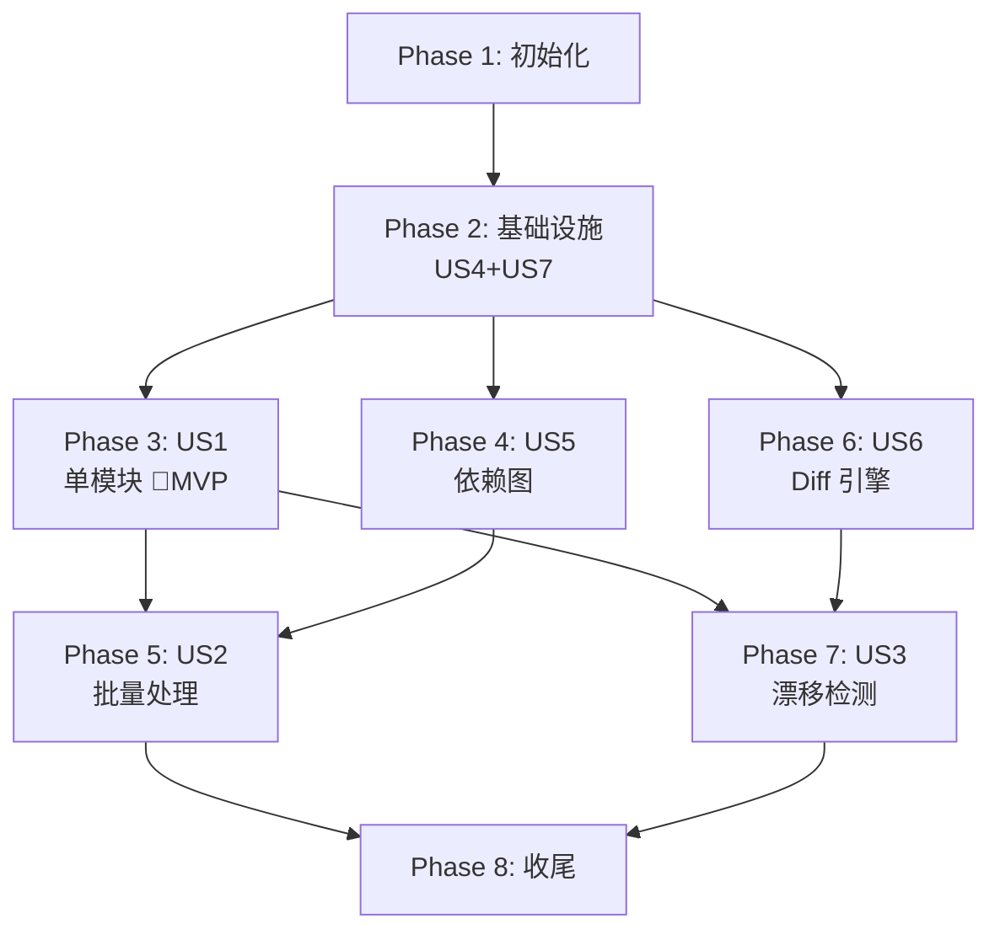

# 任务清单：Reverse-Spec Skill System v2.0

**输入**：`/specs/001-reverse-spec-v2/` 下的设计文档
**前置条件**：plan.md、spec.md、research.md、data-model.md、contracts/

**测试**：已包含 — spec 明确定义了 Vitest 单元测试、Golden Master 测试和自举测试（SC-004、SC-009）。

**组织方式**：任务按用户故事分组。US4（流水线）和 US7（模板）作为基础设施放在 Phase 2。面向用户的故事（US1–US3）按优先级排列。

## 格式说明：`[ID] [P?] [Story] 描述`

- **[P]**：可并行执行（不同文件、无依赖）
- **[Story]**：该任务所属的用户故事（如 US1、US2、US3）
- 描述中包含确切的文件路径

## 路径约定

- **单项目**：仓库根目录下的 `src/`、`tests/`
- 模板位于 `templates/`
- Skill 脚本位于 `skills/`

---

## Phase 1: 初始化（共享基础设施）

**目的**：项目初始化、依赖安装和构建配置

- [ ] T001 按 plan.md 创建项目目录结构：`src/{core,graph,diff,generator,batch,models,utils}`、`templates/`、`tests/{unit,integration,golden-master,self-hosting}`
- [ ] T002 初始化 TypeScript 项目：在 package.json 中配置 dependencies（`ts-morph`、`tree-sitter`、`tree-sitter-typescript`、`dependency-cruiser`、`handlebars`、`zod`）和 devDependencies（`vitest`、`typescript`、`@types/node`）
- [ ] T003 [P] 配置 `tsconfig.json`：启用 strict 模式、ES2022 目标、NodeNext 模块解析，以及 `src/` 的路径别名
- [ ] T004 [P] 配置 `vitest.config.ts`：启用 TypeScript 支持、覆盖率报告，以及 unit/integration/golden-master/self-hosting 的测试路径模式

---

## Phase 2: 基础设施 — US4（流水线）+ US7（模板）（优先级：P1）

**目的**：所有面向用户的命令都依赖的核心 流水线 基础设施和模板系统

**US4**：混合分析 流水线 — 三阶段引擎（预处理 → 上下文组装 → 生成）
**US7**：Spec 输出格式与模板系统 — 9 节结构、Handlebars 渲染、YAML frontmatter

**⚠️ 关键**：在此阶段完成之前，任何用户故事（US1/US2/US3）都不能开始

### Zod Schema 模型

- [ ] T005 [P] 在 `src/models/code-skeleton.ts` 中实现 CodeSkeleton、ExportSymbol、ImportReference 和 ParseError 的 Zod schema，按 data-model.md 实体定义
- [ ] T006 [P] 在 `src/models/dependency-graph.ts` 中实现 DependencyGraph、GraphNode、DependencyEdge 和 SCC 的 Zod schema，按 data-model.md 实体定义
- [ ] T007 [P] 在 `src/models/drift-item.ts` 中实现 DriftItem 和 DriftSummary 的 Zod schema，按 data-model.md 实体定义
- [ ] T008 [P] 在 `src/models/module-spec.ts` 中实现 ModuleSpec、SpecFrontmatter、SpecSections、MermaidDiagram、FileEntry、ArchitectureIndex、IndexFrontmatter、TechStackEntry、ModuleMapEntry、DriftReport、BatchState、CompletedModule、FailedModule 和 RedactionResult 的 Zod schema，按 data-model.md 实体定义

### 共享工具

- [ ] T009 [P] 在 `src/utils/file-scanner.ts` 中实现文件发现与 `.gitignore` 过滤（FR-026）：扫描目录中的 `.ts/.tsx/.js/.jsx` 文件，遵循 `.gitignore` 规则，返回排序后的文件路径
- [ ] T009a [P] 在 `tests/unit/file-scanner.test.ts` 中编写 file-scanner 单元测试：验证 `.ts/.tsx/.js/.jsx` 文件发现、`.gitignore` 规则遵循、嵌套目录递归扫描、空目录处理、符号链接忽略（FR-026）
- [ ] T010 [P] 在 `src/utils/chunk-splitter.ts` 中实现超过 5k LOC 文件的分块摘要策略（FR-005）：按函数边界分割，返回带元数据的分块数组
- [ ] T010a [P] 在 `tests/unit/chunk-splitter.test.ts` 中编写 chunk-splitter 单元测试：验证 5k LOC 阈值触发分块、函数边界正确切割、分块元数据完整性、小文件不分块（FR-005）

### 核心 流水线（US4）

- [ ] T011 在 `src/core/token-counter.ts` 中实现 token 计数的两阶段策略（research R5）：`estimateFast()`（基于字符、CJK 感知）、`countAccurate()`（带基于哈希的 LRU 缓存）、`fitsInBudget()`，按 contracts/core-pipeline.md
- [ ] T012 在 `src/core/secret-redactor.ts` 中实现密钥检测与脱敏（FR-027，research R4）：针对 AWS/GCP/JWT/私钥的正则模式、Shannon 熵分析、语义占位符脱敏 `[REDACTED_*]`、误报过滤，按 contracts/core-pipeline.md
- [ ] T013 在 `src/core/ast-analyzer.ts` 中实现 ts-morph AST 分析器 `analyzeFile()`：使用 `skipFileDependencyResolution`+`noLib` 的单一 Project 实例（research R1），提取 exports/imports/JSDoc，从 AST 构建 CodeSkeleton（非变更操作），按 contracts/core-pipeline.md
- [ ] T014 在 `src/core/tree-sitter-fallback.ts` 中实现 tree-sitter 容错降级 `analyzeFallback()`：提取部分骨架，填充 `parseErrors`，受影响的符号标记 `[SYNTAX ERROR]`，按 contracts/core-pipeline.md
- [ ] T015 在 `src/core/ast-analyzer.ts` 中扩展 `analyzeFiles()` 批量方法：单一 Project 实例，每个文件处理后调用 `file.forget()` 进行内存管理，支持 onProgress 回调，500 文件 ≤10s 目标（SC-003），按 contracts/core-pipeline.md
- [ ] T016 在 `src/core/context-assembler.ts` 中实现上下文组装 `assembleContext()`：从骨架 + 依赖 spec + 代码片段组合 LLM prompt，强制 100k token 预算（FR-003），基于优先级的截断（代码片段 → 依赖 → 骨架），按 contracts/core-pipeline.md
- [ ] T016a 在 `src/core/llm-client.ts` 中实现 LLM 客户端 `callLLM()`：Claude API 封装，默认模型 `claude-opus-4-6`，用户可通过 `REVERSE_SPEC_MODEL` 环境变量配置，指数退避重试（基础 2s、倍率 2x、最大 30s、3 次尝试 — FR-016），类型化错误，按 contracts/llm-client.md
- [ ] T016b 在 `src/core/llm-client.ts` 中实现 LLM 响应解析器 `parseLLMResponse()`：按标题提取 9 个中文章节，对照 Zod SpecSections schema 验证，后处理时将接口章节与 AST 骨架比对（Constitution I），归集不确定性标记（FR-008），按 contracts/llm-client.md
- [ ] T016c 在 `src/core/llm-client.ts` 中实现系统 prompt 构建器 `buildSystemPrompt()`：spec 生成模式（9 个章节、中文、绝不捏造接口）和语义 diff 模式（行为变更评估），按 contracts/llm-client.md

### 模板系统（US7）

- [ ] T017 在 `templates/module-spec.hbs` 中创建 9 节 Handlebars 模块 spec 模板：YAML frontmatter、中文章节标题（意图/接口定义/业务逻辑/数据结构/约束条件/边界条件/技术债务/测试覆盖/依赖关系）、Mermaid 图块、文件清单附录，按 FR-006/FR-007/FR-009
- [ ] T018 [P] 在 `templates/index-spec.hbs` 中创建架构索引 Handlebars 模板：系统目的、模块映射表、依赖关系图、横切关注点、技术栈
- [ ] T019 [P] 在 `templates/drift-report.hbs` 中创建漂移报告 Handlebars 模板：汇总统计表、新增/删除/修改表、建议章节
- [ ] T020 在 `src/generator/spec-renderer.ts` 中实现 Handlebars spec 渲染器：`initRenderer()`（编译模板、注册 helpers/partials）、`renderSpec()`（ModuleSpec → Markdown）、自定义 helpers（`formatSignature`、`hasContent`、`specLink`、`mermaidClass`），按 contracts/generator.md
- [ ] T021 在 `src/generator/frontmatter.ts` 中实现 YAML frontmatter 生成器（含版本自增）：`generateFrontmatter()` 支持自动递增（v1→v2→v3）、置信度级别、时间戳，按 contracts/generator.md
- [ ] T022 在 `src/generator/mermaid-class-diagram.ts` 中实现 Mermaid 类图生成器：`generateClassDiagram()` 从 CodeSkeleton exports 生成、`<<interface>>` 构造型、继承/组合边，按 contracts/generator.md
- [ ] T022a [P] 在 `tests/unit/mermaid-class-diagram.test.ts` 中编写 Mermaid 类图生成器单元测试：验证类/接口渲染、`<<interface>>` 构造型、继承边 `--|>`、组合边 `*--`、空 exports 处理、生成的 Mermaid 语法有效性（FR-007）

**检查点**：基础设施就绪 — 三阶段 流水线 组件和模板系统已可运行。可以开始用户故事的实现。

---

## Phase 3: US1 — 单模块 Spec 生成（优先级：P1）🎯 MVP

**目标**：开发者运行 `/reverse-spec src/auth/`，即可获得完整、准确的 `specs/auth.spec.md`，包含全部 9 个章节、内嵌 Mermaid 图和 YAML frontmatter。

**独立测试**：对已知 TypeScript 模块运行 `/reverse-spec`，验证输出与 Golden Master 的结构相似度达到 90% 以上（SC-004）。

### US1 测试

- [ ] T023 [P] [US1] 在 `tests/unit/ast-analyzer.test.ts` 中编写 ast-analyzer 单元测试：验证正确提取 functions、classes、interfaces、type aliases、enums、JSDoc；验证 6 个 export 的文件恰好产生 6 个 ExportSymbol；验证骨架中不泄露实现细节
- [ ] T024 [P] [US1] 在 `tests/unit/secret-redactor.test.ts` 中编写 secret-redactor 单元测试：验证 AWS 密钥检测/脱敏、JWT 检测、私钥处理、测试文件的误报过滤、占位符模式
- [ ] T025 [P] [US1] 在 `tests/unit/token-counter.test.ts` 中编写 token-counter 单元测试：验证快速估算与精确计数偏差在 ±15% 以内、CJK 字符处理、带安全边际的预算检查、缓存命中行为
- [ ] T025a [P] [US1] 在 `tests/unit/context-assembler.test.ts` 中编写 context-assembler 单元测试：验证 100k token 预算强制执行、裁剪优先级（代码片段 → 依赖 → 骨架）、截断标记、空依赖处理、预算刚好在边界时的行为（FR-003）
- [ ] T025b [P] [US1] 在 `tests/unit/llm-client.test.ts` 中编写 llm-client 单元测试：验证指数退避重试逻辑（基础 2s、倍率 2x、最大 30s、3 次尝试）、`parseLLMResponse()` 对 9 个中文章节的正确提取、缺失章节的占位符填充、接口章节与 AST 骨架的后验证（Constitution I 捏造签名剥离）、不确定性标记归集（FR-008、FR-016）

### US1 实现

- [ ] T026 [US1] 在 `src/core/single-spec-orchestrator.ts` 中实现单模块 spec 生成 流水线：`generateSpec()` 串联 `analyzeFiles()` → `redact()` → `assembleContext()` → `callLLM()` → `parseLLMResponse()` → `renderSpec()`（基线骨架序列化为 HTML 注释）→ 写入 `specs/*.spec.md`，按 contracts/core-pipeline.md
- [ ] T027 [US1] 实现 `[推断]`/`[不明确]`/`[SYNTAX ERROR]` 标记注入（FR-008）：确保 LLM 响应包含带理由的不确定性标记，渲染前在后处理中验证
- [ ] T028 [US1] 在 `skills/reverse-spec/SKILL.md` 中更新 `/reverse-spec` skill 脚本以调用单模块 流水线：解析目标路径、处理 `--deep` 标志（包含函数体）、写入输出、报告完成状态
- [ ] T029 [US1] 在 `tests/integration/pipeline.test.ts` 中编写三阶段 流水线 端到端集成测试：将已知 TS 模块输入所有阶段，验证骨架准确性、上下文在预算内、输出中无捏造的接口（SC-002）；**显式断言只读安全性**：记录源文件 hash 快照，流水线完成后验证所有源文件未被修改/创建/删除（FR-023），输出仅写入 `specs/`（FR-024）

**检查点**：`/reverse-spec` 完全可用 — 单模块 spec 生成独立运行。

---

## Phase 4: US5 — 依赖图与拓扑处理（优先级：P2）

**目标**：系统构建项目级模块依赖图，检测循环依赖为 SCC，计算拓扑排序顺序，并生成 Mermaid 可视化。

**独立测试**：对具有已知依赖关系的项目运行依赖图生成器，验证 JSON 结构、拓扑顺序、SCC 检测和 Mermaid 输出均符合预期。

### US5 测试

- [ ] T030 [P] [US5] 在 `tests/unit/topological-sort.test.ts` 中编写 topological-sort 单元测试：验证线性链（A→B→C）的正确排序、互相导入（X↔Y）的 SCC 检测、断开组件的处理、空图处理

### US5 实现

- [ ] T031 [US5] 在 `src/graph/dependency-graph.ts` 中实现 dependency-cruiser 封装：`buildGraph()` 使用 `cruise()` 的 JSON 输出、`doNotFollow` 排除外部依赖、`includeOnly` 限定 src/、`tsPreCompilationDeps` 提升性能，按 contracts/graph-module.md
- [ ] T032 [US5] 在 `src/graph/topological-sort.ts` 中实现拓扑排序与 Tarjan SCC 检测：`topologicalSort()` 返回有序文件路径 + 层级映射、`detectSCCs()` 分组循环依赖，按 contracts/graph-module.md
- [ ] T033 [US5] 在 `src/graph/mermaid-renderer.ts` 中实现 Mermaid 依赖图渲染器：`renderDependencyGraph()` 支持 >20 模块时的目录折叠、循环高亮、最多 50 节点，按 contracts/graph-module.md

**检查点**：依赖图模块可运行 — 拓扑排序和 SCC 检测已准备好供批量处理使用。

---

## Phase 5: US2 — 批量项目 Spec 生成（优先级：P2）

**目标**：技术负责人对 200+ 模块的 monorepo 运行 `/reverse-spec-batch`，系统按依赖顺序处理所有模块、生成架构索引、支持断点恢复，且全程无需人工干预。

**独立测试**：对多模块项目运行 `/reverse-spec-batch`，验证处理顺序遵循拓扑排序、每个 spec 引用依赖 spec（而非源码）、索引映射所有模块（SC-005、SC-008）。

### US2 实现

- [ ] T034 [US2] 在 `src/batch/progress-reporter.ts` 中实现终端进度报告器：`createReporter()` 采用 `[N/Total] Processing src/module...` 格式（FR-015）、`complete()` 带状态、`finish()` 返回 BatchSummary、`writeSummaryLog()`，按 contracts/batch-module.md
- [ ] T035 [US2] 在 `src/batch/checkpoint.ts` 中实现断点恢复的检查点持久化：`loadCheckpoint()`、`saveCheckpoint()`（通过临时文件+重命名实现原子写入）、`clearCheckpoint()`，按 contracts/batch-module.md（FR-017）。检查点默认路径：`specs/.reverse-spec-checkpoint.json`（符合 Constitution IV）
- [ ] T036 [US2] 在 `src/batch/batch-orchestrator.ts` 中实现批量编排器：`runBatch()` 按拓扑顺序处理、O(1) 上下文策略（读取依赖 spec 而非源码 — FR-014）、指数退避重试（最多 3 次 — FR-016）、AST-only 降级、每个模块后保存检查点、支持 `--force` 标志，按 contracts/batch-module.md
- [ ] T037 [US2] 在 `src/generator/index-generator.ts` 中实现架构索引生成器：`generateIndex()` 从所有 ModuleSpec + DependencyGraph 生成，使用 `templates/index-spec.hbs` 渲染，输出到 `specs/_index.spec.md`，按 contracts/generator.md（FR-013）
- [ ] T038 [US2] 在 `skills/reverse-spec-batch/SKILL.md` 中更新 `/reverse-spec-batch` skill 脚本以调用批量编排器：解析 `--force` 标志、显示进度、优雅处理中断
- [ ] T039 [US2] 在 `tests/integration/batch-processing.test.ts` 中编写批量处理集成测试：验证拓扑顺序（A→B→C 按 C,B,A 处理）、SCC 分组、模拟中断后的检查点恢复、索引生成；**显式断言只读安全性**：批处理完成后验证所有源文件未被修改（FR-023），所有写入仅发生在 `specs/` 目录（FR-024）

**检查点**：`/reverse-spec-batch` 完全可用 — 具备依赖排序、断点恢复和索引生成的批量处理已就绪。

---

## Phase 6: US6 — 结构化 Diff 引擎（优先级：P3）

**目标**：Diff 引擎比较两个 CodeSkeleton，识别结构性差异（新增/删除/修改），过滤噪声，按严重级别分类（HIGH/MEDIUM/LOW），并将行为变更委托给 LLM 进行语义评估。

**独立测试**：创建两个具有已知差异的 CodeSkeleton，验证 diff 报告包含正确的项目、正确的严重级别和分类。

### US6 测试

- [ ] T040 [P] [US6] 在 `tests/unit/structural-diff.test.ts` 和 `tests/unit/noise-filter.test.ts` 中编写 structural-diff 和 noise-filter 单元测试：验证签名修改 → MEDIUM、export 删除 → HIGH、新增 export → LOW、相同骨架 → 空 diff、仅空白变更 → 被过滤（SC-006、SC-007）

### US6 实现

- [ ] T041 [US6] 在 `src/diff/structural-diff.ts` 中实现结构化 diff 引擎：`compareSkeletons()` 比较 ExportSymbol 数组，将新增/删除/修改按严重级别分类，按 contracts/diff-engine.md（FR-019）
- [ ] T042 [US6] 在 `src/diff/noise-filter.ts` 中实现噪声过滤器：`filterNoise()` 移除空白、注释、import 重排序、尾逗号和 ASI 等价变更，按 contracts/diff-engine.md（FR-021）
- [ ] T043 [US6] 在 `src/diff/semantic-diff.ts` 中实现基于 LLM 的语义 diff：`evaluateBehaviorChange()` 将新旧函数体 + spec 描述发送至 Claude API，对照 DriftItem Zod schema 验证响应，按 contracts/diff-engine.md（FR-020）

**检查点**：Diff 引擎可运行 — 结构化比较和语义比较已准备好供漂移检测使用。

---

## Phase 7: US3 — Spec 漂移检测（优先级：P3）

**目标**：开发者运行 `/reverse-spec-diff specs/auth.spec.md src/auth/`，获得分类的漂移报告，展示变更内容、严重级别和建议更新 — 但在用户明确确认之前不修改任何 spec 文件。

**独立测试**：生成一个 spec，进行已知的代码修改（添加函数、修改签名、删除 export），验证漂移报告正确识别全部三项变更并标注适当的严重级别。

### US3 测试

- [ ] T043a [P] [US3] 在 `tests/unit/drift-orchestrator.test.ts` 中编写 `loadBaselineSkeleton()` 单元测试：验证从 HTML 注释 `<!-- baseline-skeleton: ... -->` 正确反序列化 CodeSkeleton、对无基线的旧版 spec 降级为 Markdown 重建并标记 `parserUsed: 'reconstructed'`、损坏 JSON 的错误处理、Zod 验证通过

### US3 实现

- [ ] T044 [US3] 在 `src/diff/drift-orchestrator.ts` 中实现漂移检测编排器：`detectDrift()` 串联 `loadBaselineSkeleton()`（从 spec 的 HTML 注释 `<!-- baseline-skeleton: ... -->` 反序列化基线骨架，对旧版 spec 降级为基于 Markdown 的尽力重建）→ 当前代码 AST 分析 → `compareSkeletons()` → `filterNoise()` → `evaluateBehaviorChange()` → 组装 DriftReport，按 contracts/diff-engine.md
- [ ] T045 [US3] 使用 `templates/drift-report.hbs` 实现 DriftReport 渲染：汇总统计、按严重级别分组的表格、建议章节，输出到 `drift-logs/*.md`（FR-018）
- [ ] T046 [US3] 在 `skills/reverse-spec-diff/SKILL.md` 中更新 `/reverse-spec-diff` skill 脚本以调用漂移编排器：解析 spec 路径和源码路径参数、显示报告、在任何 spec 更新前提示用户确认（FR-022）
- [ ] T047 [US3] 在 `tests/integration/drift-detection.test.ts` 中编写漂移检测集成测试：验证新增函数 → LOW、修改签名 → MEDIUM、删除 export → HIGH、仅空白变更 → 零漂移、未经确认不更新 spec

**检查点**：`/reverse-spec-diff` 完全可用 — 具备三级严重级别、噪声过滤和用户确认更新的漂移检测已就绪。

---

## Phase 8: 收尾与横切关注点

**目的**：质量保证、性能验证和自举验证

- [ ] T048 [P] 在 `tests/golden-master/fixtures/` 中创建 Golden Master 测试固件：已知的 TypeScript 代码样本（redux 子集或类似项目）及预期输出 spec
- [ ] T049 在 `tests/golden-master/golden-master.test.ts` 中实现 Golden Master 测试：从固件生成 spec，与预先验证的期望输出比对，结构相似度达到 90% 以上（SC-004）。**结构相似度度量方法**：(1) 9 个章节存在性检查（9 分）；(2) 接口定义章节中导出符号名称集合的 Jaccard 相似系数（权重 40%）；(3) frontmatter 字段完整性（权重 10%）；(4) Mermaid 图表存在性（权重 10%）；(5) 各章节非空内容覆盖率（权重 30%）；(6) 文件清单完整性 — 实际文件 vs 期望文件的交集/并集比（权重 10%）。加权总分 ≥ 0.9 即通过
- [ ] T050 在 `tests/self-hosting/self-host.test.ts` 中实现自举测试：对 reverse-spec 项目自身运行 `/reverse-spec-batch`，验证为所有源码模块生成有效且连贯的 spec（SC-009）
- [ ] T051 性能优化：用 500 文件测试集对 ast-analyzer 进行性能分析，验证 ≤10s 目标（SC-003），在 `src/core/ast-analyzer.ts` 中调优批量大小和 `file.forget()` 策略
- [ ] T052 运行 quickstart.md 验证：执行 `specs/001-reverse-spec-v2/quickstart.md` 中的所有验证步骤，确认全部检查通过

---

## 依赖关系与执行顺序

### Phase 间依赖

- **初始化（Phase 1）**：无依赖 — 可立即开始
- **基础设施（Phase 2）**：依赖初始化完成 — 阻塞所有用户故事
- **US1（Phase 3）**：依赖基础设施 — 首个面向用户的功能
- **US5（Phase 4）**：依赖基础设施 — 可与 US1 并行
- **US2（Phase 5）**：依赖 US1（流水线）+ US5（依赖图）
- **US6（Phase 6）**：依赖基础设施 — 可与 US1/US5 并行
- **US3（Phase 7）**：依赖 US1（流水线）+ US6（Diff 引擎）
- **收尾（Phase 8）**：依赖所有用户故事完成

### 用户故事依赖关系



### 各用户故事内部

- 先写测试，确保测试先失败再实现
- Zod 模型先于服务
- 服务先于集成/编排
- 核心逻辑先于 skill 脚本接入
- 当前故事完成后再进入下一优先级

### 并行机会

- **Phase 1**：T003 和 T004 可并行
- **Phase 2**：T005–T008（所有 Zod schema）可并行；T009–T010 + T009a–T010a（工具及其测试）可并行；T018–T019（模板）可并行；T022a 可与 T022 并行
- **Phase 3**：T023–T025b（所有 US1 测试，含 T025a context-assembler 和 T025b llm-client）可并行
- **Phase 4**：US5 可与 US1 并行（基础设施完成后）
- **Phase 5**：T034–T035 可在 T036 之前开始
- **Phase 6**：US6 可与 US1/US5 并行（基础设施完成后）；T040 测试可与 US1 测试并行
- **Phase 7**：T043a（loadBaselineSkeleton 测试）可与 US6 测试并行
- **Phase 8**：T048 和 T049 可在 T050 之前开始

---

## 并行示例：Phase 2 基础设施

```bash
# 同时启动所有 Zod schema 模型（不同文件、无依赖）：
Task: "T005 CodeSkeleton schemas in src/models/code-skeleton.ts"
Task: "T006 DependencyGraph schemas in src/models/dependency-graph.ts"
Task: "T007 DriftItem schemas in src/models/drift-item.ts"
Task: "T008 ModuleSpec schemas in src/models/module-spec.ts"

# 同时启动所有工具：
Task: "T009 file-scanner in src/utils/file-scanner.ts"
Task: "T010 chunk-splitter in src/utils/chunk-splitter.ts"

# 同时启动次要模板：
Task: "T018 index-spec.hbs in templates/index-spec.hbs"
Task: "T019 drift-report.hbs in templates/drift-report.hbs"
```

## 并行示例：US1 测试

```bash
# 同时启动所有 US1 测试（不同测试文件）：
Task: "T023 ast-analyzer tests in tests/unit/ast-analyzer.test.ts"
Task: "T024 secret-redactor tests in tests/unit/secret-redactor.test.ts"
Task: "T025 token-counter tests in tests/unit/token-counter.test.ts"
Task: "T025a context-assembler tests in tests/unit/context-assembler.test.ts"
Task: "T025b llm-client tests in tests/unit/llm-client.test.ts"
```

---

## 实施策略

### MVP 优先（仅 US1）

1. 完成 Phase 1：初始化
2. 完成 Phase 2：基础设施（关键 — 阻塞一切）
3. 完成 Phase 3：US1 — 单模块 Spec 生成
4. **停下来验证**：对测试模块运行 `/reverse-spec`，验证 9 节输出且接口 100% AST 准确
5. 演示：为 reverse-spec 项目自身的一个模块生成 spec

### 增量交付

1. 初始化 + 基础设施 → 流水线 和模板系统就绪
2. 加入 US1 → 独立测试 → 演示（MVP！）
3. 加入 US5 → 依赖图可用 → 用已知项目测试
4. 加入 US2 → 批量处理 → 完整 monorepo 能力
5. 加入 US6 → Diff 引擎可用 → 用已知变更测试
6. 加入 US3 → 漂移检测 → 完整 SDD 生命周期
7. 收尾 → Golden Master、自举、性能验证

### 并行执行策略

基础设施（Phase 2）完成后：

```text
时间线：
  ├── US1（单模块）──────────────────────┐
  ├── US5（依赖图）──────┐               │
  │                       ├── US2（批量）─┤
  ├── US6（Diff 引擎）──┐                │
  │                       ├── US3（漂移）─┤
  │                                       └── 收尾
```

US1、US5 和 US6 可在基础设施完成后同时开始。US2 等待 US1+US5；US3 等待 US1+US6。

---

## 注意事项

- [P] 任务 = 不同文件、不依赖未完成的任务
- [Story] 标签将任务映射到特定用户故事以实现可追溯性
- 每个用户故事应能独立完成和测试
- 测试已按 spec 明确的测试策略纳入（Vitest、Golden Master、自举）
- 每个任务或逻辑组完成后提交
- 可在任意检查点停下来独立验证故事
- Constitution 合规性：在每个检查点验证 AST-only 接口（I）、三阶段 流水线（II）、不确定性标记（III）、只读安全（IV）、npm-only 依赖（V）、双语输出（VI）
