# Tasks: Reverse-Spec Skill System v2.0

**Input**: Design documents from `/specs/001-reverse-spec-v2/`
**Prerequisites**: plan.md, spec.md, research.md, data-model.md, contracts/

**Tests**: Included — spec explicitly defines Vitest unit tests, Golden Master tests, and self-hosting test (SC-004, SC-009).

**Organization**: Tasks grouped by user story. US4 (Pipeline) and US7 (Templates) are foundational infrastructure placed in Phase 2. User-facing stories (US1–US3) follow in priority order.

## Format: `[ID] [P?] [Story] Description`

- **[P]**: Can run in parallel (different files, no dependencies)
- **[Story]**: Which user story this task belongs to (e.g., US1, US2, US3)
- Include exact file paths in descriptions

## Path Conventions

- **Single project**: `src/`, `tests/` at repository root
- Templates in `templates/`
- Skills in `skills/`

---

## Phase 1: Setup (Shared Infrastructure)

**Purpose**: Project initialization, dependencies, and build configuration

- [ ] T001 Create project directory structure per plan.md: `src/{core,graph,diff,generator,batch,models,utils}`, `templates/`, `tests/{unit,integration,golden-master,self-hosting}`
- [ ] T002 Initialize TypeScript project: `package.json` with dependencies (`ts-morph`, `tree-sitter`, `tree-sitter-typescript`, `dependency-cruiser`, `handlebars`, `zod`) and devDependencies (`vitest`, `typescript`, `@types/node`) in package.json
- [ ] T003 [P] Configure `tsconfig.json` with strict mode, ES2022 target, NodeNext module resolution, and path aliases for `src/`
- [ ] T004 [P] Configure Vitest in `vitest.config.ts` with TypeScript support, coverage reporting, and test path patterns for unit/integration/golden-master/self-hosting

---

## Phase 2: Foundational — US4 (Pipeline) + US7 (Templates) (Priority: P1)

**Purpose**: Core pipeline infrastructure and template system that ALL user-facing commands depend on

**US4**: Hybrid Analysis Pipeline — the three-stage engine (Pre-processing → Context Assembly → Generation)
**US7**: Spec Output Format & Template System — 9-section structure, Handlebars rendering, YAML frontmatter

**⚠️ CRITICAL**: No user story work (US1/US2/US3) can begin until this phase is complete

### Zod Schema Models

- [ ] T005 [P] Implement CodeSkeleton, ExportSymbol, ImportReference, and ParseError Zod schemas in `src/models/code-skeleton.ts` per data-model.md entity definitions
- [ ] T006 [P] Implement DependencyGraph, GraphNode, DependencyEdge, and SCC Zod schemas in `src/models/dependency-graph.ts` per data-model.md entity definitions
- [ ] T007 [P] Implement DriftItem and DriftSummary Zod schemas in `src/models/drift-item.ts` per data-model.md entity definitions
- [ ] T008 [P] Implement ModuleSpec, SpecFrontmatter, SpecSections, MermaidDiagram, FileEntry, ArchitectureIndex, ModuleMapEntry, DriftReport, BatchState, CompletedModule, FailedModule, and RedactionResult Zod schemas in `src/models/module-spec.ts` per data-model.md entity definitions

### Shared Utilities

- [ ] T009 [P] Implement file discovery with `.gitignore` filtering (FR-026) in `src/utils/file-scanner.ts`: scan directory for `.ts/.tsx/.js/.jsx` files, respect `.gitignore`, return sorted file paths
- [ ] T010 [P] Implement chunk-summary strategy for files >5k LOC (FR-005) in `src/utils/chunk-splitter.ts`: split by function boundaries, return chunk array with metadata

### Core Pipeline (US4)

- [ ] T011 Implement token counting with two-phase strategy (research R5) in `src/core/token-counter.ts`: `estimateFast()` (char-based, CJK-aware), `countAccurate()` (with hash-based LRU cache), `fitsInBudget()` per contracts/core-pipeline.md
- [ ] T012 Implement secret detection and redaction (FR-027, research R4) in `src/core/secret-redactor.ts`: regex patterns for AWS/GCP/JWT/private keys, Shannon entropy analysis, semantic placeholder redaction `[REDACTED_*]`, false positive filtering per contracts/core-pipeline.md
- [ ] T013 Implement ts-morph AST analyzer `analyzeFile()` in `src/core/ast-analyzer.ts`: single Project instance with `skipFileDependencyResolution`+`noLib` (research R1), extract exports/imports/JSDoc, build CodeSkeleton from AST (not mutation), per contracts/core-pipeline.md
- [ ] T014 Implement tree-sitter error-tolerant fallback `analyzeFallback()` in `src/core/tree-sitter-fallback.ts`: partial skeleton extraction with `parseErrors` populated and affected symbols marked `[SYNTAX ERROR]` per contracts/core-pipeline.md
- [ ] T015 Extend ast-analyzer with `analyzeFiles()` batch method in `src/core/ast-analyzer.ts`: single Project instance, `file.forget()` after each file for memory management, onProgress callback, 500-file ≤10s target (SC-003) per contracts/core-pipeline.md
- [ ] T016 Implement context assembly `assembleContext()` in `src/core/context-assembler.ts`: compose LLM prompt from skeleton + dependency specs + code snippets, enforce 100k token budget (FR-003), priority-based truncation (snippets → deps → skeleton), per contracts/core-pipeline.md
- [ ] T016a Implement LLM client `callLLM()` in `src/core/llm-client.ts`: Claude API wrapper with default model `claude-opus-4-6`, user-configurable via `REVERSE_SPEC_MODEL` env var, exponential backoff retry (base 2s, factor 2x, max 30s, 3 attempts — FR-016), typed errors per contracts/llm-client.md
- [ ] T016b Implement LLM response parser `parseLLMResponse()` in `src/core/llm-client.ts`: extract 9 Chinese sections by heading, validate against Zod SpecSections schema, post-validate interface section against AST skeleton (Constitution I), catalog uncertainty markers (FR-008) per contracts/llm-client.md
- [ ] T016c Implement system prompt builder `buildSystemPrompt()` in `src/core/llm-client.ts`: spec-generation mode (9 sections, Chinese, never fabricate interfaces) and semantic-diff mode (behavior change assessment) per contracts/llm-client.md

### Template System (US7)

- [ ] T017 Create 9-section Handlebars module spec template in `templates/module-spec.hbs`: YAML frontmatter, Chinese section headings (意图/接口定义/业务逻辑/数据结构/约束条件/边界条件/技术债务/测试覆盖/依赖关系), Mermaid diagram blocks, file inventory appendix per FR-006/FR-007/FR-009
- [ ] T018 [P] Create architecture index Handlebars template in `templates/index-spec.hbs`: system purpose, module map table, dependency diagram, cross-cutting concerns, technology stack
- [ ] T019 [P] Create drift report Handlebars template in `templates/drift-report.hbs`: summary statistics table, additions/removals/modifications tables, recommendation section
- [ ] T020 Implement spec renderer with Handlebars in `src/generator/spec-renderer.ts`: `initRenderer()` (compile templates, register helpers/partials), `renderSpec()` (ModuleSpec → Markdown), custom helpers (`formatSignature`, `hasContent`, `specLink`, `mermaidClass`) per contracts/generator.md
- [ ] T021 Implement YAML frontmatter generator with version increment in `src/generator/frontmatter.ts`: `generateFrontmatter()` with auto-increment (v1→v2→v3), confidence level, timestamp per contracts/generator.md
- [ ] T022 Implement Mermaid class diagram generator in `src/generator/mermaid-class-diagram.ts`: `generateClassDiagram()` from CodeSkeleton exports, `<<interface>>` stereotype, inheritance/composition edges per contracts/generator.md

**Checkpoint**: Foundation ready — three-stage pipeline components and template system operational. User story implementation can begin.

---

## Phase 3: US1 — Single Module Spec Generation (Priority: P1) 🎯 MVP

**Goal**: A developer runs `/reverse-spec src/auth/` and gets a complete, accurate `specs/auth.spec.md` with all 9 sections, embedded Mermaid diagrams, and YAML frontmatter.

**Independent Test**: Run `/reverse-spec` against a known TypeScript module and verify the output matches a golden master at 90%+ structural similarity (SC-004).

### Tests for US1

- [ ] T023 [P] [US1] Write unit tests for ast-analyzer in `tests/unit/ast-analyzer.test.ts`: verify correct extraction of functions, classes, interfaces, type aliases, enums, JSDoc; verify 6-export file produces exactly 6 ExportSymbols; verify no implementation details leak into skeleton
- [ ] T024 [P] [US1] Write unit tests for secret-redactor in `tests/unit/secret-redactor.test.ts`: verify AWS key detection/redaction, JWT detection, private key handling, false positive filtering for test files, placeholder patterns
- [ ] T025 [P] [US1] Write unit tests for token-counter in `tests/unit/token-counter.test.ts`: verify fast estimate within ±15% of accurate count, CJK character handling, budget check with safety margin, cache hit behavior

### Implementation for US1

- [ ] T026 [US1] Implement single-module spec generation pipeline in `src/core/single-spec-orchestrator.ts`: `generateSpec()` wiring `analyzeFiles()` → `redact()` → `assembleContext()` → `callLLM()` → `parseLLMResponse()` → `renderSpec()` (with baseline skeleton serialized as HTML comment) → write to `specs/*.spec.md` per contracts/core-pipeline.md
- [ ] T027 [US1] Implement `[推断]`/`[不明确]`/`[SYNTAX ERROR]` marker injection (FR-008): ensure LLM response includes uncertainty markers with rationale, validate in post-processing before rendering
- [ ] T028 [US1] Update `/reverse-spec` skill script in `skills/reverse-spec/SKILL.md` to invoke the single-module pipeline: parse target path, handle `--deep` flag (include function bodies), write output, report completion
- [ ] T029 [US1] Write integration test for three-stage pipeline end-to-end in `tests/integration/pipeline.test.ts`: feed known TS module through all stages, verify skeleton accuracy, context within budget, no fabricated interfaces in output (SC-002)

**Checkpoint**: `/reverse-spec` fully functional — single module spec generation works independently.

---

## Phase 4: US5 — Dependency Graph & Topological Processing (Priority: P2)

**Goal**: System constructs a project-wide module dependency graph, detects circular dependencies as SCCs, computes topological sort order, and produces Mermaid visualization.

**Independent Test**: Run graph generator against a project with known dependencies and verify JSON structure, topological order, SCC detection, and Mermaid output all match expectations.

### Tests for US5

- [ ] T030 [P] [US5] Write unit tests for topological-sort in `tests/unit/topological-sort.test.ts`: verify correct order for linear chain (A→B→C), verify SCC detection for mutual imports (X↔Y), verify handling of disconnected components, verify empty graph

### Implementation for US5

- [ ] T031 [US5] Implement dependency-cruiser wrapper in `src/graph/dependency-graph.ts`: `buildGraph()` using `cruise()` with JSON output, `doNotFollow` external deps, `includeOnly` src/, `tsPreCompilationDeps` for performance per contracts/graph-module.md
- [ ] T032 [US5] Implement topological sort with Tarjan's SCC detection in `src/graph/topological-sort.ts`: `topologicalSort()` returning ordered file paths + level map, `detectSCCs()` grouping circular dependencies per contracts/graph-module.md
- [ ] T033 [US5] Implement Mermaid dependency diagram renderer in `src/graph/mermaid-renderer.ts`: `renderDependencyGraph()` with directory collapsing for >20 modules, cycle highlighting, max 50 nodes per contracts/graph-module.md

**Checkpoint**: Dependency graph module operational — topological ordering and SCC detection ready for batch processing.

---

## Phase 5: US2 — Batch Project Spec Generation (Priority: P2)

**Goal**: A tech lead runs `/reverse-spec-batch` on a 200+ module monorepo and the system processes all modules in dependency order, generates an architecture index, supports breakpoint resume, and completes without manual intervention.

**Independent Test**: Run `/reverse-spec-batch` against a multi-module project, verify processing order follows topology, each spec references dependency specs (not source), and the index maps all modules (SC-005, SC-008).

### Implementation for US2

- [ ] T034 [US2] Implement terminal progress reporter in `src/batch/progress-reporter.ts`: `createReporter()` with `[N/Total] Processing src/module...` format (FR-015), `complete()` with status, `finish()` returning BatchSummary, `writeSummaryLog()` per contracts/batch-module.md
- [ ] T035 [US2] Implement checkpoint persistence for breakpoint resume in `src/batch/checkpoint.ts`: `loadCheckpoint()`, `saveCheckpoint()` (atomic write via temp+rename), `clearCheckpoint()` per contracts/batch-module.md (FR-017). Checkpoint default path: `specs/.reverse-spec-checkpoint.json` (Constitution IV compliance)
- [ ] T036 [US2] Implement batch orchestrator in `src/batch/batch-orchestrator.ts`: `runBatch()` with topological order processing, O(1) context strategy (read dep specs not source — FR-014), exponential backoff retry (max 3 — FR-016), AST-only degradation, checkpoint after each module, `--force` flag support per contracts/batch-module.md
- [ ] T037 [US2] Implement architecture index generator in `src/generator/index-generator.ts`: `generateIndex()` from all ModuleSpecs + DependencyGraph, render with `templates/index-spec.hbs`, output to `specs/_index.spec.md` per contracts/generator.md (FR-013)
- [ ] T038 [US2] Update `/reverse-spec-batch` skill script in `skills/reverse-spec-batch/SKILL.md` to invoke the batch orchestrator: parse `--force` flag, display progress, handle interruption gracefully
- [ ] T039 [US2] Write integration test for batch processing in `tests/integration/batch-processing.test.ts`: verify topological order (A→B→C processed as C,B,A), SCC grouping, checkpoint resume after simulated interruption, index generation

**Checkpoint**: `/reverse-spec-batch` fully functional — batch processing with dependency ordering, resume, and index generation works.

---

## Phase 6: US6 — Structured Diff Engine (Priority: P3)

**Goal**: The diff engine compares two CodeSkeletons, identifies structural differences (additions/removals/modifications), filters noise, categorizes by severity (HIGH/MEDIUM/LOW), and delegates behavioral changes to LLM semantic evaluation.

**Independent Test**: Create two known CodeSkeletons with deliberate differences and verify the diff report contains correct items with correct severities and categories.

### Tests for US6

- [ ] T040 [P] [US6] Write unit tests for structural-diff and noise-filter in `tests/unit/structural-diff.test.ts` and `tests/unit/noise-filter.test.ts`: verify signature modification → MEDIUM, export removal → HIGH, new export → LOW, identical skeletons → empty diff, whitespace-only changes → filtered (SC-006, SC-007)

### Implementation for US6

- [ ] T041 [US6] Implement structural diff engine in `src/diff/structural-diff.ts`: `compareSkeletons()` comparing ExportSymbol arrays, categorize additions/removals/modifications with severity per contracts/diff-engine.md (FR-019)
- [ ] T042 [US6] Implement noise filter in `src/diff/noise-filter.ts`: `filterNoise()` removing whitespace, comment, import reordering, trailing comma, and ASI equivalence changes per contracts/diff-engine.md (FR-021)
- [ ] T043 [US6] Implement semantic diff via LLM in `src/diff/semantic-diff.ts`: `evaluateBehaviorChange()` sending old/new function body + spec description to Claude API, validate response against DriftItem Zod schema per contracts/diff-engine.md (FR-020)

**Checkpoint**: Diff engine operational — structural and semantic comparison ready for drift detection.

---

## Phase 7: US3 — Spec Drift Detection (Priority: P3)

**Goal**: A developer runs `/reverse-spec-diff specs/auth.spec.md src/auth/` and gets a categorized drift report showing what changed, at what severity, with proposed updates — but no spec files are modified until explicit user confirmation.

**Independent Test**: Generate a spec, make known code modifications (add function, change signature, remove export), verify drift report correctly identifies all three changes with appropriate severities.

### Implementation for US3

- [ ] T044 [US3] Implement drift detection orchestrator in `src/diff/drift-orchestrator.ts`: `detectDrift()` wiring `loadBaselineSkeleton()` (deserialize HTML comment `<!-- baseline-skeleton: ... -->` from spec, fallback to best-effort Markdown reconstruction for legacy specs) → current code AST analysis → `compareSkeletons()` → `filterNoise()` → `evaluateBehaviorChange()` → assemble DriftReport per contracts/diff-engine.md
- [ ] T045 [US3] Implement DriftReport rendering using `templates/drift-report.hbs`: summary stats, severity-grouped tables, recommendation section, output to `drift-logs/*.md` (FR-018)
- [ ] T046 [US3] Update `/reverse-spec-diff` skill script in `skills/reverse-spec-diff/SKILL.md` to invoke drift orchestrator: parse spec path and source path args, display report, prompt for user confirmation before any spec update (FR-022)
- [ ] T047 [US3] Write integration test for drift detection in `tests/integration/drift-detection.test.ts`: verify added function → LOW, modified signature → MEDIUM, removed export → HIGH, whitespace-only → zero drift, no spec update without confirmation

**Checkpoint**: `/reverse-spec-diff` fully functional — drift detection with three severity levels, noise filtering, and user-confirmed updates.

---

## Phase 8: Polish & Cross-Cutting Concerns

**Purpose**: Quality assurance, performance validation, and self-hosting verification

- [ ] T048 [P] Create golden master test fixtures in `tests/golden-master/fixtures/`: known TypeScript code samples (subset of redux or similar) with expected output specs
- [ ] T049 Implement golden master test in `tests/golden-master/golden-master.test.ts`: generate spec from fixtures, compare against pre-validated expected output at 90%+ structural similarity (SC-004)
- [ ] T050 Implement self-hosting test in `tests/self-hosting/self-host.test.ts`: run `/reverse-spec-batch` against the reverse-spec project itself, verify valid coherent specs generated for all source modules (SC-009)
- [ ] T051 Performance optimization: profile ast-analyzer with 500-file test corpus, verify ≤10s target (SC-003), tune batch size and `file.forget()` strategy in `src/core/ast-analyzer.ts`
- [ ] T052 Run quickstart.md validation: execute all verification steps from `specs/001-reverse-spec-v2/quickstart.md` and confirm all checks pass

---

## Dependencies & Execution Order

### Phase Dependencies

- **Setup (Phase 1)**: No dependencies — can start immediately
- **Foundational (Phase 2)**: Depends on Setup completion — BLOCKS all user stories
- **US1 (Phase 3)**: Depends on Foundational — first user-facing functionality
- **US5 (Phase 4)**: Depends on Foundational — can run in parallel with US1
- **US2 (Phase 5)**: Depends on US1 (pipeline) + US5 (graph)
- **US6 (Phase 6)**: Depends on Foundational — can run in parallel with US1/US5
- **US3 (Phase 7)**: Depends on US1 (pipeline) + US6 (diff engine)
- **Polish (Phase 8)**: Depends on all user stories being complete

### User Story Dependencies

```mermaid
graph TD
    Setup[Phase 1: Setup] --> Found[Phase 2: Foundational<br/>US4+US7]
    Found --> US1[Phase 3: US1<br/>Single Module 🎯MVP]
    Found --> US5[Phase 4: US5<br/>Dep Graph]
    Found --> US6[Phase 6: US6<br/>Diff Engine]
    US1 --> US2[Phase 5: US2<br/>Batch Processing]
    US5 --> US2
    US1 --> US3[Phase 7: US3<br/>Drift Detection]
    US6 --> US3
    US2 --> Polish[Phase 8: Polish]
    US3 --> Polish
```



### Within Each User Story

- Tests FIRST, ensure they FAIL before implementation
- Zod models before services
- Services before integration/orchestration
- Core logic before skill script wiring
- Story complete before moving to next priority

### Parallel Opportunities

- **Phase 1**: T003 and T004 can run in parallel
- **Phase 2**: T005–T008 (all Zod schemas) can run in parallel; T009–T010 (utils) can run in parallel; T018–T019 (templates) can run in parallel
- **Phase 3**: T023–T025 (all US1 tests) can run in parallel
- **Phase 4**: US5 can run in parallel with US1 (after Foundational)
- **Phase 5**: T034–T035 can start before T036
- **Phase 6**: US6 can run in parallel with US1/US5 (after Foundational); T040 test in parallel with US1 tests
- **Phase 8**: T048 and T049 can start before T050

---

## Parallel Example: Phase 2 Foundational

```bash
# Launch all Zod schema models together (different files, no deps):
Task: "T005 CodeSkeleton schemas in src/models/code-skeleton.ts"
Task: "T006 DependencyGraph schemas in src/models/dependency-graph.ts"
Task: "T007 DriftItem schemas in src/models/drift-item.ts"
Task: "T008 ModuleSpec schemas in src/models/module-spec.ts"

# Launch all utils together:
Task: "T009 file-scanner in src/utils/file-scanner.ts"
Task: "T010 chunk-splitter in src/utils/chunk-splitter.ts"

# Launch secondary templates together:
Task: "T018 index-spec.hbs in templates/index-spec.hbs"
Task: "T019 drift-report.hbs in templates/drift-report.hbs"
```

## Parallel Example: US1 Tests

```bash
# Launch all US1 tests together (different test files):
Task: "T023 ast-analyzer tests in tests/unit/ast-analyzer.test.ts"
Task: "T024 secret-redactor tests in tests/unit/secret-redactor.test.ts"
Task: "T025 token-counter tests in tests/unit/token-counter.test.ts"
```

---

## Implementation Strategy

### MVP First (US1 Only)

1. Complete Phase 1: Setup
2. Complete Phase 2: Foundational (CRITICAL — blocks everything)
3. Complete Phase 3: US1 — Single Module Spec Generation
4. **STOP and VALIDATE**: Run `/reverse-spec` against a test module, verify 9-section output with 100% AST-accurate interfaces
5. Demo: Generate spec for one module of the reverse-spec project itself

### Incremental Delivery

1. Setup + Foundational → Pipeline and template system operational
2. Add US1 → Test independently → Demo (MVP!)
3. Add US5 → Dependency graph available → Test with known project
4. Add US2 → Batch processing → Full monorepo capability
5. Add US6 → Diff engine available → Test with known changes
6. Add US3 → Drift detection → Complete SDD lifecycle
7. Polish → Golden master, self-hosting, performance verification

### Parallel Execution Strategy

After Foundational (Phase 2) is complete:

```
Timeline:
  ├── US1 (Single Module) ──────────────────────┐
  ├── US5 (Dep Graph) ──────┐                   │
  │                          ├── US2 (Batch) ────┤
  ├── US6 (Diff Engine) ────┐                    │
  │                          ├── US3 (Drift) ────┤
  │                                              └── Polish
```

US1, US5, and US6 can all start in parallel after Foundational. US2 waits for US1+US5; US3 waits for US1+US6.

---

## Notes

- [P] tasks = different files, no dependencies on incomplete tasks
- [Story] label maps task to specific user story for traceability
- Each user story should be independently completable and testable
- Tests are included per spec's explicit testing strategy (Vitest, Golden Master, Self-Hosting)
- Commit after each task or logical group
- Stop at any checkpoint to validate story independently
- Constitution compliance: verify AST-only interfaces (I), three-stage pipeline (II), uncertainty markers (III), read-only safety (IV), npm-only deps (V), bilingual output (VI) at every checkpoint
