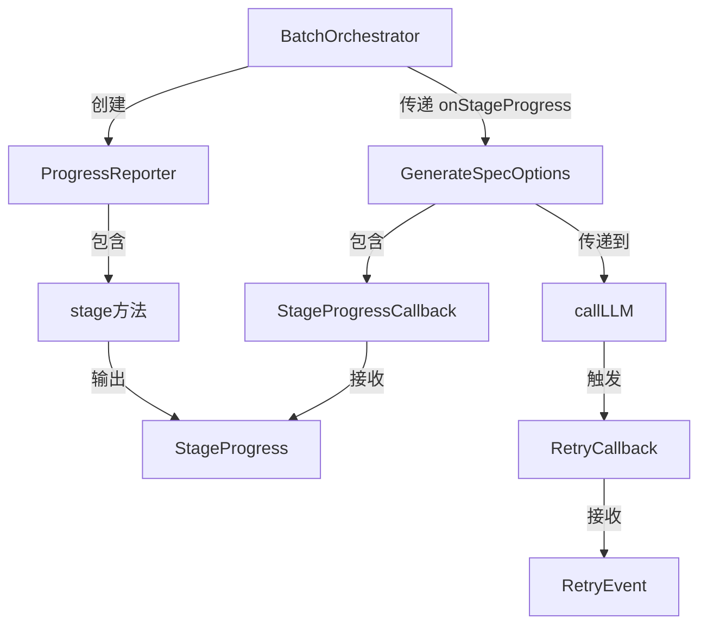

# Data Model: 批量 Spec 生成体验优化

**Feature Branch**: `006-batch-progress-timeout`
**Date**: 2026-02-14

## 新增类型定义

### StageProgress

表示模块处理中某一阶段的进度事件。定义在 `src/models/module-spec.ts` 中。

```typescript
/** 处理阶段标识符 */
export type StageId = 'scan' | 'ast' | 'context' | 'llm' | 'parse' | 'render';

/** 阶段进度事件 */
export interface StageProgress {
  /** 阶段标识符 */
  stage: StageId;
  /** 阶段中文描述 */
  message: string;
  /** 阶段耗时（毫秒，仅完成时有值） */
  duration?: number;
}
```

| 字段 | 类型 | 说明 |
| ---- | ---- | ---- |
| stage | StageId | 6 个枚举值之一 |
| message | string | 面向用户的中文进度描述 |
| duration | number? | 阶段完成时的耗时，未完成时为 undefined |

### StageProgressCallback

进度回调函数类型。

```typescript
/** 阶段进度回调 */
export type StageProgressCallback = (progress: StageProgress) => void;
```

### RetryEvent

LLM 重试事件。定义在 `src/core/llm-client.ts` 中。

```typescript
/** LLM 重试事件 */
export interface RetryEvent {
  /** 当前尝试次数（从 1 开始） */
  attempt: number;
  /** 最大尝试次数 */
  maxAttempts: number;
  /** 触发重试的错误类型 */
  errorType: 'timeout' | 'rate-limit' | 'server-error';
  /** 下一次尝试前的等待时间（毫秒） */
  delay: number;
}
```

| 字段 | 类型 | 说明 |
| ---- | ---- | ---- |
| attempt | number | 当前是第几次尝试 |
| maxAttempts | number | 最多尝试几次 |
| errorType | string | 触发重试的原因分类 |
| delay | number | 等待退避时间 |

### RetryCallback

重试回调函数类型。

```typescript
/** 重试事件回调 */
export type RetryCallback = (event: RetryEvent) => void;
```

## 修改的现有类型

### GenerateSpecOptions（扩展）

在 `src/core/single-spec-orchestrator.ts` 中新增可选字段：

```typescript
export interface GenerateSpecOptions {
  // ... 现有字段保持不变 ...

  /** 阶段进度回调（可选） */
  onStageProgress?: StageProgressCallback;
}
```

### ProgressReporter（扩展）

在 `src/batch/progress-reporter.ts` 中新增方法：

```typescript
export interface ProgressReporter {
  // ... 现有方法保持不变 ...

  /** 报告模块内阶段进度 */
  stage(modulePath: string, progress: StageProgress): void;
}
```

## 类型关系


