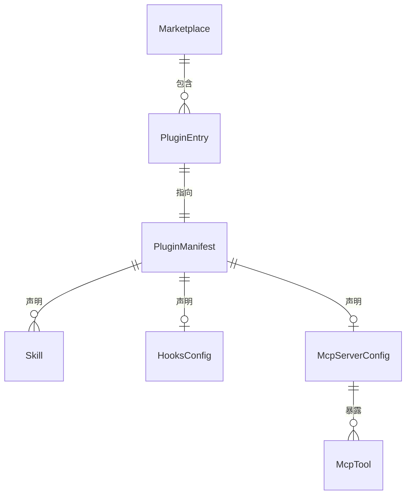

# Data Model: 重构为 Claude Code Plugin Marketplace 架构

**Feature Branch**: `009-plugin-marketplace`
**Date**: 2026-02-14

---

## 实体关系概览

---

## 实体定义

### 1. Marketplace（市场清单）

**文件位置**：`.claude-plugin/marketplace.json`
**用途**：仓库级别声明，定义可供安装的 plugin 集合

| 字段 | 类型 | 必填 | 验证规则 | 说明 |
|------|------|------|---------|------|
| `name` | string | 是 | kebab-case, 1-64 字符 | 市场名称 |
| `owner` | Owner | 是 | — | 所有者信息 |
| `metadata` | MarketplaceMetadata | 否 | — | 元信息 |
| `plugins` | PluginEntry[] | 是 | 非空数组 | 可安装的 plugin 列表 |

**Owner 子结构**：

| 字段 | 类型 | 必填 | 说明 |
|------|------|------|------|
| `name` | string | 是 | 所有者名称 |
| `email` | string | 否 | 联系邮箱 |

**MarketplaceMetadata 子结构**：

| 字段 | 类型 | 必填 | 说明 |
|------|------|------|------|
| `description` | string | 否 | 市场描述 |
| `version` | string | 否 | semver 格式的市场版本 |
| `pluginRoot` | string | 否 | plugin 根目录的相对路径前缀 |

---

### 2. PluginEntry（plugin 条目）

**存在于**：`marketplace.json` 的 `plugins` 数组
**用途**：描述单个 plugin 的元信息和位置

| 字段 | 类型 | 必填 | 验证规则 | 说明 |
|------|------|------|---------|------|
| `name` | string | 是 | kebab-case, 1-64 字符 | plugin 名称（唯一标识） |
| `source` | string | 是 | 以 `./` 开头的相对路径 | plugin 目录路径 |
| `description` | string | 否 | — | plugin 功能描述 |
| `version` | string | 否 | semver 格式 | plugin 版本 |
| `category` | string | 否 | — | 分类标签（如 `documentation`） |
| `tags` | string[] | 否 | — | 搜索标签 |
| `author` | Author | 否 | — | 作者信息 |

---

### 3. PluginManifest（plugin 清单）

**文件位置**：`plugins/<name>/plugin.json`
**用途**：plugin 自身的结构声明

| 字段 | 类型 | 必填 | 验证规则 | 说明 |
|------|------|------|---------|------|
| `name` | string | 是 | kebab-case, 1-64 字符 | plugin 名称 |
| `version` | string | 否 | semver | 版本号 |
| `description` | string | 否 | — | 功能描述 |
| `author` | Author | 否 | — | 作者信息 |
| `skills` | string | 否 | 相对路径 | 自定义 skill 目录（补充默认 `skills/`） |
| `hooks` | string/object | 否 | — | hooks 配置路径或内联 |
| `mcpServers` | string/object | 否 | — | MCP server 配置路径或内联 |
| `homepage` | string | 否 | URL | 文档链接 |
| `repository` | string | 否 | URL | 仓库地址 |
| `license` | string | 否 | SPDX | 许可证 |
| `keywords` | string[] | 否 | — | 关键字 |

**Author 子结构**：

| 字段 | 类型 | 必填 | 说明 |
|------|------|------|------|
| `name` | string | 是 | 作者名 |
| `email` | string | 否 | 邮箱 |
| `url` | string | 否 | 个人/组织 URL |

---

### 4. Skill（技能定义）

**文件位置**：`plugins/<name>/skills/<skill-name>/SKILL.md`
**用途**：用户可调用的工作流定义

| 属性 | 类型 | 来源 | 说明 |
|------|------|------|------|
| `name` | string | YAML frontmatter 或目录名 | skill 名称 |
| `description` | string | YAML frontmatter | 触发条件描述 |
| `content` | markdown | SKILL.md 正文 | 工作流指令 |
| `disable-model-invocation` | boolean | YAML frontmatter | 是否禁止自动调用 |
| `user-invocable` | boolean | YAML frontmatter | 是否显示在 `/` 菜单 |

**本项目的 3 个 Skill**：

| Skill 名称 | 目录 | 触发方式 |
|-----------|------|---------|
| `reverse-spec` | `skills/reverse-spec/` | `/reverse-spec <target>` |
| `reverse-spec-batch` | `skills/reverse-spec-batch/` | `/reverse-spec-batch` |
| `reverse-spec-diff` | `skills/reverse-spec-diff/` | `/reverse-spec-diff <spec> <source>` |

---

### 5. HooksConfig（Hook 配置）

**文件位置**：`plugins/<name>/hooks/hooks.json`
**用途**：plugin 生命周期事件处理

| 字段 | 类型 | 说明 |
|------|------|------|
| `hooks` | object | 事件名 → matcher + handler 数组 |

**事件类型**（本项目使用）：

| 事件 | 触发时机 | 用途 |
|------|---------|------|
| `SessionStart` | 每次会话开始 | 检查依赖是否已安装 |

---

### 6. McpServerConfig（MCP Server 配置）

**文件位置**：`plugins/<name>/.mcp.json`
**用途**：声明 plugin 提供的 MCP server

| 字段 | 类型 | 必填 | 说明 |
|------|------|------|------|
| `mcpServers` | object | 是 | server 名 → 启动配置 |

**每个 server 的启动配置**：

| 字段 | 类型 | 必填 | 说明 |
|------|------|------|------|
| `command` | string | 是 | 启动命令（如 `npx`） |
| `args` | string[] | 否 | 命令参数 |
| `env` | object | 否 | 环境变量 |
| `cwd` | string | 否 | 工作目录 |

---

### 7. McpTool（MCP 工具定义）

**存在于**：MCP server 运行时注册
**用途**：AI 助手可调用的结构化工具

| 字段 | 类型 | 必填 | 说明 |
|------|------|------|------|
| `name` | string | 是 | 工具名（A-Z, a-z, 0-9, `_`, `-`, `.`） |
| `description` | string | 否 | 功能描述 |
| `inputSchema` | JSON Schema | 是 | 输入参数定义 |

**本项目的 4 个 MCP 工具**：

| 工具名 | 映射函数 | 说明 |
|--------|---------|------|
| `prepare` | `prepareContext()` | AST 预处理 + 上下文组装 |
| `generate` | `generateSpec()` | 完整 spec 生成流水线 |
| `batch` | `runBatch()` | 批量 spec 生成 |
| `diff` | `detectDrift()` | spec 漂移检测 |

---

## 实体间关系

| 源实体 | 关系 | 目标实体 | 基数 |
|--------|------|---------|------|
| Marketplace | 包含 | PluginEntry | 1:N |
| PluginEntry | 指向 | PluginManifest | 1:1 |
| PluginManifest | 声明 | Skill | 1:N (0..∞) |
| PluginManifest | 声明 | HooksConfig | 1:0..1 |
| PluginManifest | 声明 | McpServerConfig | 1:0..1 |
| McpServerConfig | 暴露 | McpTool | 1:N |

---

## 数据验证规则

1. **marketplace.json 的 `name`** 与 仓库 URL 的最后一段保持一致
2. **PluginEntry 的 `source`** 路径必须指向存在的目录且该目录包含 `plugin.json`
3. **plugin.json 的 `name`** 与 marketplace.json 中对应 entry 的 `name` 一致
4. **Skill 目录名**与 SKILL.md frontmatter 的 `name` 字段一致（如有）
5. **MCP tool `name`** 不得包含空格或特殊字符，限 1-128 字符
6. **所有版本号**遵循 semver 格式
