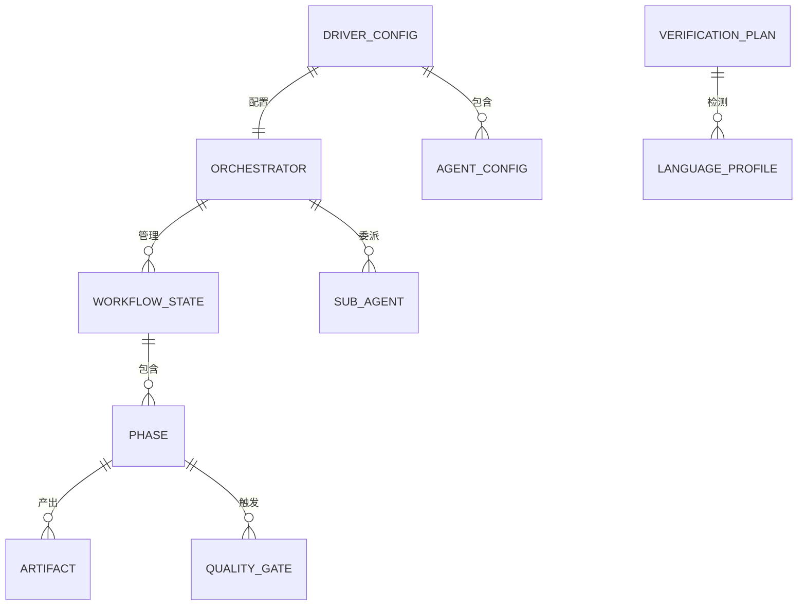

# Data Model: Speckit Driver Pro

**Branch**: `011-speckit-driver-pro` | **Date**: 2026-02-15 | **Plan**: [plan.md](plan.md)

## 实体总览



## 实体定义

### 1. WorkflowState（工作流状态）

编排器在内存中维护的运行时状态，用于追踪流程进度、制品路径和恢复点。

| 属性 | 类型 | 说明 |
| ---- | ---- | ---- |
| feature_name | string | 特性名称（如 `011-speckit-driver-pro`） |
| feature_dir | path | 特性目录绝对路径 |
| current_phase | PhaseID | 当前执行的阶段 |
| completed_phases | PhaseID[] | 已完成的阶段列表 |
| prompt_sources | Map<PhaseID, path> | 每个阶段的 prompt 来源路径 |
| artifacts | Map<PhaseID, ArtifactInfo> | 已生成的制品信息 |
| driver_config | DriverConfig | 已加载的配置 |
| is_resumed | boolean | 是否为恢复模式 |

**状态转换**:

```text
INIT → CONSTITUTION → PRODUCT_RESEARCH → TECH_RESEARCH → SYNTHESIS →
SPECIFY → CLARIFY → CHECKLIST → PLAN → TASKS → ANALYZE → IMPLEMENT → VERIFY → DONE

任何阶段 → PAUSED（质量门阻断或子代理失败）
PAUSED → 当前阶段（用户决策后恢复）
任何已完成阶段 → RE_RUN（选择性重跑）
RE_RUN → 后续阶段标记 STALE
```

---

### 2. Phase（阶段）

工作流的基本执行单元，每个阶段对应一个子代理调用。

| 属性 | 类型 | 说明 |
| ---- | ---- | ---- |
| id | PhaseID | 阶段标识（见 PhaseID 枚举） |
| name | string | 显示名称（中文） |
| agent_file | path | 子代理 prompt 文件路径 |
| model | string | 使用的模型（opus/sonnet） |
| depends_on | PhaseID[] | 依赖的前置阶段 |
| input_artifacts | path[] | 需要读取的制品路径 |
| output_artifact | path | 产出的制品路径 |
| status | PhaseStatus | 当前状态 |
| retry_count | number | 已重试次数 |

**PhaseID 枚举**:

```text
CONSTITUTION        # Phase 0
PRODUCT_RESEARCH    # Phase 1a
TECH_RESEARCH       # Phase 1b
SYNTHESIS           # Phase 1c（编排器亲自执行）
SPECIFY             # Phase 2
CLARIFY             # Phase 3
CHECKLIST           # Phase 3.5
PLAN                # Phase 4
TASKS               # Phase 5
ANALYZE             # Phase 5.5
IMPLEMENT           # Phase 6
VERIFY              # Phase 7
```

**PhaseStatus 枚举**:

```text
PENDING     # 等待执行
RUNNING     # 执行中
COMPLETED   # 已完成
FAILED      # 执行失败
STALE       # 过期（上游阶段已重跑）
SKIPPED     # 已跳过（恢复模式）
```

---

### 3. Artifact（制品）

每个阶段产出的结构化文档或代码。

| 属性 | 类型 | 说明 |
| ---- | ---- | ---- |
| phase_id | PhaseID | 所属阶段 |
| file_path | path | 文件绝对路径 |
| type | ArtifactType | 制品类型 |
| is_stale | boolean | 是否过期 |
| stale_reason | string | 过期原因（如 "上游阶段 PLAN 已重跑"） |
| created_at | timestamp | 创建时间（文件 mtime） |

**ArtifactType 枚举与路径映射**:

| ArtifactType | 文件路径 | 产出阶段 |
| ---- | ---- | ---- |
| CONSTITUTION_CHECK | (编排器内存，不持久化) | CONSTITUTION |
| PRODUCT_RESEARCH | `research/product-research.md` | PRODUCT_RESEARCH |
| TECH_RESEARCH | `research/tech-research.md` | TECH_RESEARCH |
| RESEARCH_SYNTHESIS | `research/research-synthesis.md` | SYNTHESIS |
| SPEC | `spec.md` | SPECIFY |
| CLARIFIED_SPEC | `spec.md`（含 Clarifications 节） | CLARIFY |
| CHECKLIST | `checklists/*.md` | CHECKLIST |
| PLAN | `plan.md` | PLAN |
| TASKS | `tasks.md` | TASKS |
| ANALYSIS_REPORT | `analysis-report.md` | ANALYZE |
| SOURCE_CODE | (项目源代码目录) | IMPLEMENT |
| VERIFICATION_REPORT | `verification/verification-report.md` | VERIFY |

---

### 4. QualityGate（质量门）

自动化质量检查点，决定流程是否继续。

| 属性 | 类型 | 说明 |
| ---- | ---- | ---- |
| id | GateID | 质量门标识 |
| trigger_after | PhaseID | 触发时机（哪个阶段之后） |
| type | GateType | 类型：ALWAYS_PAUSE / CONDITIONAL |
| condition | string | 条件表达式（仅 CONDITIONAL 类型） |
| result | GateResult | 检查结果 |

**质量门实例**:

| GateID | 触发时机 | 类型 | 暂停条件 |
| ---- | ---- | ---- | ---- |
| GATE_RESEARCH | SYNTHESIS 后 | ALWAYS_PAUSE | 始终暂停，等待用户确认调研结论 |
| GATE_ANALYSIS | ANALYZE 后 | CONDITIONAL | 存在 CRITICAL 级别发现时暂停 |
| GATE_TASKS | TASKS 后 | ALWAYS_PAUSE | 始终暂停，等待用户确认任务计划 |
| GATE_VERIFY | VERIFY 后 | CONDITIONAL | 构建或测试失败时暂停 |

**GateResult 枚举**:

```text
PASS            # 通过，自动继续
PAUSE_USER      # 暂停，等待用户决策
PAUSE_CRITICAL  # 暂停，CRITICAL 问题需处理
```

---

### 5. DriverConfig（驱动配置）

用户的 spec-driver.config.yaml 解析后的配置实体。

| 属性 | 类型 | 说明 |
| ---- | ---- | ---- |
| preset | PresetID | 预设名称 |
| agents | Map<AgentID, AgentConfig> | 子代理级配置覆盖 |
| verification | VerificationConfig | 验证阶段配置 |
| quality_gates | QualityGateConfig | 质量门配置 |
| retry | RetryConfig | 重试策略配置 |

**PresetID 枚举**:

```text
balanced         # 默认：重分析用 Opus，执行用 Sonnet
quality-first    # 全部用 Opus
cost-efficient   # 大部分用 Sonnet，仅核心分析用 Opus
```

**AgentConfig**:

| 属性 | 类型 | 说明 |
| ---- | ---- | ---- |
| model | string | 模型选择（opus/sonnet），覆盖预设 |

**VerificationConfig**:

| 属性 | 类型 | 说明 |
| ---- | ---- | ---- |
| commands | Map<language, CommandSet> | 语言级自定义命令 |
| monorepo_enabled | boolean | 是否启用 Monorepo 检测 |

**CommandSet**:

| 属性 | 类型 | 说明 |
| ---- | ---- | ---- |
| build | string | 构建命令（可选） |
| lint | string | Lint 命令（可选） |
| test | string | 测试命令（可选） |

**RetryConfig**:

| 属性 | 类型 | 说明 |
| ---- | ---- | ---- |
| max_attempts | number | 最大重试次数（默认 2） |

---

### 6. LanguageProfile（语言配置文件）

verify 子代理检测到的语言/构建系统信息。

| 属性 | 类型 | 说明 |
| ---- | ---- | ---- |
| language | string | 语言名称（如 "TypeScript"、"Rust"） |
| build_system | string | 构建系统（如 "npm"、"Cargo"） |
| signature_file | path | 特征文件路径 |
| root_dir | path | 项目/子项目根目录 |
| commands | CommandSet | 检测到的默认命令 |
| tool_available | Map<string, boolean> | 工具是否已安装 |
| is_monorepo_child | boolean | 是否为 Monorepo 的子项目 |

---

### 7. SubAgent（子代理定义）

子代理的静态定义信息。

| 属性 | 类型 | 说明 |
| ---- | ---- | ---- |
| id | AgentID | 子代理标识 |
| phase_id | PhaseID | 对应的阶段 |
| prompt_file | path | prompt 文件路径（agents/*.md） |
| default_model | Map<PresetID, string> | 各预设下的默认模型 |
| input_contract | InputContract | 输入契约 |
| output_contract | OutputContract | 输出契约 |

## 实体关系说明

```text
主编排器 (1) ──管理──> 工作流状态 (1)
主编排器 (1) ──委派──> 子代理 (11)
工作流状态 (1) ──包含──> 阶段 (12)
阶段 (1) ──产出──> 制品 (1..n)
阶段 (1) ──触发──> 质量门 (0..1)
驱动配置 (1) ──配置──> 主编排器 (1)
驱动配置 (1) ──包含──> 子代理配置 (0..11)
验证计划 (1) ──检测──> 语言配置 (1..n)
```
