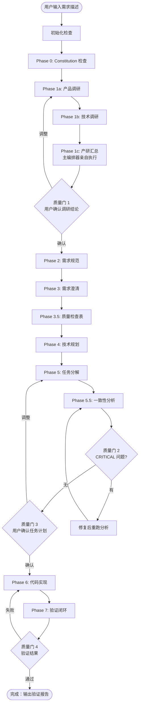
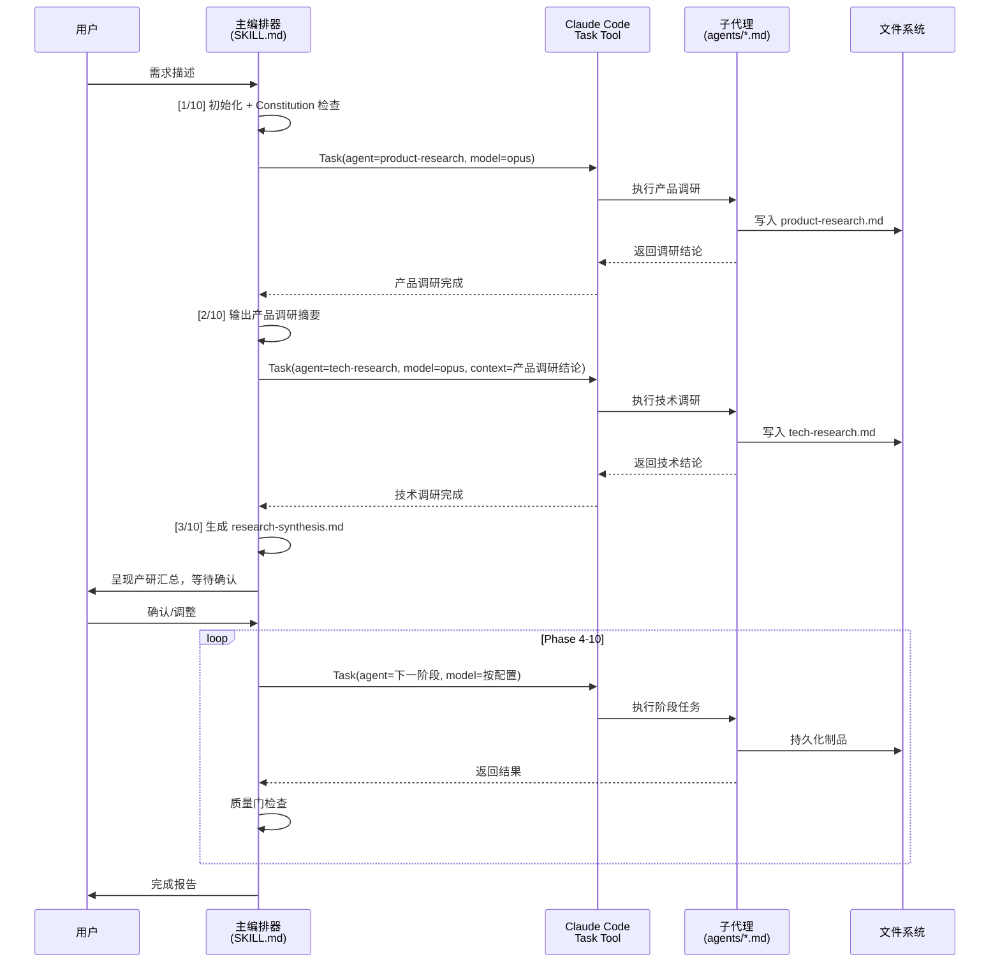

# Implementation Plan: Speckit Driver Pro

**Branch**: `011-speckit-driver-pro` | **Date**: 2026-02-15 | **Spec**: [spec.md](spec.md)
**Input**: Feature specification from `/specs/011-speckit-driver-pro/spec.md`

## Summary

设计并开发 Speckit Driver Pro——一个自治研发编排器 Claude Code Plugin。通过主编排器（SKILL.md）+ 10 个子代理（agents/*.md）架构，将 Spec Kit 的完整研发流程自动化为单一命令触发。核心技术方案：纯 Markdown prompt + YAML 配置 + Bash 脚本（无运行时依赖），通过 Claude Code 的 Task tool 实现子代理委派，通过 spec-driver.config.yaml 实现模型分级配置。

## Technical Context

**Language/Version**: Bash 5.x（脚本）、Markdown（prompt 和模板）、YAML（配置）
**Primary Dependencies**: 无运行时依赖。Plugin 完全由 Markdown prompt、Bash 脚本和 YAML 配置构成，运行在 Claude Code 沙箱中
**Storage**: 文件系统（specs/[feature]/ 目录树，spec-driver.config.yaml 配置文件）
**Testing**: 端到端验收测试（通过真实项目运行完整流程验证制品生成）；单元级验证通过 Bash 脚本的 `--dry-run` 模式
**Target Platform**: Claude Code CLI / VS Code 扩展（跨平台：macOS、Linux、Windows WSL）
**Project Type**: Claude Code Plugin（单项目，纯声明式）
**Performance Goals**: 全流程（10 阶段）完成时间取决于 LLM API 延迟，Plugin 自身脚本执行 < 5 秒
**Constraints**: Plugin 不引入任何 npm/Node.js 运行时依赖；所有逻辑通过 Claude Code 的 Prompt Engineering + Task tool 实现
**Scale/Scope**: 1 个主 skill、11 个子代理 prompt 文件、3 个模板、2-3 个 Bash 脚本、1 个配置模板

## Constitution Check

*GATE: Must pass before Phase 0 research. Re-check after Phase 1 design.*

| 原则 | 适用性 | 评估 | 说明 |
|------|--------|------|------|
| **I. AST 精确性优先** | 不直接适用 | ✅ PASS | Driver Pro 是编排器，不直接执行 AST 分析。委派给 speckit 子代理时，由子代理自身遵守此原则 |
| **II. 混合分析流水线** | 不直接适用 | ✅ PASS | 编排器不直接处理代码分析。research 子代理使用 Web 搜索 + 本地代码分析，属于不同的分析范式 |
| **III. 诚实标注不确定性** | 适用 | ✅ PASS | research 子代理的输出要求使用 `[推断]`/`[INFERRED]` 标记不确定信息；research-synthesis.md 中的推荐方案需标注置信度 |
| **IV. 只读安全性** | 需要豁免 | ⚠️ JUSTIFIED | Driver Pro 的 implement 子代理会写入源代码，这与 reverse-spec 的只读原则不同。**豁免理由**：Driver Pro 是正向研发工具（非逆向分析工具），写入源代码是其核心功能。仅 reverse-spec 系列工具受此约束，Driver Pro 作为独立 Plugin 不受此条限制 |
| **V. 纯 Node.js 生态** | 部分适用 | ✅ PASS | Plugin 自身零运行时依赖。verify 子代理调用多语言构建工具（如 cargo、go、mvn）是执行用户项目的原生工具链，不是引入新依赖 |
| **VI. 双语文档规范** | 适用 | ✅ PASS | 所有生成的制品（spec.md、plan.md、tasks.md、research reports）遵循中文散文 + 英文代码标识符规范 |

**门控结论**: PASS（1 项豁免已论证合理，不阻断）

## Project Structure

### Documentation (this feature)

```text
specs/011-speckit-driver-pro/
├── plan.md                  # 本文件（/speckit.plan 输出）
├── research.md              # Phase 0 输出：技术决策研究
├── data-model.md            # Phase 1 输出：实体和状态模型
├── quickstart.md            # Phase 1 输出：快速上手指南
├── contracts/               # Phase 1 输出：子代理输入输出契约
│   ├── orchestrator-contract.md
│   ├── sub-agent-contract.md
│   └── config-schema.yaml
└── tasks.md                 # Phase 2 输出（/speckit.tasks 生成）
```

### Source Code (repository root)

```text
plugins/speckit-driver-pro/
├── .claude-plugin/
│   └── plugin.json                        # Plugin 元数据清单
├── hooks/
│   └── hooks.json                         # SessionStart hook 配置
├── scripts/
│   ├── postinstall.sh                     # 安装后初始化脚本
│   └── init-project.sh                    # 项目级 .specify/ 初始化
├── skills/
│   └── speckit-driver-pro/
│       └── SKILL.md                       # 主编排器 skill（研发总监）
├── agents/
│   ├── constitution.md                    # Phase 0: 宪法检查子代理
│   ├── product-research.md                # Phase 1a: 产品调研子代理
│   ├── tech-research.md                   # Phase 1b: 技术调研子代理
│   ├── specify.md                         # Phase 2: 需求规范子代理
│   ├── clarify.md                         # Phase 3: 需求澄清子代理
│   ├── checklist.md                       # Phase 3.5: 质量检查表子代理
│   ├── plan.md                            # Phase 4: 技术规划子代理
│   ├── tasks.md                           # Phase 5: 任务分解子代理
│   ├── analyze.md                         # Phase 5.5: 一致性分析子代理
│   ├── implement.md                       # Phase 6: 实现子代理
│   └── verify.md                          # Phase 7: 验证子代理
├── templates/
│   ├── product-research-template.md       # 产品调研报告模板
│   ├── tech-research-template.md          # 技术调研报告模板
│   ├── research-synthesis-template.md     # 产研汇总模板
│   ├── verification-report-template.md    # 验证报告模板
│   └── spec-driver.config-template.yaml        # 驱动配置模板
└── README.md                              # Plugin 说明文档
```

**Structure Decision**: 采用 Claude Code Plugin 标准结构（.claude-plugin/ + skills/ + agents/），与现有 reverse-spec plugin 保持一致的组织方式。agents/ 目录为 Driver Pro 特有，存放 11 个子代理 prompt 文件（research 拆为 product + tech 两个文件）。templates/ 包含 5 个模板（3 个新增 + 2 个辅助）。

## Architecture

### 编排流程总览



### 子代理委派模式



### 模型分级配置

| 子代理 | balanced | quality-first | cost-efficient |
|--------|----------|---------------|----------------|
| 主编排器 | opus | opus | opus |
| product-research | opus | opus | sonnet |
| tech-research | opus | opus | sonnet |
| specify | opus | opus | sonnet |
| clarify | sonnet | opus | sonnet |
| checklist | sonnet | opus | sonnet |
| plan | opus | opus | sonnet |
| tasks | sonnet | opus | sonnet |
| analyze | opus | opus | sonnet |
| implement | sonnet | opus | sonnet |
| verify | sonnet | opus | sonnet |

### 多语言验证矩阵

| 语言/构建系统 | 特征文件 | 构建命令 | Lint 命令 | 测试命令 |
|--------------|---------|---------|----------|---------|
| JS/TS (npm) | package.json | `npm run build` | `npm run lint` | `npm test` |
| JS/TS (pnpm) | pnpm-lock.yaml | `pnpm build` | `pnpm lint` | `pnpm test` |
| JS/TS (yarn) | yarn.lock | `yarn build` | `yarn lint` | `yarn test` |
| JS/TS (bun) | bun.lockb | `bun run build` | `bun run lint` | `bun test` |
| Rust | Cargo.toml | `cargo build` | `cargo clippy` | `cargo test` |
| Go | go.mod | `go build ./...` | `golangci-lint run` | `go test ./...` |
| Python (pip) | requirements.txt | N/A | `ruff check .` | `pytest` |
| Python (poetry) | pyproject.toml | N/A | `ruff check .` | `pytest` |
| Python (uv) | uv.lock | N/A | `ruff check .` | `pytest` |
| Java (Maven) | pom.xml | `mvn compile` | `mvn checkstyle:check` | `mvn test` |
| Java (Gradle) | build.gradle | `gradle build` | `gradle check` | `gradle test` |
| Kotlin | build.gradle.kts | `gradle build` | `gradle ktlintCheck` | `gradle test` |
| Swift (SPM) | Package.swift | `swift build` | `swiftlint` | `swift test` |
| C/C++ (CMake) | CMakeLists.txt | `cmake --build build` | `cppcheck .` | `ctest --test-dir build` |
| C/C++ (Make) | Makefile | `make` | `cppcheck .` | `make test` |
| C# (.NET) | *.csproj | `dotnet build` | `dotnet format --verify-no-changes` | `dotnet test` |
| Elixir | mix.exs | `mix compile` | `mix credo` | `mix test` |
| Ruby | Gemfile | N/A | `rubocop` | `bundle exec rspec` |

### 质量门设计

```text
质量门 1 - 调研结论确认（人工介入点）
├── 触发条件：research-synthesis.md 生成后
├── 判断逻辑：始终暂停（用户必须确认调研方向）
└── 用户选项：确认 / 补充调研 / 调整范围

质量门 2 - 分析门（自动 + 条件暂停）
├── 触发条件：analyze 子代理完成后
├── 判断逻辑：
│   ├── CRITICAL 发现 → 暂停（人工介入点）
│   ├── WARNING 发现 → 记录并继续
│   └── 零发现 → 自动继续
└── 用户选项：修复后重跑 / 忽略并继续

质量门 3 - 任务计划确认（人工介入点）
├── 触发条件：tasks.md 生成且分析门通过后
├── 判断逻辑：始终暂停（用户必须确认实现计划）
└── 用户选项：确认 / 调整任务 / 重跑规划

质量门 4 - 验证门（自动 + 条件暂停）
├── 触发条件：verify 子代理完成后
├── 判断逻辑：
│   ├── 构建/测试失败 → 暂停（人工介入点）
│   ├── 仅 Lint 警告 → 记录并完成
│   └── 全部通过 → 自动完成
└── 用户选项：修复后重验 / 接受当前结果
```

### 选择性重跑机制

```text
阶段依赖链：
constitution → research → specify → clarify → checklist → plan → tasks → analyze → implement → verify

重跑规则：
- 用户指定重跑某阶段 → 该阶段重新执行
- 该阶段之后所有制品添加 [STALE: 上游阶段已重跑] 标记
- 提示用户是否级联重跑后续阶段
- 级联重跑仅执行标记为 STALE 的阶段

示例：重跑 "plan" 阶段
  plan.md → 重新生成
  tasks.md → [STALE]
  analyze 结果 → [STALE]
  实现代码 → [STALE]
  验证报告 → [STALE]
  用户选择：级联重跑 tasks → analyze → implement → verify
```

### 中断恢复机制

```text
制品检测优先级（从后向前扫描）：
1. verification-report.md 存在 → 流程完成
2. 实现代码变更存在 → 从 verify 恢复
3. tasks.md 存在 → 从 analyze 恢复
4. plan.md 存在 → 从 tasks 恢复
5. spec.md 存在且已 clarified → 从 checklist 恢复
6. spec.md 存在 → 从 clarify 恢复
7. research-synthesis.md 存在 → 从 specify 恢复
8. product-research.md 或 tech-research.md 存在 → 从对应调研阶段恢复
9. 无制品 → 从头开始

恢复时行为：
- 读取已有制品，不重新生成
- 从检测到的恢复点继续
- 输出 "[恢复] 检测到已有制品，从 Phase N 继续..."
```

### Plugin 集成设计

```yaml
# plugin.json
{
  "name": "speckit-driver-pro",
  "version": "1.0.0",
  "description": "自治研发编排器——通过主编排器 + 10 子代理架构自动执行 Spec-Driven Development 全流程",
  "author": { "name": "Connor Lu" },
  "license": "MIT",
  "keywords": ["orchestrator", "spec-driven", "autonomous", "claude-code"],
  "hooks": "./hooks/hooks.json"
}
```

```yaml
# hooks/hooks.json
{
  "hooks": [
    {
      "event": "SessionStart",
      "commands": [
        { "type": "shell", "command": "./scripts/postinstall.sh" }
      ]
    }
  ]
}
```

### 子代理 Prompt 通用结构

每个子代理（agents/*.md）遵循统一的 prompt 框架：

```markdown
# [阶段名] 子代理

## 角色
你是 Speckit Driver Pro 的 [角色名] 子代理，负责 [职责描述]。

## 输入
- 从主编排器接收：[输入描述]
- 读取制品：[需要读取的文件]

## 执行流程
1. [步骤 1]
2. [步骤 2]
...

## 输出
- 生成制品：[输出文件路径]
- 返回给编排器：[返回信息摘要]

## 约束
- [约束条件 1]
- [约束条件 2]

## 失败处理
- [失败场景] → [处理方式]
```

## Complexity Tracking

| Violation | Why Needed | Simpler Alternative Rejected Because |
|-----------|------------|-------------------------------------|
| Constitution 原则 IV（只读安全性）豁免 | Driver Pro 是正向研发工具，implement 子代理必须写入源代码 | 只读约束仅适用于 reverse-spec 逆向分析工具，Driver Pro 是独立的正向工具 |
| 11 个子代理文件（超过 10 个逻辑分类） | research 拆为 product-research + tech-research 两个文件 | 合并为单一 research 子代理会导致 prompt 过长（> 100k tokens 风险）且无法利用 Task tool 的并行能力 |
