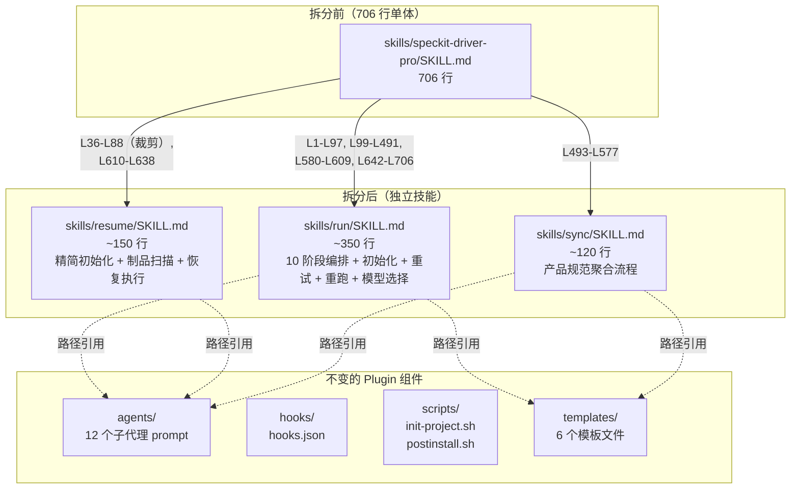
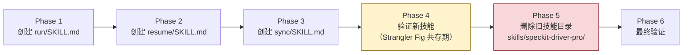

# Implementation Plan: 拆分 Speckit Driver Pro 技能命令

**Branch**: `013-split-skill-commands` | **Date**: 2026-02-15 | **Spec**: [spec.md](spec.md)
**Input**: Feature specification from `specs/013-split-skill-commands/spec.md`

## Summary

将 Speckit Driver Pro Plugin 的单体 `skills/speckit-driver-pro/SKILL.md`（706 行）拆分为三个独立技能：`run`（主编排流程，~350 行）、`resume`（中断恢复，~150 行）、`sync`（产品规范聚合，~120 行）。采用方案 A（完全独立拆分）+ Strangler Fig 迁移策略，实现命令可发现性提升、上下文预算优化和职责分离。这是一个纯 Markdown 文件重构任务，零代码变更、零新增依赖。

## Technical Context

**Language/Version**: Markdown + YAML frontmatter（无编程语言变更）
**Primary Dependencies**: 无新增。所有操作均为文件系统级的 Markdown 文件创建/删除
**Storage**: 文件系统（`plugins/speckit-driver-pro/skills/` 目录）
**Testing**: 手动验证——在 Claude Code 中通过 `/speckit-driver-pro:` 补全菜单验证命令可见性和功能正确性
**Target Platform**: Claude Code Plugin 系统（自动发现 `skills/*/SKILL.md`）
**Project Type**: Plugin 内部重构（Markdown 文件）
**Performance Goals**: N/A（非运行时代码变更）
**Constraints**: 每个 SKILL.md 控制在 200-350 行（Claude Code 官方建议 1,500-2,000 words）
**Scale/Scope**: 5 个文件操作（3 个新建 + 1 个删除 + 目录结构调整）

## Constitution Check

*GATE: Must pass before Phase 0 research. Re-check after Phase 1 design.*

| 原则 | 适用性 | 评估 | 说明 |
|------|--------|------|------|
| I. AST 精确性优先 | 不适用 | PASS | 本特性为纯 Markdown 文件重构，不涉及 AST 解析或结构化数据提取 |
| II. 混合分析流水线 | 不适用 | PASS | 不涉及代码分析，无需三阶段流水线 |
| III. 诚实标注不确定性 | 不适用 | PASS | 不生成 reverse-spec 意义上的 Spec 文档 |
| IV. 只读安全性 | 适用 | PASS | 写操作仅作用于 `plugins/speckit-driver-pro/skills/` 目录，不修改目标源代码。Plugin 内部的 skills/ 为合法写入目标 |
| V. 纯 Node.js 生态 | 不适用 | PASS | 不引入任何运行时依赖 |
| VI. 双语文档规范 | 适用 | PASS | SKILL.md 使用中文散文 + 英文代码标识符/路径，符合现有规范 |

**结论**: 全部 PASS，无 VIOLATION。本特性与 Constitution 完全兼容。

## Project Structure

### Documentation (this feature)

```text
specs/013-split-skill-commands/
├── spec.md              # 需求规范（已存在）
├── plan.md              # 本文件（技术规划）
├── research.md          # 技术决策研究（6 项决策）
├── quickstart.md        # 快速上手指南
├── research/
│   ├── product-research.md      # 产品调研（已存在）
│   ├── tech-research.md         # 技术调研（已存在）
│   └── research-synthesis.md    # 产研汇总（已存在）
└── tasks.md             # 任务分解（后续阶段生成）
```

### Source Code (Plugin 目录)

```text
plugins/speckit-driver-pro/
├── .claude-plugin/
│   └── plugin.json               # Plugin manifest（不变）
├── agents/                       # 子代理 prompt（不变，12 个文件）
│   ├── analyze.md
│   ├── checklist.md
│   ├── clarify.md
│   ├── constitution.md
│   ├── implement.md
│   ├── plan.md
│   ├── product-research.md
│   ├── specify.md
│   ├── sync.md
│   ├── tasks.md
│   ├── tech-research.md
│   └── verify.md
├── hooks/                        # 生命周期钩子（不变）
│   └── hooks.json
├── scripts/                      # 初始化脚本（不变）
│   ├── init-project.sh
│   └── postinstall.sh
├── templates/                    # 文档模板（不变）
│   ├── spec-driver.config-template.yaml
│   ├── product-research-template.md
│   ├── product-spec-template.md
│   ├── research-synthesis-template.md
│   ├── tech-research-template.md
│   └── verification-report-template.md
├── skills/                       # [变更区域]
│   ├── speckit-driver-pro/       # [删除] 旧单体技能
│   │   └── SKILL.md              #   706 行 → 删除
│   ├── run/                      # [新建] 主编排技能
│   │   └── SKILL.md              #   ~350 行
│   ├── resume/                   # [新建] 中断恢复技能
│   │   └── SKILL.md              #   ~150 行
│   └── sync/                     # [新建] 产品规范聚合技能
│       └── SKILL.md              #   ~120 行
├── README.md                     # Plugin 说明（不变）
└── spec-driver.config.yaml            # 运行时配置模板（不变）
```

**Structure Decision**: 变更范围严格限制在 `skills/` 目录内。`agents/`、`hooks/`、`scripts/`、`templates/`、`.claude-plugin/` 均不受影响。Claude Code 通过自动发现 `skills/*/SKILL.md` 注册技能，无需修改 `plugin.json`。

## Architecture

### 拆分架构图



### 内容归属映射

原始 SKILL.md 的 706 行内容按以下方式分配到三个新技能：

| 原始段落 | 行范围 | 归属技能 | 处理方式 |
|---------|--------|---------|---------|
| 标题和角色描述 | L1-L3 | run（裁剪版） | 每个技能有独立标题 |
| 触发方式 | L5-L13 | 拆分到各技能 | 每个技能仅保留自身触发命令 |
| 输入解析 | L15-L33 | run | resume/sync 各自仅保留相关参数 |
| 初始化：环境检查 | L36-L54 | run + resume | 完整保留 |
| 初始化：Constitution 处理 | L55-L58 | run + resume | 完整保留 |
| 初始化：配置加载 | L59-L70 | run + resume | 完整保留 |
| 初始化：Prompt 来源映射 | L72-L88 | run + resume | 完整保留 |
| 初始化：特性目录准备 | L90-L97 | run only | resume 不需要此步骤 |
| 工作流定义（10 阶段） | L99-L457 | run | 完整保留（核心编排逻辑） |
| 完成报告 | L458-L491 | run | 完整保留 |
| 产品规范聚合模式 | L493-L577 | sync | 完整保留 |
| 失败重试 | L580-L609 | run | 完整保留 |
| 中断恢复机制 | L610-L638 | resume | 完整保留（核心恢复逻辑） |
| 选择性重跑 | L642-L663 | run | 完整保留 |
| 模型选择逻辑 | L666-L689 | run（完整）+ resume（配置加载） | resume 仅保留读取 spec-driver.config.yaml 的部分 |
| 阶段进度编号映射 | L692-L706 | run | 完整保留 |

### Frontmatter 配置

```yaml
# skills/run/SKILL.md
---
name: run
description: "执行 Spec-Driven Development 完整研发流程（10 阶段编排：调研-规范-规划-实现-验证）"
disable-model-invocation: true
---

# skills/resume/SKILL.md
---
name: resume
description: "恢复中断的 Speckit 研发流程 — 扫描已有制品并从断点继续编排"
disable-model-invocation: true
---

# skills/sync/SKILL.md
---
name: sync
description: "聚合功能规范为产品级活文档 — 将 specs/ 下的增量 spec 合并为 current-spec.md"
disable-model-invocation: false
---
```

### 迁移流程图



### 每个技能的职责边界

#### run 技能（~350 行）

**包含**:
- 完整的 10 阶段编排流程（Phase 0 - Phase 7）
- 完整的初始化阶段（含特性目录准备）
- 子代理失败重试机制
- 选择性重跑机制（`--rerun <phase>`）
- 完整的模型选择逻辑（含 preset 决策表）
- 阶段进度编号映射
- 完成报告模板
- 质量门 1-4

**不包含**:
- 中断恢复机制（归属 resume）
- 产品规范聚合模式（归属 sync）

**参数**:
- `<需求描述>`: 自然语言需求
- `--rerun <phase>`: 选择性重跑
- `--preset <name>`: 临时覆盖模型预设

#### resume 技能（~150 行）

**包含**:
- 精简的初始化（环境检查 + 配置加载 + prompt 来源映射）
- 制品扫描和恢复点确定逻辑
- 恢复执行流程（从断点阶段继续调用后续阶段）
- 模型选择的配置加载部分
- 无可恢复制品时的错误提示和引导

**不包含**:
- 特性目录准备（目录已存在是 resume 的前提）
- 选择性重跑（归属 run）
- 完整的模型选择决策表（归属 run）
- 产品规范聚合（归属 sync）

**参数**:
- 无必需参数（扫描已有特性目录）
- `--preset <name>`: 临时覆盖模型预设（可选）

#### sync 技能（~120 行）

**包含**:
- 产品规范聚合的完整 3 步流程（扫描 -> 聚合 -> 报告）
- sync 专用的上下文注入块模板
- specs/ 目录为空或不存在时的错误提示
- 聚合完成报告模板

**不包含**:
- 任何编排流程逻辑
- 初始化阶段（sync 仅需项目路径，不需环境检查/配置加载）
- 中断恢复逻辑

**参数**:
- 无参数（直接执行聚合）

### 路径引用一致性

三个新技能中引用的外部资源路径与拆分前保持一致：

| 引用类型 | 路径格式 | 使用技能 |
|---------|---------|---------|
| 子代理 prompt | `plugins/speckit-driver-pro/agents/{phase}.md` | run, resume |
| 文档模板 | `plugins/speckit-driver-pro/templates/{template}.md` | run, sync |
| 初始化脚本 | `plugins/speckit-driver-pro/scripts/init-project.sh` | run, resume |
| 配置模板 | `plugins/speckit-driver-pro/templates/spec-driver.config-template.yaml` | run, resume |

### 行数预算

| 技能 | 预估行数 | 占原 706 行比例 | 符合 NFR-001 |
|------|---------|---------------|-------------|
| run | ~350 行 | ~50% | 是（上限 350 行） |
| resume | ~150 行 | ~21% | 是（200-350 范围内偏低，可接受） |
| sync | ~120 行 | ~17% | 是（200-350 范围内偏低，可接受） |
| 初始化重复 | ~60 行 | ~8.5% | N/A（分布在 run 和 resume 中） |
| 总计（含重复） | ~620 行 | ~88% | — |

**说明**: 拆分后总行数（~620 行）少于原 706 行。减少的 ~86 行来自：(1) 去除跨职责的条件分支逻辑（如 `if --resume` / `if --sync`）；(2) 每个技能的触发方式和输入解析精简化。

## Risk Management

| # | 风险 | 概率 | 影响 | 缓解策略 | 状态 |
|---|------|------|------|---------|------|
| 1 | 初始化逻辑遗漏（resume 缺少关键步骤） | 中 | 高 | 实现时逐行对照原始 L36-L97，resume 包含环境检查+配置加载+prompt 映射，排除特性目录准备 | 待监控 |
| 2 | description 措辞导致 sync 误触发 | 中 | 低 | 使用具体动作词和技术术语（"specs/"、"current-spec.md"），避免泛化词汇 | 待监控 |
| 3 | `--rerun` 归属引发用户困惑 | 中 | 中 | 归入 run 技能（需完整编排上下文），在 resume description 中不提及重跑 | 已决策 |
| 4 | 向后兼容中断 | 低 | 低 | Plugin 未广泛分发，在 README 说明迁移路径 | 已接受 |
| 5 | 上下文预算节省不如预期 | 低 | 低 | 即使预算节省有限，命令可发现性和语义清晰度改进仍然成立 | 已接受 |

## Implementation Phases

### Phase 1: 创建 run/SKILL.md

**内容**: 从原始 SKILL.md 提取主编排流程相关段落，组装为独立技能文件
**关键检查点**:
- frontmatter 配置正确（name: run, disable-model-invocation: true）
- 触发方式仅包含 run 相关命令
- 输入解析包含 `--rerun` 和 `--preset`，不含 `--resume` 和 `--sync`
- 初始化完整（含特性目录准备）
- 10 阶段编排流程完整
- 失败重试、选择性重跑、模型选择、进度映射完整
- 所有路径引用保持不变
**预估行数**: ~350 行
**对应 FR**: FR-001, FR-004, FR-005, FR-010, FR-011

### Phase 2: 创建 resume/SKILL.md

**内容**: 从原始 SKILL.md 提取中断恢复相关段落，加上精简的初始化逻辑
**关键检查点**:
- frontmatter 配置正确（name: resume, disable-model-invocation: true）
- 初始化包含环境检查+配置加载+prompt 映射，不含特性目录准备
- 制品扫描和恢复点确定逻辑完整
- 模型选择仅含配置加载，不含完整决策表
- 无可恢复制品时给出明确提示并引导使用 run
- 不包含 `--rerun` 逻辑
**预估行数**: ~150 行
**对应 FR**: FR-002, FR-004, FR-006, FR-010, FR-011

### Phase 3: 创建 sync/SKILL.md

**内容**: 从原始 SKILL.md 提取产品规范聚合模式段落
**关键检查点**:
- frontmatter 配置正确（name: sync, disable-model-invocation: false）
- 聚合 3 步流程完整（扫描 -> 聚合 -> 报告）
- specs/ 为空或不存在时给出明确提示
- 不包含编排流程或恢复逻辑
- description 使用具体技术术语
**预估行数**: ~120 行
**对应 FR**: FR-003, FR-004, FR-007, FR-010, FR-011, FR-013

### Phase 4: Strangler Fig 验证（共存期）

**内容**: 验证新旧技能共存期间的功能正确性
**验证项目**:
- `/speckit-driver-pro:` 补全菜单显示 run、resume、sync 和旧的 speckit-driver-pro（四个共存）
- 每个新技能的 description 正确显示
- 新技能的路径引用指向正确的 agents/ 和 templates/ 文件
**对应 FR**: FR-012

### Phase 5: 删除旧技能目录

**内容**: `rm -rf plugins/speckit-driver-pro/skills/speckit-driver-pro/`
**关键检查点**:
- 检查所有 Plugin 组件文件中无对 `skills/speckit-driver-pro/` 的引用
- agents/、hooks/、scripts/、templates/ 目录不受影响
- plugin.json 不需要修改
**对应 FR**: FR-008, FR-009

### Phase 6: 最终验证

**内容**: 拆分后的整体功能验证
**验证项目**:
- `/speckit-driver-pro:` 仅显示 run、resume、sync（三个命令）
- 旧的 `/speckit-driver-pro:speckit-driver-pro` 不再可用
- Plugin 整体功能正常（hooks、scripts 正常执行）
**对应 SC**: SC-001 ~ SC-006

## Complexity Tracking

本特性的 Constitution Check 全部 PASS，无 VIOLATION 需要豁免。

| 决策 | 为何不选择更简单方案 | 被拒绝的更简单方案 |
|------|-------------------|------------------|
| 完全独立拆分（方案 A，含 ~60 行重复） | 方案 A 已是最简方案。共享引用层（方案 C）看似减少重复，但引入 `_shared/` 目录设计、引用协议等额外复杂度 | N/A — 方案 A 就是最简方案 |
| Strangler Fig 迁移（而非原地替换） | 增加一个临时共存阶段换取回滚安全性。额外开销极小（仅保留旧目录数分钟），风险收益比优秀 | 原地替换——无回滚机制，如新技能有问题则所有命令不可用 |
