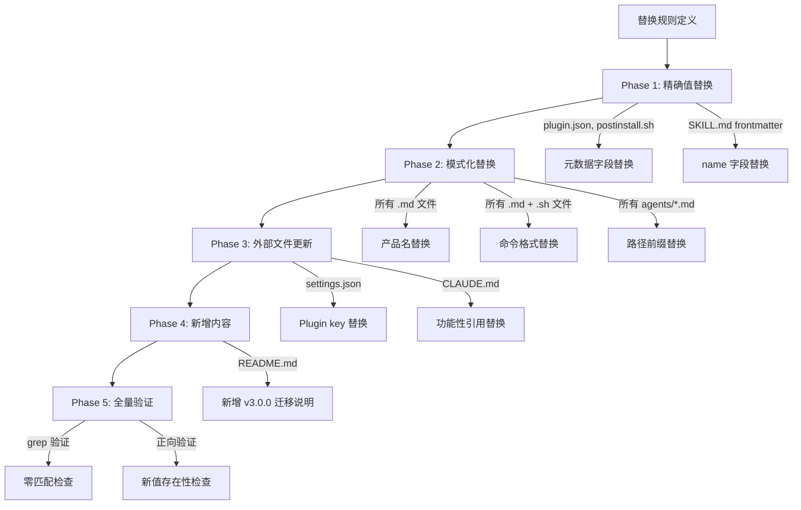

# Implementation Plan: Spec-Driver 重命名 v3.0.0

**Branch**: `feat/rename-spec-driver` | **Date**: 2026-02-15 | **Spec**: [spec.md](./spec.md)
**Input**: Feature specification from `specs/014-rename-spec-driver/spec.md`

## Summary

将 `speckitdriver` plugin 重命名为 `spec-driver`（v3.0.0），涉及 23 个 plugin 内部文件 + 2 个外部配置文件中共 110+ 处旧引用的文本替换。这是一个纯文本替换型任务，不涉及代码逻辑变更。目录结构和 skill 文件夹已提前完成重命名（`plugins/speckitdriver/` -> `plugins/spec-driver/`，`skills/run/` -> `skills/speckit-feature/` 等），本次任务专注于文件内容中残留旧引用的全量清理。

## Technical Context

**Language/Version**: Bash 5.x（脚本）、Markdown（prompt 和模板）、YAML（配置）、JSON（plugin 元数据）
**Primary Dependencies**: 无运行时依赖。纯文本替换操作，使用编辑器直接修改
**Storage**: 文件系统（`plugins/spec-driver/` 目录树，`.claude/settings.json`，`CLAUDE.md`）
**Testing**: 全文搜索验证（`grep -ri "speckitdriver"` 和 `grep -i "Speckit Driver Pro"` 返回零匹配）
**Target Platform**: Claude Code Plugin 系统
**Project Type**: Plugin 配置文件集合（非代码项目）
**Performance Goals**: N/A（一次性批量替换）
**Constraints**: 历史特性编号（如 `011-speckit-driver-pro`）不可修改；迁移说明中对旧命令的引述作为历史记录保留
**Scale/Scope**: 25 个文件，110+ 处替换

## Constitution Check

*GATE: Must pass before Phase 0 research. Re-check after Phase 1 design.*

| 原则 | 适用性 | 评估 | 说明 |
|------|--------|------|------|
| I. AST 精确性优先 | 不适用 | PASS | 本任务不涉及代码结构分析，是纯文本替换 |
| II. 混合分析流水线 | 不适用 | PASS | 本任务不涉及代码分析或 LLM 生成 |
| III. 诚实标注不确定性 | 不适用 | PASS | 本任务不涉及推断性内容生成 |
| IV. 只读安全性 | 部分适用 | PASS | 本任务修改的是 plugin 自身的配置和文档文件，不修改目标源代码（`src/`）。写操作范围限于 `plugins/spec-driver/`、`.claude/settings.json`、`CLAUDE.md` |
| V. 纯 Node.js 生态 | 不适用 | PASS | 本任务不引入任何新依赖 |
| VI. 双语文档规范 | 适用 | PASS | 替换后的文档保持中文散文 + 英文标识符的既有规范 |

**Constitution Check 结果**: 全部 PASS，无 VIOLATION。

## Project Structure

### Documentation (this feature)

```text
specs/014-rename-spec-driver/
├── spec.md              # 需求规范（已有）
└── plan.md              # 本文件
```

### Source Code (affected files)

```text
plugins/spec-driver/                          # plugin 根目录（已重命名）
├── .claude-plugin/plugin.json                # [FR-001] name + version
├── README.md                                 # [FR-010, FR-011] 全文 + 迁移说明
├── skills/
│   ├── speckit-feature/SKILL.md              # [FR-002~004, FR-016] frontmatter + 正文
│   ├── speckit-story/SKILL.md                # [FR-002~004, FR-016] frontmatter + 正文
│   ├── speckit-fix/SKILL.md                  # [FR-002~004, FR-016] frontmatter + 正文
│   ├── speckit-resume/SKILL.md               # [FR-002~004, FR-016] frontmatter + 正文
│   └── speckit-sync/SKILL.md                 # [FR-002~004, FR-017] frontmatter + 正文
├── agents/
│   ├── analyze.md                            # [FR-005, FR-006]
│   ├── checklist.md                          # [FR-005, FR-006]
│   ├── clarify.md                            # [FR-005, FR-006]
│   ├── constitution.md                       # [FR-005, FR-006]
│   ├── implement.md                          # [FR-005, FR-006]
│   ├── plan.md                               # [FR-005, FR-006]
│   ├── product-research.md                   # [FR-005, FR-006]
│   ├── specify.md                            # [FR-005, FR-006]
│   ├── sync.md                               # [FR-005, FR-006]
│   ├── tasks.md                              # [FR-005, FR-006]
│   ├── tech-research.md                      # [FR-005, FR-006]
│   └── verify.md                             # [FR-005, FR-006]
├── scripts/
│   ├── postinstall.sh                        # [FR-007, FR-008]
│   └── init-project.sh                       # [FR-009]
├── templates/
│   ├── spec-driver.config-template.yaml           # [FR-014]
│   └── product-spec-template.md              # [FR-015]

.claude/settings.json                         # [FR-012] enabledPlugins key
CLAUDE.md                                     # [FR-013] 功能性引用（保留历史编号）
```

**Structure Decision**: 本任务不创建新文件或目录。所有操作均为就地编辑（in-place edit）已有文件。

## Architecture

### 替换策略概览



### 替换规则详细定义

替换分为 **精确值替换**（exact match）和 **模式化替换**（pattern-based）两类，执行时必须按规则编号顺序进行，避免先行替换破坏后续规则的匹配目标。

#### 规则执行顺序原则

1. **先长后短**：优先替换较长的字符串（如 `Speckit Driver Pro` 先于 `Speckitdriver` 先于 `speckitdriver`），避免短串替换破坏长串的匹配
2. **先精确后模式**：优先处理有唯一上下文的精确替换，再处理可能出现在多处的模式替换
3. **先内容后迁移说明**：先更新正文内容，最后新增迁移说明（迁移说明中会引述旧命令作为历史参考）

#### 规则清单

| 规则编号 | 类型 | 旧值 | 新值 | 作用范围 | 匹配数 |
|---------|------|------|------|---------|--------|
| R01 | 精确 | `"name": "speckitdriver"` | `"name": "spec-driver"` | plugin.json | 1 |
| R02 | 精确 | `"version": "2.0.0"` (plugin.json) | `"version": "3.0.0"` | plugin.json | 1 |
| R03 | 精确 | `PLUGIN_NAME="Speckitdriver"` | `PLUGIN_NAME="Spec Driver"` | postinstall.sh | 1 |
| R04 | 精确 | `PLUGIN_VERSION="2.0.0"` | `PLUGIN_VERSION="3.0.0"` | postinstall.sh | 1 |
| R05 | 精确 | `.speckitdriver-installed` | `.spec-driver-installed` | postinstall.sh | 1 |
| R06 | 精确 | `"speckitdriver@cc-plugin-market"` | `"spec-driver@cc-plugin-market"` | settings.json | 1 |
| R07 | 精确 | `name: run` (frontmatter) | `name: speckit-feature` | speckit-feature/SKILL.md | 1 |
| R08 | 精确 | `name: story` (frontmatter) | `name: speckit-story` | speckit-story/SKILL.md | 1 |
| R09 | 精确 | `name: fix` (frontmatter) | `name: speckit-fix` | speckit-fix/SKILL.md | 1 |
| R10 | 精确 | `name: resume` (frontmatter) | `name: speckit-resume` | speckit-resume/SKILL.md | 1 |
| R11 | 精确 | `name: sync` (frontmatter) | `name: speckit-sync` | speckit-sync/SKILL.md | 1 |
| R12 | 模式 | `Speckit Driver Pro` | `Spec Driver` | 所有文件 | 3 |
| R13 | 模式 | `# Speckitdriver` (标题行) | `# Spec Driver` | README.md | 1 |
| R14 | 模式 | `Speckitdriver` (角色名/品牌名) | `Spec Driver` | agents/*.md, SKILL.md, scripts/*.sh, README.md, templates/*.md | ~20 |
| R15 | 模式 | `/speckitdriver:run` | `/spec-driver:speckit-feature` | SKILL.md, README.md, postinstall.sh | ~10 |
| R16 | 模式 | `/speckitdriver:story` | `/spec-driver:speckit-story` | SKILL.md, README.md, postinstall.sh | ~5 |
| R17 | 模式 | `/speckitdriver:fix` | `/spec-driver:speckit-fix` | SKILL.md, README.md, postinstall.sh | ~5 |
| R18 | 模式 | `/speckitdriver:resume` | `/spec-driver:speckit-resume` | SKILL.md, README.md, postinstall.sh | ~5 |
| R19 | 模式 | `/speckitdriver:sync` | `/spec-driver:speckit-sync` | SKILL.md, README.md, postinstall.sh | ~5 |
| R20 | 模式 | `plugins/speckitdriver/` | `plugins/spec-driver/` | agents/*.md, SKILL.md | ~15 |
| R21 | 模式 | `claude plugin install speckitdriver` | `claude plugin install spec-driver` | README.md | 1 |
| R22 | 精确 | `speckitdriver 的方式` (CLAUDE.md) | `spec-driver 的方式` | CLAUDE.md | 1 |
| R23 | 内容 | N/A | 新增 v3.0.0 迁移说明 | README.md | 新增段落 |
| R24 | 内容 | README.md 目录结构中 `plugins/speckitdriver/` | `plugins/spec-driver/` | README.md | 1 |
| R25 | 内容 | README.md 目录结构中旧 skill 目录名 | 新 skill 目录名 | README.md | 5 |
| R26 | 模式 | `# Speckitdriver - ` (脚本注释) | `# Spec Driver - ` | postinstall.sh, init-project.sh | 2 |
| R27 | 精确 | `speckitdriver:` (sync.md YAML 示例中) | `spec-driver:` | agents/sync.md | 1 |

### 特殊处理规则

#### 1. 历史特性编号保留

以下引用属于历史记录，**不可修改**：
- `CLAUDE.md` 中的 `011-speckit-driver-pro`（出现在第 19、20、40 行，作为已完成特性的标识符）
- `agents/sync.md` 中 product-mapping.yaml 示例里的 `"011-speckit-driver-pro"`（spec 编号）

#### 2. 迁移说明中的旧命令引述

`README.md` 的 v2.0.0 迁移说明和新增的 v3.0.0 迁移说明中，旧命令作为历史引述保留原值。具体策略：
- v2.0.0 迁移表中的旧列（`/speckit-driver-pro:*`）：保留不变
- v2.0.0 迁移表中的新列（`/speckitdriver:*`）：保留不变（它们现在变成"旧值"列）
- v3.0.0 迁移表：新增，旧列使用 `/speckitdriver:*`，新列使用 `/spec-driver:speckit-*`

#### 3. agents/sync.md YAML 示例中的产品键名

`agents/sync.md` 第 65 行的 YAML 示例中 `speckitdriver:` 作为产品映射 key，需要更新为 `spec-driver:` 以匹配新的 plugin 名称。同时第 66 行描述 `"自治研发编排器 Claude Code Plugin"` 保持不变。

#### 4. description 字段中的 `run/story/fix/resume/sync` 引用

`postinstall.sh` 第 45 行和 `plugin.json` 第 4 行中的"支持 run/story/fix/resume/sync 五种模式"描述虽然旧 skill 名称已经变更，但这些是模式名（mode name）而非命令名，保持原文不影响功能理解。可选择更新为 `speckit-feature/speckit-story/speckit-fix/speckit-resume/speckit-sync` 或保留简称。**建议保留简称**，因为模式概念层级高于命令名。

### 执行阶段划分

#### Phase 1: 元数据精确替换（R01-R06）

替换具有唯一上下文的精确值，不会出现歧义匹配：

| 文件 | 操作 |
|------|------|
| `plugin.json` | R01: name 字段 `speckitdriver` -> `spec-driver`; R02: version 字段 `2.0.0` -> `3.0.0` |
| `postinstall.sh` | R03: PLUGIN_NAME; R04: PLUGIN_VERSION; R05: 安装标记路径; R26: 脚本头注释 |
| `settings.json` | R06: enabledPlugins key |

#### Phase 2: SKILL.md frontmatter 替换（R07-R11）

替换 5 个 SKILL.md 的 frontmatter `name` 字段：

| 文件 | 旧 name | 新 name |
|------|---------|---------|
| `skills/speckit-feature/SKILL.md` | `run` | `speckit-feature` |
| `skills/speckit-story/SKILL.md` | `story` | `speckit-story` |
| `skills/speckit-fix/SKILL.md` | `fix` | `speckit-fix` |
| `skills/speckit-resume/SKILL.md` | `resume` | `speckit-resume` |
| `skills/speckit-sync/SKILL.md` | `sync` | `speckit-sync` |

#### Phase 3: 品牌名替换（R12-R14）

按长度递减顺序：
1. `Speckit Driver Pro` -> `Spec Driver`（3 处，仅在 speckit-sync/SKILL.md）
2. `Speckitdriver` -> `Spec Driver`（~20 处，遍布各文件）

**注意**：R14 替换 `Speckitdriver` 时需确保不影响已被 R12 处理的 `Speckit Driver Pro`。由于 R12 先执行，`Speckit Driver Pro` 已不存在，不会产生冲突。

#### Phase 4: 命令格式替换（R15-R19）

按命令长度递减顺序替换（避免短命令部分匹配）：
1. `/speckitdriver:resume` -> `/spec-driver:speckit-resume`
2. `/speckitdriver:story` -> `/spec-driver:speckit-story`
3. `/speckitdriver:sync` -> `/spec-driver:speckit-sync`
4. `/speckitdriver:run` -> `/spec-driver:speckit-feature`
5. `/speckitdriver:fix` -> `/spec-driver:speckit-fix`

**豁免范围**：v2.0.0 迁移说明中的旧命令引述（README.md 第 129-137 行）。这些行中 `/speckitdriver:*` 作为历史记录保留。处理策略：先将 v2.0.0 迁移表整段标记/隔离，执行替换后恢复，或者在替换时逐文件处理，对 README.md 的迁移表区域单独处理。

**推荐实现方式**：对 README.md 采用逐行精确编辑而非全局替换，确保迁移表中的旧命令不被误改。

#### Phase 5: 路径前缀替换（R20-R21）

1. `plugins/speckitdriver/` -> `plugins/spec-driver/`（~15 处）
2. `claude plugin install speckitdriver` -> `claude plugin install spec-driver`（1 处）

#### Phase 6: 外部文件更新（R22）

1. `CLAUDE.md`：仅替换功能性引用 `speckitdriver 的方式` -> `spec-driver 的方式`，保留所有 `011-speckit-driver-pro` 历史编号

#### Phase 7: 新增内容（R23-R25, R27）

1. README.md：更新目录结构描述（R24-R25）
2. README.md：新增 v3.0.0 迁移说明（R23）
3. agents/sync.md：更新 YAML 示例中的产品键名（R27）

#### Phase 8: 残留清扫

对 Phase 1-7 中可能遗漏的零散 `speckitdriver`（小写）引用执行最终扫描和替换：
- `init-project.sh` 中的注释引用（R26）
- `spec-driver.config-template.yaml` 中的注释引用（R14 覆盖）
- `product-spec-template.md` 中的引用（R14 覆盖）

#### Phase 9: 全量验证

| 验证项 | 方法 | 预期结果 |
|--------|------|---------|
| SC-001 | `grep -ri "speckitdriver" plugins/spec-driver/`（排除迁移说明） | 0 匹配 |
| SC-002 | `grep -i "Speckit Driver Pro" plugins/spec-driver/`（排除迁移说明） | 0 匹配 |
| SC-003 | `grep "speckitdriver" .claude/settings.json` | 0 匹配 |
| SC-004 | 检查 5 个 SKILL.md 的 frontmatter `name` 字段 | 与目录名一致 |
| SC-005 | 读取 `plugin.json` 的 `name` 和 `version` | `spec-driver`、`3.0.0` |
| SC-006 | `grep "speckitdriver" CLAUDE.md` 排除 `011-speckit-driver-pro` | 0 匹配 |
| SC-007 | 统计受影响文件数和替换处数 | ~25 文件，~110+ 处 |
| 正向验证 | `grep -r "spec-driver" plugins/spec-driver/` | 在预期位置出现 |
| 正向验证 | `grep -r "Spec Driver" plugins/spec-driver/` | 在预期位置出现 |

### 受影响文件完整清单（按替换处数排序）

| # | 文件路径 | 旧引用数 | 涉及规则 |
|---|---------|---------|---------|
| 1 | `plugins/spec-driver/README.md` | 23 | R12-R21, R23-R25 |
| 2 | `plugins/spec-driver/skills/speckit-resume/SKILL.md` | 16 | R10, R14, R15, R18, R20 |
| 3 | `plugins/spec-driver/skills/speckit-feature/SKILL.md` | 14 | R07, R14, R15, R20 |
| 4 | `plugins/spec-driver/skills/speckit-story/SKILL.md` | 10 | R08, R14, R15, R16, R20 |
| 5 | `plugins/spec-driver/scripts/postinstall.sh` | 9 | R03-R05, R15-R19, R26 |
| 6 | `plugins/spec-driver/skills/speckit-fix/SKILL.md` | 8 | R09, R14, R15-R17, R20 |
| 7 | `plugins/spec-driver/skills/speckit-sync/SKILL.md` | 5+3 | R11, R12, R14, R15, R19, R20 |
| 8 | `plugins/spec-driver/agents/sync.md` | 3 | R14, R20, R27 |
| 9 | `plugins/spec-driver/agents/tech-research.md` | 2 | R14, R20 |
| 10 | `plugins/spec-driver/agents/product-research.md` | 2 | R14, R20 |
| 11 | `plugins/spec-driver/agents/verify.md` | 2 | R14, R20 |
| 12 | `plugins/spec-driver/scripts/init-project.sh` | 2 | R14, R26 |
| 13 | `plugins/spec-driver/agents/specify.md` | 1 | R14 |
| 14 | `plugins/spec-driver/agents/clarify.md` | 1 | R14 |
| 15 | `plugins/spec-driver/agents/plan.md` | 1 | R14 |
| 16 | `plugins/spec-driver/agents/tasks.md` | 1 | R14 |
| 17 | `plugins/spec-driver/agents/implement.md` | 1 | R14 |
| 18 | `plugins/spec-driver/agents/checklist.md` | 1 | R14 |
| 19 | `plugins/spec-driver/agents/constitution.md` | 1 | R14 |
| 20 | `plugins/spec-driver/agents/analyze.md` | 1 | R14 |
| 21 | `plugins/spec-driver/.claude-plugin/plugin.json` | 1 | R01, R02 |
| 22 | `plugins/spec-driver/templates/spec-driver.config-template.yaml` | 1 | R14 |
| 23 | `plugins/spec-driver/templates/product-spec-template.md` | 1 | R14 |
| 24 | `.claude/settings.json` | 1 | R06 |
| 25 | `CLAUDE.md` | 1 | R22 |
| | **总计** | **~113** | |

### README.md v3.0.0 迁移说明内容

在 v2.0.0 迁移说明之后新增：

```markdown
### 迁移说明（v3.0.0）

Plugin 名称从 `speckitdriver` 更名为 `spec-driver`，技能名统一为 `speckit-*` 前缀：

| 旧命令 (v2.0.0) | 新命令 (v3.0.0) |
| ------ | ------ |
| `/speckitdriver:run <需求>` | `/spec-driver:speckit-feature <需求>` |
| `/speckitdriver:story <需求>` | `/spec-driver:speckit-story <需求>` |
| `/speckitdriver:fix <问题>` | `/spec-driver:speckit-fix <问题>` |
| `/speckitdriver:resume` | `/spec-driver:speckit-resume` |
| `/speckitdriver:sync` | `/spec-driver:speckit-sync` |
```

### README.md 更新后的目录结构

```text
plugins/spec-driver/
├── .claude-plugin/plugin.json    # Plugin 元数据
├── hooks/hooks.json              # SessionStart hook
├── skills/
│   ├── speckit-feature/SKILL.md  # 完整 10 阶段编排
│   ├── speckit-story/SKILL.md    # 快速 5 阶段需求实现
│   ├── speckit-fix/SKILL.md      # 快速 4 阶段问题修复
│   ├── speckit-resume/SKILL.md   # 中断恢复
│   └── speckit-sync/SKILL.md     # 产品规范聚合
├── agents/                       # 12 个子代理 prompt
├── templates/                    # 6 个模板
├── scripts/                      # 初始化脚本
└── README.md
```

## Complexity Tracking

| 决策 | 原因 | 被拒绝的更简单方案 |
|------|------|-------------------|
| 分 9 个 Phase 逐步执行而非一次全局 sed | 需要精确控制替换顺序（先长后短），避免部分匹配导致损坏；需要豁免历史引用和迁移说明 | 全局 `sed -i 's/speckitdriver/spec-driver/g'` 会破坏历史编号和迁移表中的引述 |
| README.md 逐行编辑而非全局替换 | README.md 同时包含需要更新的正文和需要保留的迁移历史引述，全局替换无法区分 | 全局替换后手动恢复迁移表——容易遗漏且不可靠 |
| 保留 `run/story/fix/resume/sync` 模式简称不替换 | 模式名是概念层级，不是命令名，保留简称更利于用户理解 | 全部替换为 `speckit-*` 全名——增加认知负担且不影响功能 |
