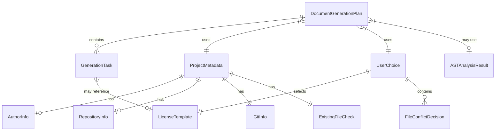
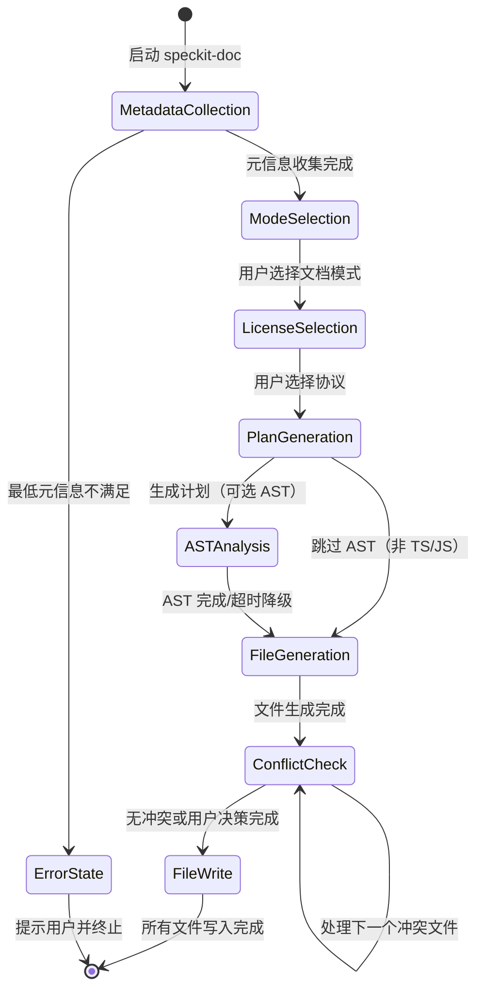

# 数据模型: speckit-doc 命令

**Branch**: `015-speckit-doc-command` | **Date**: 2026-02-15 | **Spec**: [spec.md](spec.md)

> **说明**: speckit-doc 采用 Skill-Only 架构（纯 Prompt 驱动），无 TypeScript 运行时代码。以下数据模型以 TypeScript 接口形式描述，用于规范 Bash 脚本输出的 JSON 结构和 Skill prompt 内部的数据流，而非实际的运行时类型定义。

## 核心实体

### 1. ProjectMetadata（项目元信息）

由 `scan-project.sh` 脚本收集，作为 JSON 输出传递给 Skill prompt。

```typescript
interface ProjectMetadata {
  // === package.json 字段 ===
  name: string;                          // 项目名称，降级: 从目录名推断
  version: string | null;                // 版本号，可能不存在
  description: string | null;            // 项目描述，可能不存在
  license: string | null;                // 已声明的协议标识符（SPDX ID）
  author: AuthorInfo | null;             // 作者信息
  scripts: Record<string, string>;       // npm 脚本命令
  dependencies: Record<string, string>;  // 运行时依赖
  devDependencies: Record<string, string>; // 开发依赖
  repository: RepositoryInfo | null;     // 仓库信息
  main: string | null;                   // 主入口文件（判断库类型）
  bin: Record<string, string> | null;    // CLI 入口（判断 CLI 工具类型）

  // === git 信息 ===
  git: GitInfo;

  // === 项目结构 ===
  directoryTree: string;                 // 顶层目录树（深度 2），文本格式
  projectType: "cli" | "library" | "web-app" | "unknown"; // 从 main/bin 推断

  // === 已有文件检测 ===
  existingFiles: ExistingFileCheck;

  // === 元信息完整度 ===
  hasPackageJson: boolean;
  hasGitRepo: boolean;
  missingFields: string[];               // 缺失字段列表，用于生成 [待补充] 标记
}

interface AuthorInfo {
  name: string;
  email: string | null;
}

interface RepositoryInfo {
  url: string;                           // 仓库完整 URL
  type: string;                          // 通常为 "git"
}

interface GitInfo {
  userName: string | null;               // git config user.name
  userEmail: string | null;              // git config user.email
  remoteUrl: string | null;              // git remote get-url origin
  defaultBranch: string;                 // 默认分支名（main/master）
}

interface ExistingFileCheck {
  "README.md": boolean;
  "LICENSE": boolean;
  "CONTRIBUTING.md": boolean;
  "CODE_OF_CONDUCT.md": boolean;
}
```

**降级策略**:
| 缺失源 | 受影响字段 | 降级行为 |
|--------|-----------|---------|
| 无 package.json | name, version, description 等 | name 从目录名推断；其余标记 `[待补充]` |
| 无 git 仓库 | git.* | 所有 git 字段为 null；badge 和链接使用占位符 |
| package.json 解析失败 | 所有 package.json 字段 | 降级为无 package.json 模式 + 提示用户修复 |
| 无 remote URL | git.remoteUrl | Badge 和仓库链接优雅跳过或使用 `[REPOSITORY_URL]` |

### 2. UserChoice（用户选择）

交互过程中收集的用户决策。

```typescript
interface UserChoice {
  documentationMode: "minimal" | "full";
  licenseType: LicenseType;
  // 以下为冲突处理过程中逐文件收集的决策
  fileConflictDecisions: Record<string, "overwrite" | "skip">;
}

type LicenseType =
  | "MIT"
  | "Apache-2.0"
  | "GPL-3.0"
  | "BSD-2-Clause"
  | "BSD-3-Clause"
  | "ISC"
  | "MPL-2.0"
  | "Unlicense";
```

### 3. LicenseTemplate（协议模板）

静态文件，存储在 `plugins/spec-driver/templates/licenses/` 目录下。

```typescript
interface LicenseTemplate {
  spdxId: LicenseType;                  // SPDX 标准标识符
  fileName: string;                      // 模板文件名，如 "MIT.txt"
  placeholders: {
    year: "[year]";                      // 需替换为当前年份
    fullname: "[fullname]";              // 需替换为版权持有者
  };
  description: string;                   // 一行简要说明（展示在选择列表中）
}
```

**8 种预置协议**:

| SPDX ID | 文件名 | 简要说明 |
|---------|--------|---------|
| MIT | `MIT.txt` | 最宽松，几乎无限制，适合大多数项目 |
| Apache-2.0 | `Apache-2.0.txt` | 宽松 + 专利保护，适合企业级项目 |
| GPL-3.0 | `GPL-3.0.txt` | 强 Copyleft，衍生作品必须同协议开源 |
| BSD-2-Clause | `BSD-2-Clause.txt` | 极简宽松，仅保留版权声明和免责声明 |
| BSD-3-Clause | `BSD-3-Clause.txt` | BSD-2 + 禁止未授权使用作者名字推广 |
| ISC | `ISC.txt` | 类似 MIT，更简洁，Node.js 项目常用 |
| MPL-2.0 | `MPL-2.0.txt` | 文件级 Copyleft，修改的文件需开源，新文件可闭源 |
| Unlicense | `Unlicense.txt` | 公共领域，放弃所有权利 |

### 4. DocumentGenerationPlan（文档生成计划）

Skill prompt 内部使用的中间数据结构，用于编排生成流程。

```typescript
interface DocumentGenerationPlan {
  mode: "minimal" | "full";
  filesToGenerate: GenerationTask[];
  copyrightHolder: string;               // 从 metadata 提取的版权持有者
  copyrightYear: string;                 // 当前年份
  astAnalysisAvailable: boolean;         // AST 分析是否成功
}

interface GenerationTask {
  fileName: string;                      // 目标文件名，如 "README.md"
  targetPath: string;                    // 项目根目录下的完整路径
  exists: boolean;                       // 文件是否已存在
  action: "generate" | "overwrite-with-backup" | "skip"; // 最终决策
  generator: "llm" | "template-copy";   // 生成方式
  // "llm": 由 LLM 通过 prompt 生成（README、CONTRIBUTING）
  // "template-copy": 从静态模板文件复制并替换占位符（LICENSE、CODE_OF_CONDUCT）
}
```

### 5. ASTAnalysisResult（AST 分析结果）

由 `reverse-spec prepare` 命令输出，可选数据源。

```typescript
interface ASTAnalysisResult {
  available: boolean;                    // 分析是否成功（超时或失败时为 false）
  exports: ExportedSymbol[];             // 项目导出的公共符号
  entryPoints: string[];                 // 入口文件列表
  fallbackReason?: string;               // 降级原因（如 "ast-timeout", "not-ts-project"）
}

interface ExportedSymbol {
  name: string;                          // 符号名称
  kind: "function" | "class" | "interface" | "type" | "variable" | "enum";
  signature: string;                     // 类型签名
  filePath: string;                      // 所在文件
  description?: string;                  // JSDoc 描述（如有）
}
```

## 实体关系



## 数据流

```text
[scan-project.sh]
       |
       v
  ProjectMetadata (JSON)
       |
       +---> [Skill prompt: 展示交互选项]
       |              |
       |              v
       |        UserChoice
       |              |
       +---> [AST 分析 (可选)]
       |              |
       |              v
       |        ASTAnalysisResult
       |              |
       +----+---------+
            |
            v
   DocumentGenerationPlan
            |
            v
   [逐文件生成 + 冲突处理]
            |
            v
   README.md / LICENSE / CONTRIBUTING.md / CODE_OF_CONDUCT.md
```

## 状态转换

### 文档生成流程状态机


