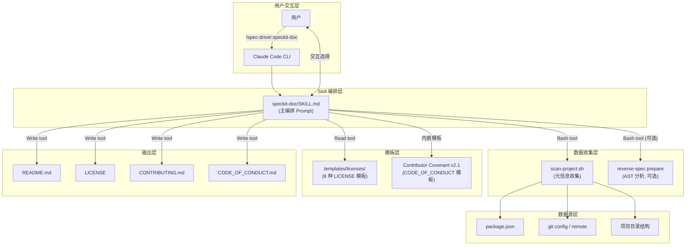
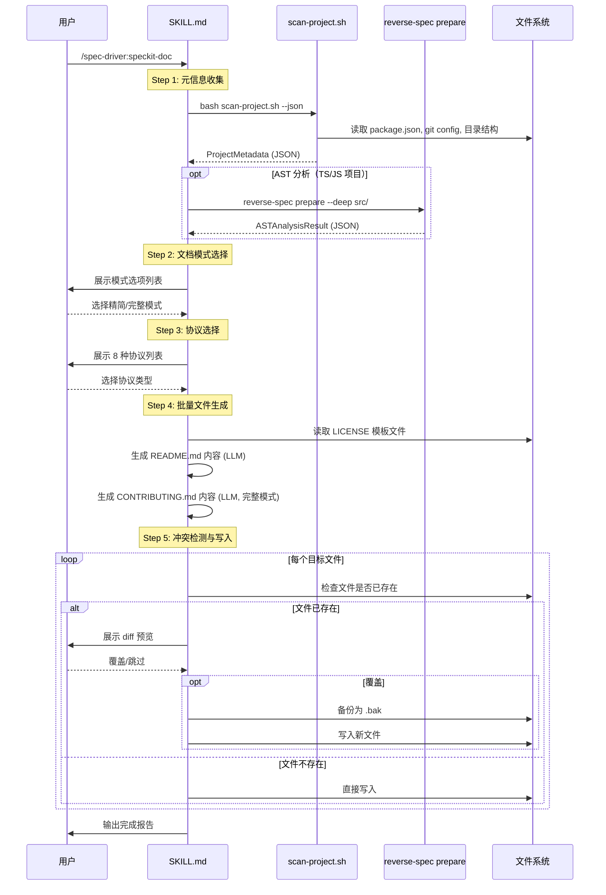

# Implementation Plan: speckit-doc 命令

**Branch**: `015-speckit-doc-command` | **Date**: 2026-02-15 | **Spec**: [spec.md](spec.md)
**Input**: Feature specification from `/specs/015-speckit-doc-command/spec.md`

## Summary

speckit-doc 是 speckit 工具链的文档生成命令，用于一键生成 README.md、LICENSE、CONTRIBUTING.md、CODE_OF_CONDUCT.md 等开源项目标准文档。采用 **Skill-Only 架构**（纯 Prompt 驱动），零新增 TypeScript 代码，所有实现文件位于 `plugins/spec-driver/` 目录内。通过 Bash 脚本收集项目元信息，间接调用 `reverse-spec prepare` 获取 AST 分析结果，LLM 生成高质量 Markdown 文档，静态模板文件保障 LICENSE 法律文本的 100% 精确性。

**核心技术决策**:
- 架构方案: Skill-Only（与现有 5 个 speckit Skill 一致）
- LICENSE 文本: 静态 `.txt` 文件，8 种主流协议，禁止 LLM 生成
- 交互机制: "展示选项 -> 用户回复"模式（与质量门机制一致）
- AST 分析: 通过 `reverse-spec prepare` CLI 命令间接使用
- 文件安全: 默认不覆盖 + diff 预览 + `.bak` 备份
- 文档语言: 英文（开源社区国际化惯例）

## Technical Context

**Language/Version**: Bash 5.x（脚本）、Markdown（Skill prompt 和模板）
**Primary Dependencies**: 无新增运行时依赖。Skill 完全由 Markdown prompt、Bash 脚本和静态文本文件构成，运行在 Claude Code 沙箱中
**Storage**: 文件系统（项目根目录写入 README.md、LICENSE 等；`plugins/spec-driver/` 目录下新增 Skill 文件）
**Testing**: 集成测试（在 3 种不同类型 Node.js 项目上手动验证）；无单元测试（Skill-Only 架构不涉及 TypeScript 代码）
**Target Platform**: Claude Code 沙箱（macOS/Linux），Node.js LTS (>=20.x) 环境
**Project Type**: Plugin（Claude Code Skill）
**Performance Goals**: 端到端时间 < 3 分钟（含交互选择时间）
**Constraints**: 零新增 TypeScript 代码；不修改现有源码；所有变更仅在 `plugins/spec-driver/` 目录内
**Scale/Scope**: 10 个新增文件（1 个 SKILL.md + 1 个 Bash 脚本 + 8 个 LICENSE 模板），0 个修改文件

## Constitution Check

*GATE: Must pass before Phase 0 research. Re-check after Phase 1 design.*

| 原则 | 适用性 | 评估 | 说明 |
|------|--------|------|------|
| I. AST 精确性优先 | 部分适用 | PASS | speckit-doc 通过 `reverse-spec prepare` 间接使用 AST 分析增强 README 功能特性章节。AST 数据来源于 ts-morph，满足精确性要求。LLM 仅负责自然语言描述，不生成结构化数据 |
| II. 混合分析流水线 | 部分适用 | PASS | speckit-doc 遵循 Pipeline 模式: scan-project.sh 预处理 -> Skill prompt 上下文组装 -> LLM 生成文档。原始源代码不直接输入 LLM，通过 AST 提取的 Skeleton 和 package.json 元数据间接使用 |
| III. 诚实标注不确定性 | 适用 | PASS | 降级场景中缺失信息标记为 `[待补充]`；AST 分析不可用时明确标注"基于包声明"而非"基于代码分析" |
| IV. 只读安全性 | 需注意 | PASS（有条件） | speckit-doc 写入项目根目录（README.md、LICENSE 等），超出 specs/ 范围。通过以下机制满足安全性要求: (1) 所有写入前展示文件列表供用户确认；(2) 默认不覆盖已有文件；(3) 覆盖前自动备份；(4) Claude Code 权限系统额外确认 |
| V. 纯 Node.js 生态 | 完全适用 | PASS | 零新增运行时依赖。Bash 脚本仅用于数据收集（非运行时依赖）。所有功能基于 Claude Code 内置能力 + 项目现有基础设施 |
| VI. 双语文档规范 | 部分适用 | PASS（有豁免） | speckit-doc 生成的文档（README、CONTRIBUTING、CODE_OF_CONDUCT）使用英文，这与 Constitution 的"中文散文"要求不同。但此为有意设计: 开源文档面向国际社区，英文是行业惯例。此豁免仅限于 speckit-doc 生成的面向用户的开源文档，不影响 spec/plan 等内部设计文档的中文要求 |

**Constitution Check 总结**: 6 项原则全部 PASS。原则 VI 有条件豁免（开源文档使用英文），理由充分且范围明确。原则 IV 通过多层安全机制满足。

**Post-Phase 1 Re-check**: 设计完成后重新评估——所有契约和数据模型均在 Skill-Only 架构框架内，未引入额外的技术栈或依赖。原则 IV 的写入安全性通过 `contracts/skill-interaction-flow.md` 中定义的逐文件冲突处理协议保障。确认 PASS。

## Project Structure

### Documentation (this feature)

```text
specs/015-speckit-doc-command/
├── plan.md              # 本文件
├── spec.md              # 需求规范
├── research.md          # Phase 0 技术决策研究
├── data-model.md        # Phase 1 数据模型
├── quickstart.md        # Phase 1 快速上手指南
├── contracts/           # Phase 1 接口契约
│   ├── scan-project-output.md    # scan-project.sh 输出格式
│   ├── skill-interaction-flow.md # Skill 交互流程协议
│   └── license-template-format.md # LICENSE 模板文件格式
├── research/            # 前序调研制品
│   ├── product-research.md
│   ├── tech-research.md
│   └── research-synthesis.md
└── checklists/          # 质量检查表
```

### Source Code (repository root)

```text
plugins/spec-driver/
├── skills/
│   ├── speckit-feature/SKILL.md     # 现有 Skill（参考模板）
│   ├── speckit-story/SKILL.md       # 现有 Skill
│   ├── speckit-fix/SKILL.md         # 现有 Skill
│   ├── speckit-resume/SKILL.md      # 现有 Skill
│   ├── speckit-sync/SKILL.md        # 现有 Skill
│   └── speckit-doc/                 # *** 新增 ***
│       └── SKILL.md                 # 主 Skill prompt（~400-600 行）
├── scripts/
│   ├── init-project.sh              # 现有脚本（参考模板）
│   ├── postinstall.sh               # 现有脚本
│   └── scan-project.sh              # *** 新增 *** 项目元信息收集脚本
└── templates/
    ├── spec-driver.config-template.yaml  # 现有模板
    ├── product-research-template.md # 现有模板
    └── licenses/                    # *** 新增 *** LICENSE 模板目录
        ├── MIT.txt
        ├── Apache-2.0.txt
        ├── GPL-3.0.txt
        ├── BSD-2-Clause.txt
        ├── BSD-3-Clause.txt
        ├── ISC.txt
        ├── MPL-2.0.txt
        └── Unlicense.txt
```

**Structure Decision**: 采用 Plugin 目录结构，所有新增文件位于 `plugins/spec-driver/` 内。与 speckit-feature 等现有 Skill 保持一致的目录组织模式: `skills/{name}/SKILL.md` + `scripts/{name}.sh` + `templates/{category}/`。

## Architecture

### 系统架构图



### 端到端流程图



### 文件生成策略矩阵

| 文件 | 生成方式 | 数据源 | 精简模式 | 完整模式 |
|------|---------|--------|---------|---------|
| README.md | LLM 生成 | ProjectMetadata + ASTAnalysisResult(可选) | 生成（贡献章节内联简化） | 生成（贡献章节链接 CONTRIBUTING.md） |
| LICENSE | 模板复制 + 占位符替换 | LicenseTemplate + 版权信息 | 生成 | 生成 |
| CONTRIBUTING.md | LLM 生成 | ProjectMetadata.scripts | 不生成 | 生成 |
| CODE_OF_CONDUCT.md | 静态模板 + 联系方式填充 | Contributor Covenant v2.1 + 作者邮箱 | 不生成 | 生成 |

### README.md 章节结构

```markdown
<!-- speckit:section:badges -->

...badges...
<!-- speckit:section:badges:end -->

# {project-name}

<!-- speckit:section:description -->
{project description}
<!-- speckit:section:description:end -->

<!-- speckit:section:features -->
## Features
{功能特性 — AST 增强时列出实际导出模块}
<!-- speckit:section:features:end -->

<!-- speckit:section:getting-started -->
## Getting Started
### Prerequisites
### Installation
<!-- speckit:section:getting-started:end -->

<!-- speckit:section:usage -->
## Usage
{使用示例 — 从 main/bin 推断 CLI vs Library}
<!-- speckit:section:usage:end -->

<!-- speckit:section:project-structure -->
## Project Structure
{目录树}
<!-- speckit:section:project-structure:end -->

<!-- speckit:section:tech-stack -->
## Tech Stack
{从 dependencies 提取}
<!-- speckit:section:tech-stack:end -->

<!-- speckit:section:testing -->
## Testing
{从 scripts 提取测试命令}
<!-- speckit:section:testing:end -->

<!-- speckit:section:contributing -->
## Contributing
{精简模式: 内联简化 / 完整模式: 链接 CONTRIBUTING.md}
<!-- speckit:section:contributing:end -->

<!-- speckit:section:license -->
## License
{协议声明 + 链接}
<!-- speckit:section:license:end -->
```

### SKILL.md 内部架构

```text
SKILL.md 内部结构（~400-600 行）:

[1] Frontmatter（元数据）
    - name: speckit-doc
    - description: 生成 README 等开源标准文档

[2] 角色定义
    - 定位: 开源文档生成专家
    - 职责: 分析项目 -> 收集选择 -> 生成文档

[3] 触发方式与参数解析
    - /spec-driver:speckit-doc

[4] 前置检查
    - 验证项目目录有效性
    - 执行 scan-project.sh
    - 可选: AST 分析

[5] 交互流程
    - Step 2: 文档模式选择
    - Step 3: 协议选择

[6] 文档生成模板
    - [6a] README.md 章节定义（含 HTML 注释标记）
    - [6b] CONTRIBUTING.md 章节定义
    - [6c] CODE_OF_CONDUCT.md 处理逻辑
    - [6d] LICENSE 处理逻辑

[7] 冲突处理流程
    - 逐文件检测 + diff + 备份

[8] 完成报告
    - 生成文件清单 + 缺失字段提醒

[9] 降级与错误处理
    - 非 Node.js 项目降级
    - 空项目终止
    - AST 超时降级
    - package.json 解析失败
```

### 降级策略矩阵

| 降级场景 | 触发条件 | 行为 | 影响范围 |
|---------|---------|------|---------|
| 无 package.json | `hasPackageJson == false` | 项目名从目录名推断；安装/使用/脚本章节标注 `[待补充]` | README 多个章节 |
| 无 git 仓库 | `hasGitRepo == false` | Badge 和链接使用占位符；作者信息标注 `[待补充]` | README Badge、LICENSE 版权持有者 |
| AST 分析超时 | `reverse-spec prepare` 60s 超时 | 功能特性章节基于 package.json description | README Features 章节 |
| AST 分析不可用 | 非 TS/JS 项目或命令不存在 | 同 AST 超时 | README Features 章节 |
| package.json 解析失败 | JSON 语法错误 | 降级为无 package.json 模式 + 提示修复 | 同"无 package.json" |
| 无远程仓库 URL | `git.remoteUrl == null` | Badge 和仓库链接优雅跳过 | README Badge、链接 |
| 完全空项目 | 无 package.json 且无 git | 终止生成，提示 `git init` + `npm init` | 整个流程 |

## Complexity Tracking

| 项目 | 说明 | 简单替代方案未采用的原因 |
|------|------|----------------------|
| Constitution 原则 VI 豁免 | 开源文档使用英文而非中文 | 中文文档不符合开源社区国际化惯例，会限制项目的国际受众。豁免范围明确且仅限于面向用户的开源文档 |
| HTML 注释标记预埋 | README 中预埋 `<!-- speckit:section:* -->` | 不预埋标记的简单方案无法支持二期 `--update` 功能的渐进式演进。标记在渲染时完全隐藏，零用户感知成本 |
| scan-project.sh 独立脚本 | 新增 Bash 脚本而非 Skill prompt 直接读取 | Skill prompt 直接读取需要多次 Read tool 调用，效率低且目录树生成不可靠。独立脚本一次调用收集所有数据 |
