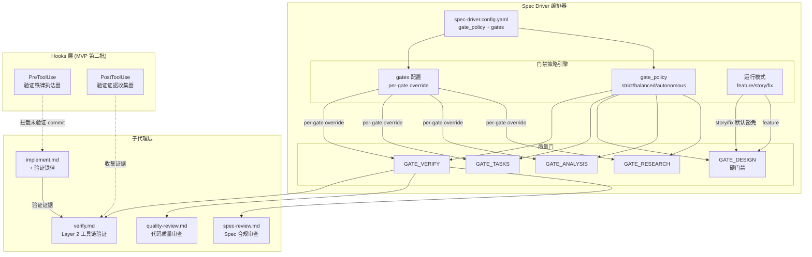
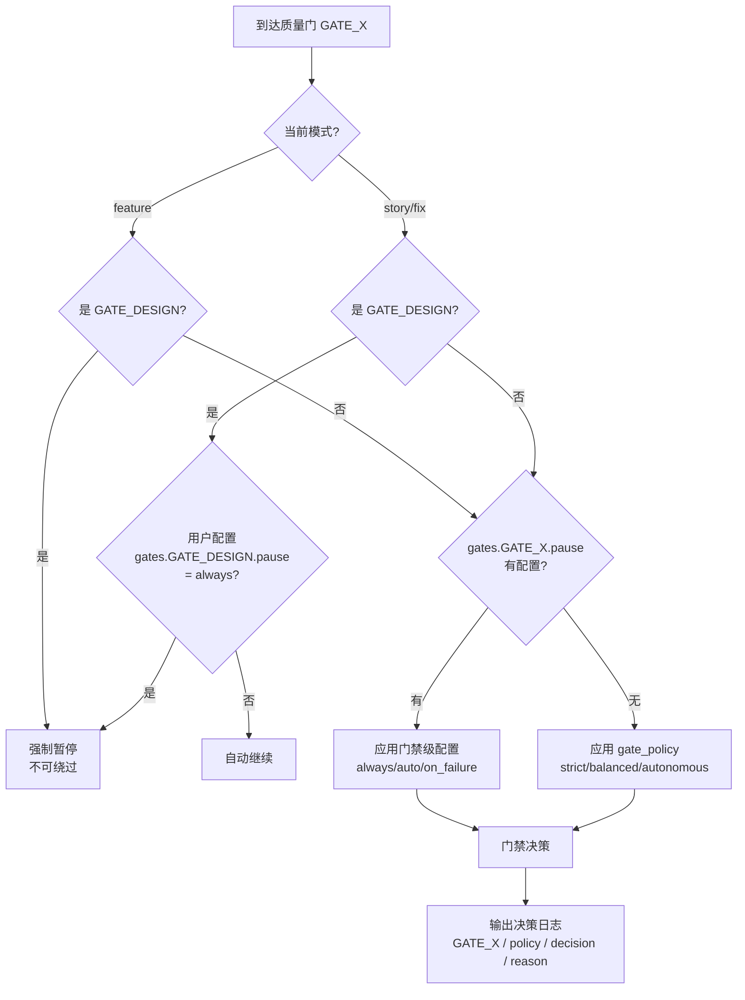
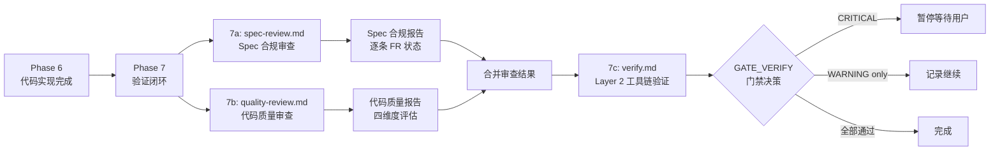
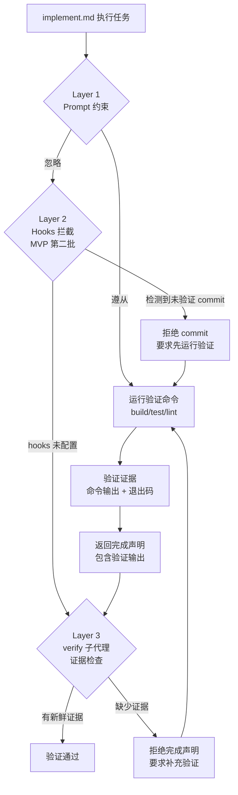

# Implementation Plan: 借鉴 Superpowers 行为约束模式与增强人工控制权

**Branch**: `017-adopt-superpowers-patterns` | **Date**: 2026-02-27 | **Spec**: [spec.md](spec.md)
**Input**: Feature specification from `/specs/017-adopt-superpowers-patterns/spec.md`

## Summary

将 Superpowers 的质量约束理念（验证铁律、双阶段审查、设计硬门禁）嫁接到 Spec Driver 的编排层之上，同时新增三级门禁策略（strict/balanced/autonomous）实现可配置的人工控制权。采用方案 B（Hooks + Prompt 混合架构），MVP 第一批交付 Prompt 层——修改 implement.md/verify.md 植入验证铁律、新增 spec-review.md/quality-review.md 双阶段审查子代理、扩展编排器门禁逻辑和配置结构。零新增运行时依赖，全部通过 Markdown prompt、YAML 配置和 Shell 脚本实现。

## Technical Context

**Language/Version**: Bash 5.x（脚本）、Markdown（prompt 和模板）、YAML（配置）
**Primary Dependencies**: 无新增运行时依赖。Plugin 完全由 Markdown prompt、YAML 配置和 Shell 脚本构成，运行在 Claude Code 沙箱中
**Storage**: 文件系统（`plugins/spec-driver/` 目录下的 agents、skills、templates、scripts）
**Testing**: 手动验证——在三种模式（feature/story/fix）x 三种策略（strict/balanced/autonomous）下运行完整流程
**Target Platform**: Claude Code 沙箱（macOS/Linux），hooks 脚本二期扩展 Windows 支持
**Project Type**: Plugin（Markdown prompt + YAML config + Shell scripts）
**Performance Goals**: 门禁决策逻辑不增加可感知的延迟（< 1s）；双阶段审查在 balanced 模式下可并行执行以控制总耗时
**Constraints**: 零新增 npm 依赖；配置新增字段不超过 3 个顶层配置项（SC-008）；向后兼容（未配置新字段时行为不变）
**Scale/Scope**: 修改 7 个现有文件 + 新增 2 个子代理 Markdown 文件

## Constitution Check

*GATE: Must pass before Phase 0 research. Re-check after Phase 1 design.*

| 原则 | 适用性 | 评估 | 说明 |
|------|--------|------|------|
| I. AST 精确性优先 | 不适用 | PASS | 本特性不涉及 AST 分析或结构化数据提取。所有变更限于 Markdown prompt、YAML 配置和 Shell 脚本 |
| II. 混合分析流水线 | 不适用 | PASS | 本特性不涉及代码分析流水线。子代理审查（spec-review/quality-review）属于 LLM 推理范畴，非 AST 预处理 |
| III. 诚实标注不确定性 | 适用 | PASS | spec-review.md 输出的 FR 状态（已实现/部分实现/未实现/过度实现）是确定性判断，不涉及推测。quality-review.md 的问题发现如有不确定性将标注 [推断] |
| IV. 只读安全性 | 适用 | PASS | spec-review.md 和 quality-review.md 是只读审查子代理，不修改源代码。verify.md 的 Layer 2 工具链验证仅执行构建/测试命令，不含写操作 |
| V. 纯 Node.js 生态 | 适用 | PASS | 零新增运行时依赖。hooks 脚本（MVP 第二批）使用 Shell + jq（系统工具），不引入非 Node.js 运行时 |
| VI. 双语文档规范 | 适用 | PASS | 新增子代理 prompt 和配置遵循中文散文 + 英文代码标识符规范 |

**Constitution Check 结论**: 全部 PASS，无 VIOLATION。

## Project Structure

### Documentation (this feature)

```text
specs/017-adopt-superpowers-patterns/
├── plan.md              # 本文件（技术规划）
├── research.md          # Phase 0 技术决策研究
├── quickstart.md        # 快速上手指南
├── spec.md              # 需求规范（已有）
├── research/            # 产研调研（已有）
│   ├── product-research.md
│   ├── tech-research.md
│   └── research-synthesis.md
├── checklists/          # 质量检查表（已有）
│   ├── requirements.md
│   └── quality.md
└── tasks.md             # 任务分解（由 /speckit.tasks 生成）
```

### Source Code (repository root)

```text
plugins/spec-driver/
├── agents/
│   ├── implement.md          # [修改] 植入验证铁律约束段落
│   ├── verify.md             # [修改] 增加验证证据检查 + 双阶段触发
│   ├── spec-review.md        # [新增] Spec 合规审查子代理
│   ├── quality-review.md     # [新增] 代码质量审查子代理
│   ├── constitution.md       # [不变]
│   ├── specify.md            # [不变]
│   ├── clarify.md            # [不变]
│   ├── checklist.md          # [不变]
│   ├── plan.md               # [不变]
│   ├── tasks.md              # [不变]
│   ├── analyze.md            # [不变]
│   ├── product-research.md   # [不变]
│   ├── tech-research.md      # [不变]
│   └── sync.md               # [不变]
├── skills/
│   ├── speckit-feature/
│   │   └── SKILL.md          # [修改] 编排器新增门禁策略逻辑 + GATE_DESIGN
│   ├── speckit-story/
│   │   └── SKILL.md          # [修改] 编排器新增门禁策略逻辑 + GATE_DESIGN 豁免
│   ├── speckit-fix/
│   │   └── SKILL.md          # [修改] 编排器新增门禁策略逻辑 + GATE_DESIGN 豁免
│   ├── speckit-resume/
│   │   └── SKILL.md          # [不变]
│   ├── speckit-sync/
│   │   └── SKILL.md          # [不变]
│   └── speckit-doc/
│       └── SKILL.md          # [不变]
├── templates/
│   └── spec-driver.config-template.yaml  # [修改] 新增 gate_policy + gates 配置段
├── scripts/
│   └── init-project.sh       # [修改] 支持新配置字段初始化引导
└── hooks/                     # [新增目录, MVP 第二批]
    ├── pre-commit-verify.sh   # [MVP 第二批] PreToolUse hook
    └── post-verify-collect.sh # [MVP 第二批] PostToolUse hook

# 项目根目录
spec-driver.config.yaml             # [修改] 同步新增配置字段（项目级示例）
```

**Structure Decision**: 本特性完全在 `plugins/spec-driver/` Plugin 目录内操作，不涉及 `src/` 或 `tests/` 目录。所有变更通过 Markdown prompt 修改和 YAML 配置扩展实现，保持"纯 Markdown plugin"架构。

## Architecture

### 整体架构



### 门禁决策流程



### 双阶段审查流程



### 验证铁律三层防线



## 文件变更详细设计

### 1. implement.md — 植入验证铁律

**变更位置**: 在"约束"章节之前新增"验证铁律"章节

**新增内容概要**:
- 铁律规则段落：声明完成前必须运行验证命令
- "excuse vs reality"对照表：列出禁止的推测性表述和要求的实际证据格式
- 完成声明模板：要求包含命令名称、退出码、输出摘要
- 无可用验证工具的降级处理：标注"无可用验证工具"，不阻断

**设计要点**:
- 铁律文本使用大写强调（`MUST`、`NEVER`），参考 Superpowers 的 verification-before-completion 格式
- 铁律段落放在执行流程的"Phase 完成验证"步骤中，确保在每个 Phase 结束时触发
- 新增"验证命令执行"步骤：在"进度追踪"之后、"Phase 完成验证"之前

### 2. verify.md — 双阶段触发 + 验证证据检查

**变更概要**:
- Layer 1 的逐条 FR 检查能力移至 spec-review.md（由编排器在 7a 调用）
- 新增"验证证据检查"步骤：检查 implement 子代理返回中是否包含实际运行的验证命令输出
- 保留 Layer 2 工具链验证能力不变
- 在报告中新增"验证铁律合规"章节

**设计要点**:
- verify.md 的核心职责从"Spec-Code 对齐 + 工具链验证"简化为"工具链验证 + 验证证据核查"
- 验证证据检查规则：检查返回消息中是否包含验证命令的实际输出文本（非引用性描述），如 `npm test` 输出、构建日志等
- 如果检测到推测性表述（"should pass"等），在报告中标记为 EVIDENCE_MISSING

### 3. spec-review.md — Spec 合规审查子代理（新增）

**职责**: 逐条检查 spec.md 中的每个功能需求（FR）的实现状态

**输入**:
- `{feature_dir}/spec.md`（需求规范）
- `{feature_dir}/tasks.md`（任务清单 + 完成状态）
- 项目源代码（通过 Glob/Read 访问）

**输出**: Spec 合规审查报告，包含：
- 逐条 FR 状态表：FR 编号 | 描述 | 状态（已实现/部分实现/未实现/过度实现）| 证据/说明
- 总体合规率：{M}/{K} FR 已实现
- 偏差清单：每个非"已实现"的 FR 的详细说明和修复建议
- 过度实现检测：不在 spec.md 中的额外功能

**工具权限**: Read、Glob、Grep（只读）

**设计要点**:
- 从 verify.md Layer 1 演化而来，但提供更精细的状态输出
- 状态判定标准明确：
  - 已实现：对应 task checkbox 已勾选 + 代码文件存在且内容合理
  - 部分实现：task 已勾选但代码不完整或有明显缺陷
  - 未实现：task 未勾选或对应代码不存在
  - 过度实现：代码中发现 spec 未定义的功能

### 4. quality-review.md — 代码质量审查子代理（新增）

**职责**: 从设计模式、安全性、性能、可维护性四个维度评估代码质量

**输入**:
- `{feature_dir}/plan.md`（技术计划——参考架构决策）
- `{feature_dir}/spec.md`（需求规范——参考边界条件）
- 项目源代码（通过 Glob/Read 访问，聚焦本特性变更的文件）

**输出**: 代码质量审查报告，包含：
- 四维度评估表：
  - 设计模式合理性：架构决策是否符合 plan.md、是否过度工程
  - 安全性：硬编码密钥、SQL 注入、XSS、不安全的反序列化等
  - 性能：N+1 查询、内存泄漏风险、不必要的同步操作等
  - 可维护性：过长函数（>50 行）、缺少注释、命名不清晰、重复代码等
- 问题清单：严重程度（CRITICAL/WARNING/INFO）| 位置 | 描述 | 修复建议
- 总体质量评级：EXCELLENT / GOOD / NEEDS_IMPROVEMENT / POOR

**工具权限**: Read、Glob、Grep（只读）

**设计要点**:
- 四维度评估是 verify.md 完全不覆盖的新能力
- 安全性检查聚焦 OWASP Top 10 中的常见模式
- 对于纯 Markdown/YAML/Shell 项目（如 Spec Driver 本身），性能和安全维度可标注"不适用"
- 问题分级标准：
  - CRITICAL：安全漏洞、数据丢失风险、构建阻断
  - WARNING：性能隐患、设计偏离、缺少错误处理
  - INFO：命名建议、注释缺失、轻微重复

### 5. SKILL.md (speckit-feature) — 编排器门禁逻辑

**变更概要**: 在编排器中新增门禁策略引擎和 GATE_DESIGN 暂停点

**新增内容**:

#### 5a. 初始化阶段新增——门禁配置加载

在"配置加载"步骤后新增：
- 读取 `gate_policy` 字段（默认 balanced）
- 读取 `gates` 字段（默认空）
- 构建"门禁行为表"：为每个已知门禁确定 pause 行为

```text
门禁行为表构建逻辑:

  各模式的门禁子集:
    feature 模式: GATE_RESEARCH, GATE_DESIGN, GATE_ANALYSIS, GATE_TASKS, GATE_VERIFY（全部 5 个）
    story 模式:   GATE_DESIGN, GATE_TASKS, GATE_VERIFY（3 个，无 GATE_RESEARCH/GATE_ANALYSIS）
    fix 模式:     GATE_DESIGN, GATE_VERIFY（2 个，无 GATE_RESEARCH/GATE_ANALYSIS/GATE_TASKS）

  仅为当前模式存在的门禁构建行为表:
  for GATE in [当前模式的门禁子集]:
    if gates.{GATE}.pause 有配置:
      behavior[GATE] = gates.{GATE}.pause  // always | auto | on_failure
    else:
      根据 gate_policy 应用默认行为:
        strict:     behavior[GATE] = always
        balanced:   behavior[GATE] = balanced 默认值（关键门禁 always，非关键 on_failure）
        autonomous: behavior[GATE] = on_failure
```

balanced 默认值表:

| 门禁 | 默认行为 | 分类 |
|------|---------|------|
| GATE_RESEARCH | auto | 非关键 |
| GATE_ANALYSIS | on_failure | 非关键（CRITICAL 时暂停） |
| GATE_DESIGN | always | 关键（且硬门禁） |
| GATE_TASKS | always | 关键 |
| GATE_VERIFY | always | 关键 |

#### 5b. Phase 3 后新增——GATE_DESIGN 暂停点

在 Phase 3（需求澄清 + 质量检查表）完成后、Phase 4（技术规划）之前插入。这确保用户审批的是**已澄清**的 spec（而非初稿），减少"澄清后发现需要重新审批"的风险：

```text
### Phase 3.5: 设计门禁 [GATE_DESIGN]

**此阶段由编排器亲自执行。**

1. 检查运行模式:
   - feature 模式 → GATE_DESIGN 强制暂停（不检查配置，硬门禁）
   - story/fix 模式 → 检查 gates.GATE_DESIGN.pause:
     - 如果为 "always" → 暂停
     - 否则 → 自动继续（默认豁免）

2. 如果决策为暂停:
   展示 spec.md 关键摘要（User Stories 数量、FR 数量、成功标准）
   等待用户选择：
   A) 批准继续 → 进入 Phase 4（技术规划）
   B) 修改需求 → 重跑 Phase 2/3（需求规范/澄清）
   C) 中止流程

3. 输出门禁决策日志:
   [GATE] GATE_DESIGN | mode={mode} | policy={gate_policy} | decision={PAUSE|AUTO_CONTINUE} | reason={理由}
```

#### 5c. 各质量门——门禁策略条件分支

修改现有的 GATE_RESEARCH、GATE_ANALYSIS、GATE_TASKS、GATE_VERIFY，在每个质量门增加条件分支：

```text
质量门 N（GATE_X）:
  1. 获取 behavior[GATE_X]
  2. 根据 behavior 决策:
     - always → 暂停展示结果，等待用户选择
     - auto → 自动继续（仅在日志中记录）
     - on_failure → 检查结果:
       - 有 CRITICAL 问题 → 暂停
       - 仅 WARNING 或全部通过 → 自动继续
  3. 输出门禁决策日志:
     [GATE] GATE_X | policy={gate_policy} | override={有/无} | decision={PAUSE|AUTO_CONTINUE} | reason={理由}
```

#### 5d. Phase 7——双阶段审查编排

将现有 Phase 7 拆分为 3 个子调用：

```text
### Phase 7: 验证闭环 [10/10]

`[10/10] 正在执行验证闭环...`

#### Phase 7a: Spec 合规审查

读取 spec-review.md prompt，调用 Task(
  description: "Spec 合规审查",
  prompt: "{spec-review prompt}" + "{上下文注入 + spec.md + tasks.md 路径}",
  model: "{config.agents.verify.model}"
)

#### Phase 7b: 代码质量审查

读取 quality-review.md prompt，调用 Task(
  description: "代码质量审查",
  prompt: "{quality-review prompt}" + "{上下文注入 + plan.md + spec.md 路径}",
  model: "{config.agents.verify.model}"
)

注：Phase 7a 和 7b 可串行或并行执行。balanced/autonomous 模式建议并行。

#### Phase 7c: 工具链验证

读取 verify.md prompt，调用 Task(
  description: "工具链验证 + 验证证据核查",
  prompt: "{verify prompt}" + "{上下文注入 + spec.md + tasks.md + 7a/7b 报告路径}",
  model: "{config.agents.verify.model}"
)

#### 质量门 (GATE_VERIFY)

合并 7a/7b/7c 三份报告的结果:
  - 任一报告有 CRITICAL → 按 behavior[GATE_VERIFY] 决策（可能暂停）
  - 仅 WARNING → 记录自动继续
  - 全部通过 → 自动完成
```

### 6. SKILL.md (speckit-story) — Story 模式门禁适配

**变更概要**: 与 speckit-feature 类似的门禁策略逻辑，但 GATE_DESIGN 默认豁免

**差异点**:
- 初始化阶段：同样加载 gate_policy + gates 配置
- GATE_DESIGN 处理：默认 auto（跳过），除非 gates.GATE_DESIGN.pause = "always"
- 其他质量门：与 feature 模式行为一致

### 7. SKILL.md (speckit-fix) — Fix 模式门禁适配

**变更概要**: 与 speckit-story 类似的门禁策略逻辑

**差异点**:
- GATE_DESIGN 处理：默认 auto（跳过），与 story 模式一致
- Fix 模式只有 4 个阶段（诊断-规划-修复-验证），门禁点较少
- GATE_VERIFY 行为与 feature/story 模式一致

### 8. spec-driver.config-template.yaml — 配置扩展

在现有 `quality_gates` 章节之后新增：

```yaml
# ═══════════════════════════════════════
# 门禁策略
# ═══════════════════════════════════════
# 控制质量门（Quality Gate）在流程中的暂停行为
#
# strict:     所有门禁暂停等待确认（最高人工控制权）
# balanced:   关键门禁暂停，非关键自动继续（默认，推荐）
# autonomous: 仅失败或 CRITICAL 问题时暂停（最低中断）
#
# 注：GATE_DESIGN 在 feature 模式下始终暂停（硬门禁），不受此配置影响
gate_policy: balanced

# ═══════════════════════════════════════
# 门禁级配置（高级，可选）
# ═══════════════════════════════════════
# 对每个门禁独立配置，优先于 gate_policy
# 可选值: always（始终暂停）| auto（始终自动继续）| on_failure（仅失败时暂停）
#
# gates:
#   GATE_RESEARCH:
#     pause: auto
#   GATE_DESIGN:
#     pause: always
#   GATE_ANALYSIS:
#     pause: auto
#   GATE_TASKS:
#     pause: always
#   GATE_VERIFY:
#     pause: always
```

### 9. init-project.sh — 初始化引导扩展

**变更概要**: 在配置创建引导中增加 gate_policy 选项

**新增逻辑**:
- 在选择 preset 后，新增"门禁策略"选项：
  - `strict` — 适合关键业务代码，所有门禁暂停
  - `balanced`（默认）— 推荐，关键门禁暂停
  - `autonomous` — 适合快速原型，仅失败暂停
- 根据选择写入 `gate_policy` 字段到 spec-driver.config.yaml
- gates 配置不在引导中展示（高级选项，文档引导）

## Complexity Tracking

> 本次 Constitution Check 全部 PASS，无 VIOLATION 需要豁免。以下记录架构决策中偏离"最简方案"的选择。

| 偏离项 | 为什么需要 | 拒绝更简单方案的理由 |
|--------|-----------|---------------------|
| 门禁策略三级而非二级（开/关） | FR-010 明确要求三级（strict/balanced/autonomous），三 Persona 有不同的门禁需求 | 二级策略（全开/全关）无法满足"关键门禁暂停、非关键自动继续"的 balanced 需求 |
| 门禁级配置（gates 字段） | FR-012 要求每个门禁可独立配置，覆盖全局策略 | 仅全局策略无法满足"研究门始终自动继续，验证门始终暂停"的精细需求 |
| 双阶段审查拆分为独立子代理 | FR-005 要求 Spec 合规和代码质量独立审查、独立报告 | 在 verify.md 内部增加段落会使文件过长（当前已 128 行），降低 Prompt 遵从性 |
| 设计硬门禁不可配置（feature 模式） | FR-015 要求 GATE_DESIGN 不受 gate_policy 和 gates 配置影响 | 可配置的设计门禁违背了"每个项目都需要设计审批"的 Superpowers 核心理念 |
| 三层验证铁律防线 | 单层 Prompt 遵从率在长上下文中可能降至 70-80%，三层防线提升可靠性 | 仅 Prompt 层的可靠性不足以满足 SC-001（90% 遵从率） |
