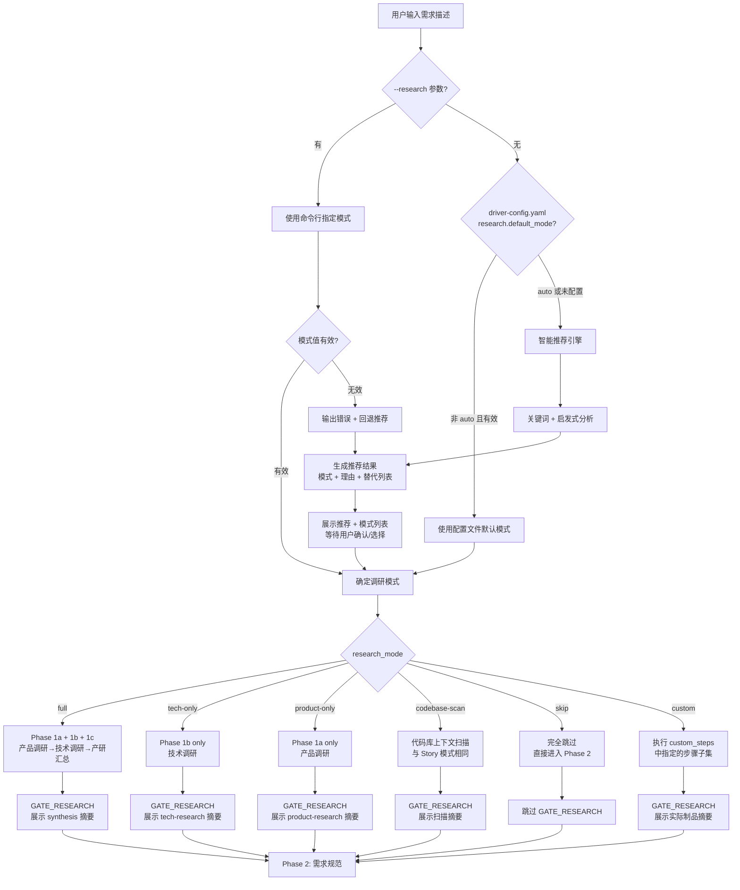
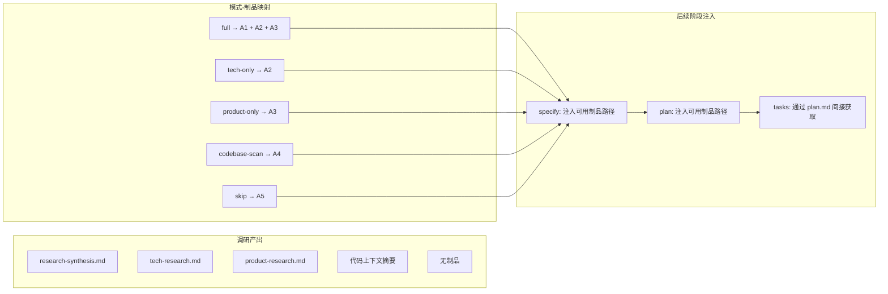

# Implementation Plan: Feature 模式灵活调研路由

**Branch**: `018-flexible-research-routing` | **Date**: 2026-02-27 | **Spec**: [spec.md](./spec.md)
**Input**: Feature specification from `/specs/018-flexible-research-routing/spec.md`

## Summary

将 Feature 模式的调研阶段从固定三阶段流水线（产品调研 → 技术调研 → 产研汇总）重构为支持 6 种调研模式的灵活路由机制。通过修改编排器 Prompt（SKILL.md）中的调研阶段编排逻辑，新增模式推荐、配置默认值和命令行覆盖三层确定机制，同时适配技术调研子代理的软依赖降级和后续阶段的上下文注入调整。

技术方案：在现有 `speckit-feature/SKILL.md` 中通过 Prompt 内条件分支实现模式路由（research.md Decision 1），使用关键词 + 启发式规则实现智能推荐（Decision 2），修改 `tech-research.md` 将 product-research.md 硬依赖改为软依赖（Decision 3），在 `driver-config.yaml` 模板中新增顶级 `research` 配置段（Decision 4）。

## Technical Context

**Language/Version**: Markdown（Prompt）、YAML（配置）、Bash 5.x（辅助脚本）
**Primary Dependencies**: 无运行时依赖。全部由 Markdown Prompt + YAML 配置构成，运行在 Claude Code 沙箱中
**Storage**: 文件系统（`specs/[feature]/` 目录树，`driver-config.yaml` 配置文件）
**Testing**: 手动端到端测试——分别以 6 种调研模式执行 Feature 流程，验证行为正确性
**Target Platform**: Claude Code 沙箱
**Project Type**: Plugin（Markdown Prompt 工程）
**Performance Goals**: N/A（Prompt 工程无运行时性能指标）
**Constraints**: 零运行时依赖、向后兼容、所有行为通过 Prompt 文本定义
**Scale/Scope**: 修改 4 个文件（SKILL.md、tech-research.md、driver-config-template.yaml、driver-config.yaml），不新增文件

## Constitution Check

*GATE: Must pass before Phase 0 research. Re-check after Phase 1 design.*

### 项目级原则

| 原则 | 适用性 | 评估 | 说明 |
|------|--------|------|------|
| I. 双语文档规范 | 适用 | PASS | 所有 Prompt 文本使用中文散文 + 英文代码标识符（`research_mode`、`--research`、`full`、`tech-only` 等） |
| II. Spec-Driven Development | 适用 | PASS | 本特性通过 Spec-Driven 流程执行（spec.md → plan.md → tasks.md → 实现 → 验证） |
| III. 诚实标注不确定性 | 适用 | PASS | 智能推荐结果附带推荐理由，用户可覆盖；不确定的推荐标注为建议而非断言 |

### Plugin: reverse-spec 约束

| 原则 | 适用性 | 评估 | 说明 |
|------|--------|------|------|
| IV. AST 精确性优先 | 不适用 | N/A | 本特性不涉及 TypeScript 源代码或 AST 解析 |
| V. 混合分析流水线 | 不适用 | N/A | 本特性不涉及代码分析 |
| VI. 只读安全性 | 不适用 | N/A | 本特性不涉及 reverse-spec 工具 |
| VII. 纯 Node.js 生态 | 不适用 | N/A | 本特性不涉及 Node.js 运行时 |

### Plugin: spec-driver 约束

| 原则 | 适用性 | 评估 | 说明 |
|------|--------|------|------|
| VIII. Prompt 工程优先 | 适用 | PASS | 所有行为变更通过修改 Prompt 文本实现（SKILL.md、tech-research.md），不引入运行时代码 |
| IX. 零运行时依赖 | 适用 | PASS | 不引入任何 npm 包或外部运行时依赖。调研模式路由完全通过 Prompt 条件分支实现 |
| X. 质量门控不可绕过 | 适用 | PASS（带说明） | `skip` 模式跳过 GATE_RESEARCH，但 GATE_DESIGN、GATE_TASKS、GATE_VERIFY 均保持启用（FR-013）。GATE_RESEARCH 的跳过是有意设计——无调研产出则无门禁意义。其他模式保留适配后的门禁 |
| XI. 验证铁律 | 适用 | PASS | 验证阶段不受调研模式影响，始终执行 |
| XII. 向后兼容 | 适用 | PASS | 未配置 `research` 段时默认 `auto`（回退到智能推荐，默认推荐 `full`）；`full` 模式行为与当前版本 100% 一致；无效配置值输出警告但不阻断 |

**Constitution Check 结论**: 全部 PASS，无 VIOLATION，无需豁免。

---

## Architecture

### 调研模式路由流程



### 上下文注入适配流程



---

## Project Structure

### Documentation (this feature)

```text
specs/018-flexible-research-routing/
├── spec.md              # 需求规范（已生成）
├── plan.md              # 本文件
├── research.md          # 技术决策研究
├── quickstart.md        # 快速上手指南
└── tasks.md             # 任务分解（由 /speckit.tasks 生成）
```

### Source Code (修改清单)

```text
plugins/spec-driver/
├── skills/speckit-feature/
│   └── SKILL.md                          # [修改] 主编排器——新增调研模式路由逻辑
├── agents/
│   └── tech-research.md                  # [修改] 技术调研子代理——product-research 硬依赖改软依赖
└── templates/
    └── driver-config-template.yaml       # [修改] 配置模板——新增 research 配置段

driver-config.yaml                         # [修改] 项目实例配置——同步新增 research 配置段
```

**Structure Decision**: 本特性不新增任何文件，全部通过修改 4 个现有文件实现。这符合 Constitution VIII（行为变更通过修改 Prompt 文本实现）和 IX（不增加运行时依赖）的要求。

---

## Detailed Change Specification

### Change 1: SKILL.md — 编排器主文件重构

**文件**: `plugins/spec-driver/skills/speckit-feature/SKILL.md`
**变更范围**: 输入解析、新增调研模式确定阶段、重构 Phase 1a-1c、适配 GATE_RESEARCH、适配后续阶段上下文注入、适配完成报告和进度显示

#### 1.1 输入解析扩展

在"输入解析"表格中新增 `--research` 参数行：

```text
| `--research <mode>` | string | 指定调研模式，跳过推荐和交互选择（可选值: full, tech-only, product-only, codebase-scan, skip） |
```

在"解析规则"中追加：`--research` 值为无效模式名时，输出错误提示并回退到推荐交互流程。

#### 1.2 新增"调研模式确定"阶段

在 Phase 0（Constitution 检查）之后、Phase 1a（产品调研）之前，插入新的编排逻辑段：

```markdown
### 调研模式确定（Phase 0.5）

在 Constitution 检查通过后、调研阶段开始前，确定本次执行的调研模式。

**确定优先级**: (1) `--research` 命令行参数（最高） → (2) `driver-config.yaml` 中 `research.default_mode`（非 `auto` 时） → (3) 智能推荐

**智能推荐逻辑**（当无命令行参数且配置为 `auto` 或未配置时）:

分析需求描述文本，按以下启发式规则推荐：
- 若出现"新产品"、"市场"、"用户群体"、"定价"、"商业模式"、"SaaS"、"B2B/B2C"、"目标用户"等关键词 ≥ 2 个 → 推荐 `full`
- 若出现"迁移"、"重构"、"架构"、"性能优化"、"技术栈"、"升级"、"替换"、"框架"等关键词 ≥ 1 个且无上述产品信号 → 推荐 `tech-only`
- 若出现"竞品"、"对标"、"用户调研"、"市场分析"等关键词且无技术信号 → 推荐 `product-only`
- 若需求描述较短（< 50 字）且为增量功能或修复 → 推荐 `codebase-scan`
- 若需求描述极短（< 20 字）且为 trivial 变更 → 推荐 `skip`
- 无法判断时 → 推荐 `full`（安全默认）

**交互展示格式**（非 `--research` 直接指定时）:

输出推荐结果和完整模式列表，等待用户确认：

  [调研模式推荐]

  基于需求特征分析，推荐使用 **{推荐模式}** 模式。
  理由: {推荐理由}

  可选模式:
  1. full       — 完整调研（产品+技术+汇总），适合新产品方向
  2. tech-only  — 仅技术调研，适合技术选型/迁移/重构
  3. product-only — 仅产品调研，适合需要市场验证的需求
  4. codebase-scan — 代码库扫描（与 Story 模式相同），适合中等规模增量功能
  5. skip       — 跳过调研，适合简单修复和微小功能
  6. custom     — 自定义步骤组合（需在 driver-config.yaml 中配置 custom_steps）

  请输入编号（1-6）确认，或直接回车使用推荐模式 [{推荐模式}]:
```

#### 1.3 重构 Phase 1a-1c 为条件执行

将当前硬编码的 Phase 1a → 1b → 1c 改为根据 `research_mode` 条件执行：

```text
research_steps = {
  "full":         [Phase_1a, Phase_1b, Phase_1c],
  "tech-only":    [Phase_1b],
  "product-only": [Phase_1a],
  "codebase-scan": [codebase_scan],
  "skip":         [],
  "custom":       [根据 config.research.custom_steps 映射]
}

对于 research_steps[research_mode] 中的每个步骤:
  执行该步骤

对于不在 research_steps[research_mode] 中的 Phase 1a/1b/1c:
  输出: "[{N}/10] {阶段名} [已跳过 - 调研模式: {research_mode}]"
```

#### 1.4 `codebase-scan` 步骤定义

`codebase-scan` 步骤复用 Story 模式的代码库上下文扫描逻辑：

```markdown
### codebase-scan 步骤

编排器亲自执行（不委派子代理）。与 Story 模式"代码库上下文扫描"步骤相同：
- 读取项目 README.md 和 CLAUDE.md
- 通过 Grep/Glob 扫描与需求相关的源代码文件
- 读取 `specs/products/` 下的产品活文档（如存在）
- 汇总为代码上下文摘要字符串（不写入磁盘，通过上下文注入传递）

进度显示: `[{对应编号}/10] 正在扫描代码库上下文...`（占用 Phase 1a 的编号 [2/10]，Phase 1b 和 1c 标记为 [已跳过]）
```

#### 1.5 GATE_RESEARCH 适配

```text
if research_mode == "full":
  展示 research-synthesis.md 关键摘要
  选项: A) 确认继续 | B) 补充调研 | C) 调整 MVP 范围

elif research_mode in ["tech-only", "product-only"]:
  展示对应单份调研报告的关键发现摘要
  选项: A) 确认继续 | B) 补充调研 | C) 切换到 full 模式

elif research_mode == "codebase-scan":
  展示代码上下文扫描摘要
  选项: A) 确认继续 | B) 切换到带调研的模式

elif research_mode == "skip":
  跳过 GATE_RESEARCH，直接进入 Phase 2

elif research_mode == "custom":
  展示实际生成的调研制品摘要
  选项: A) 确认继续 | B) 补充调研 | C) 切换到 full 模式
```

#### 1.6 后续阶段上下文注入适配

Phase 2（specify）和 Phase 4（plan）的上下文注入块需根据 `research_mode` 动态调整：

```markdown
# 上下文注入块中的调研制品引用

if research_mode == "full":
  **前序制品**: research/research-synthesis.md, research/product-research.md, research/tech-research.md

elif research_mode == "tech-only":
  **调研模式**: tech-only
  **前序制品**: research/tech-research.md

elif research_mode == "product-only":
  **调研模式**: product-only
  **前序制品**: research/product-research.md

elif research_mode == "codebase-scan":
  **调研模式**: codebase-scan
  **代码上下文摘要**: {扫描结果文本}

elif research_mode == "skip":
  **调研模式**: skip（无调研制品）

elif research_mode == "custom":
  **调研模式**: custom
  **前序制品**: {实际生成的制品路径列表}
```

对 specify 和 plan 子代理追加模式提示：

```text
[调研模式: {research_mode}] 本次调研制品有限。请基于可用的调研制品（如有）和需求描述生成规范/计划。
如无 research-synthesis.md，请直接基于需求描述和已有代码上下文工作。
```

#### 1.7 完成报告适配

生成的制品列表根据实际调研模式动态调整：

```text
生成的制品:
  {根据 research_mode 列出实际生成的调研制品，未执行的标注 [已跳过]}
  ✅ spec.md
  ✅ plan.md
  ✅ tasks.md
  ...
```

#### 1.8 `--rerun research` 适配

当 `--rerun research` 触发时，重新进入调研模式确定流程（Phase 0.5），而非直接重跑上次使用的模式。

---

### Change 2: tech-research.md — 软依赖降级

**文件**: `plugins/spec-driver/agents/tech-research.md`
**变更范围**: 角色描述、输入定义、执行流程第 1 步、约束、失败处理

#### 2.1 角色描述调整

```text
# 原文
你是 Spec Driver 的技术调研子代理，负责基于产品调研结论执行架构方案选型...

# 改为
你是 Spec Driver 的技术调研子代理，负责基于产品调研结论（如有）或需求描述执行架构方案选型...
```

#### 2.2 输入定义调整

```text
# 原文
- 读取制品：`{feature_dir}/research/product-research.md`（产品调研结论——必须）

# 改为
- 读取制品：`{feature_dir}/research/product-research.md`（产品调研结论——如存在则读取，不存在则基于需求描述执行）
```

#### 2.3 执行流程第 1 步调整

```text
# 原文
1. **理解产品方向**
   - 读取 product-research.md，提取 MVP 范围建议、差异化机会、用户场景
   ...

# 改为
1. **理解产品方向 / 需求上下文**
   - 检查 `{feature_dir}/research/product-research.md` 是否存在
   - **如果存在**: 读取 product-research.md，提取 MVP 范围建议、差异化机会、用户场景
   - **如果不存在**: 直接基于运行时上下文中的需求描述和代码上下文摘要（如有），提取技术调研需要解答的核心问题
   - 确定技术调研需要解答的核心问题
   - **约束**：技术评估必须服务于需求方向，不得偏离
```

#### 2.4 约束调整

```text
# 原文
- **必须基于产品调研结论**：不可在产品调研完成前执行

# 改为
- **基于产品调研结论（如有）或需求描述**：优先使用产品调研结论，无产品调研时直接基于需求描述执行
```

#### 2.5 失败处理调整

```text
# 原文
- product-research.md 不存在 → 返回失败，建议先完成产品调研

# 改为
- product-research.md 不存在 → 进入独立模式，基于需求描述和代码上下文执行技术调研，在报告中标注"[独立模式] 本次技术调研未参考产品调研结论"
```

---

### Change 3: driver-config-template.yaml — 新增 research 配置段

**文件**: `plugins/spec-driver/templates/driver-config-template.yaml`
**变更位置**: 在 `agents:` 配置段之后、`verification:` 配置段之前

新增内容：

```yaml
# ═══════════════════════════════════════
# 调研阶段配置（Feature 模式）
# ═══════════════════════════════════════
# 控制 Feature 模式中调研阶段的行为
# Story 模式和 Fix 模式不受此配置影响
#
# default_mode 可选值:
#   auto          — 由编排器根据需求特征智能推荐（默认）
#   full          — 完整调研（产品+技术+汇总），与当前版本行为一致
#   tech-only     — 仅技术调研（跳过产品调研和汇总）
#   product-only  — 仅产品调研（跳过技术调研和汇总）
#   codebase-scan — 代码库上下文扫描（与 Story 模式相同）
#   skip          — 跳过调研（不执行任何调研步骤）
#   custom        — 自定义步骤组合（需配置 custom_steps）
#
research:
  default_mode: auto

  # 自定义步骤（仅当 default_mode: custom 时生效）
  # 可选步骤: product-research, tech-research, codebase-scan, synthesis
  # 注意: synthesis 依赖 product-research 和 tech-research 的输出
  custom_steps: []
```

---

### Change 4: driver-config.yaml — 同步新增 research 配置段

**文件**: `driver-config.yaml`（项目根目录）
**变更**: 在 `agents:` 段之后、`verification:` 段之前新增与模板相同的 `research:` 配置段

```yaml
research:
  default_mode: auto
  custom_steps: []
```

---

## Implementation Order

建议的实现顺序（基于依赖关系）：

1. **Change 3 + Change 4**（配置文件）— 无依赖，最简单，先完成基础设施
2. **Change 2**（tech-research.md 软依赖降级）— 无依赖，独立变更
3. **Change 1**（SKILL.md 编排器重构）— 依赖 Change 2-4 的完成

Change 1 内部的推荐实现顺序：
1. 输入解析扩展（1.1）
2. 调研模式确定阶段（1.2）
3. Phase 1a-1c 条件执行重构（1.3）
4. codebase-scan 步骤定义（1.4）
5. GATE_RESEARCH 适配（1.5）
6. 后续阶段上下文注入适配（1.6）
7. 完成报告适配（1.7）
8. `--rerun research` 适配（1.8）

---

## Risk Assessment

| 风险 | 概率 | 影响 | 缓解策略 |
|------|------|------|----------|
| `full` 模式行为回归（向后兼容破坏） | 低 | 高 | 先实现 `full` 模式的条件分支，确保与原逻辑 100% 等价后再扩展其他模式 |
| 智能推荐的关键词规则准确率不足 | 中 | 低 | 推荐结果始终需用户确认，不准确时用户可手动选择；关键词列表可迭代调整 |
| tech-research 独立模式下输出质量下降 | 中 | 中 | 在独立模式报告中明确标注"[独立模式]"，帮助用户理解调研范围的局限性 |
| SKILL.md 文件过长导致 LLM 上下文压力 | 低 | 中 | 预估增加 ~120 行（从 299 到 ~420 行），仍在合理范围内；如超出可考虑拆分为 include 片段 |
| 后续子代理无法在缺少 research-synthesis.md 时正常工作 | 低 | 高 | 通过上下文注入中的模式标记和 fallback 提示确保子代理的降级行为 |

---

## Complexity Tracking

> 记录偏离简单方案的决策及理由

| 偏离项 | 为何需要 | 被拒绝的更简方案及原因 |
|--------|----------|----------------------|
| 6 种调研模式（而非简单的"跳过/不跳过"二选一） | spec.md FR-001 明确要求 6 种模式，覆盖从完整调研到完全跳过的连续谱。二选一无法满足"技术重构只需技术调研"等中间场景 | 简单的 skip/full 二选一——无法覆盖 `tech-only`、`product-only`、`codebase-scan` 等中间需求 |
| 三层模式确定机制（CLI > Config > 推荐） | spec.md FR-003/FR-006/FR-011 分别要求智能推荐、配置默认值和命令行覆盖，三层优先级是这些需求的自然组合 | 仅支持命令行参数——无法满足团队配置默认值的需求（US-3） |
| GATE_RESEARCH 模式感知分级门禁 | Constitution X 要求质量门控不可绕过，但 `skip` 模式下无调研产出则门禁无意义，需要分级处理 | 所有模式统一跳过 GATE_RESEARCH——违反 Constitution X（对有调研产出的模式应保留门禁） |
| `custom` 模式支持 | spec.md FR-001 和 US-5 明确要求，虽然是 P3 优先级但属于完整规范的一部分 | 不支持 custom——无法满足 power user 的长尾需求（US-5） |
