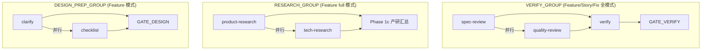

# Implementation Plan: Parallel Subagent Speedup

**Branch**: `feat/019-parallel-subagent-speedup` | **Date**: 2026-02-28 | **Spec**: [spec.md](./spec.md)
**Input**: Feature specification from `specs/019-parallel-subagent-speedup/spec.md`

## Summary

修改 3 个 SKILL.md 编排 prompt（speckit-feature、speckit-story、speckit-fix），将可并行的子代理阶段从串行调用改为并行调度，以缩短整体编排流程耗时。核心改造为 3 个并行组：VERIFY_GROUP（全模式）、RESEARCH_GROUP（Feature full 模式）、DESIGN_PREP_GROUP（Feature 模式）。变更完全在 Markdown prompt 层面，通过 Claude Code 的"同一消息多 Task 调用"机制实现并行，不涉及任何运行时代码修改。

## Technical Context

**Language/Version**: Markdown（Prompt 语言）、YAML（配置格式）、Bash 5.x（辅助脚本）
**Primary Dependencies**: 无（spec-driver 为零运行时依赖 Plugin）
**Storage**: 文件系统（`specs/` 目录写入）
**Testing**: 手动流程验证（执行 speckit-feature/story/fix 流程，观察并行行为）
**Target Platform**: Claude Code 沙箱
**Project Type**: Plugin（Markdown Prompt + YAML 配置）
**Performance Goals**: 验证闭环阶段耗时减少 30%+，调研阶段耗时减少 40%+
**Constraints**: 零新增运行时依赖，仅修改 SKILL.md 文件，不修改子代理 prompt（agents/*.md）
**Scale/Scope**: 3 个 SKILL.md 文件（speckit-feature、speckit-story、speckit-fix），2 个确认无需修改（speckit-doc、speckit-sync）

## Constitution Check

*GATE: Must pass before Phase 0 research. Re-check after Phase 1 design.*

| 原则 | 适用性 | 评估 | 说明 |
|------|--------|------|------|
| I. 双语文档规范 | 适用 | PASS | 所有改动在中文散文 Prompt 中进行，代码标识符保持英文 |
| II. Spec-Driven Development | 适用 | PASS | 本需求通过完整 Spec-Driven 流程推进 |
| III. 诚实标注不确定性 | 低适用 | PASS | 本次为确定性 prompt 文本修改，无推断内容 |
| IV. AST 精确性优先 | 不适用 | N/A | 本需求不涉及 AST 分析，属于 spec-driver Plugin 范畴 |
| V. 混合分析流水线 | 不适用 | N/A | 同上 |
| VI. 只读安全性 | 不适用 | N/A | 本需求不涉及 reverse-spec 工具 |
| VII. 纯 Node.js 生态 | 不适用 | N/A | 本需求属于 spec-driver Plugin，零运行时依赖 |
| **VIII. Prompt 工程优先** | **核心适用** | **PASS** | 所有编排行为通过修改 Markdown Prompt 实现，不引入运行时代码 |
| **IX. 零运行时依赖** | **核心适用** | **PASS** | 不引入任何 npm 包或外部运行时，纯 Prompt 修改 |
| **X. 质量门控不可绕过** | **核心适用** | **PASS** | 并行化不改变任何门禁的行为语义——门禁仍在所有并行子代理完成后执行，暂停/通过/失败逻辑不变 |
| **XI. 验证铁律** | **核心适用** | **PASS** | verify 在 spec-review 和 quality-review 完成后串行执行，保留对两者报告的二次核查能力 |
| **XII. 向后兼容** | **核心适用** | **PASS** | 并行为默认行为，但回退机制确保异常时自动降级串行，输出质量不变 |

**Constitution Check 结论**: 全部 PASS，无 VIOLATION，无需豁免。

---

## Project Structure

### Documentation (this feature)

```text
specs/019-parallel-subagent-speedup/
├── spec.md              # 需求规范
├── plan.md              # 本文件（实现计划）
├── research.md          # 技术决策研究
└── tasks.md             # 任务分解（由 /speckit.tasks 生成）
```

### Source Code (变更文件)

```text
plugins/spec-driver/skills/
├── speckit-feature/
│   └── SKILL.md          # 需改 3 个并行组: VERIFY_GROUP + RESEARCH_GROUP + DESIGN_PREP_GROUP
├── speckit-story/
│   └── SKILL.md          # 需改 1 个并行组: VERIFY_GROUP
├── speckit-fix/
│   └── SKILL.md          # 需改 1 个并行组: VERIFY_GROUP
├── speckit-doc/
│   └── SKILL.md          # 确认无需修改（无 Task 委派）
└── speckit-sync/
    └── SKILL.md          # 确认无需修改（无 Task 委派）
```

**Structure Decision**: 本需求为纯 Prompt 文本修改，不涉及源代码目录结构变更。所有改动集中在 `plugins/spec-driver/skills/` 下的 3 个 SKILL.md 文件中。

---

## Architecture

### 并行化改造总览



### 并行组详细设计

#### 1. VERIFY_GROUP: `parallel(spec-review, quality-review) -> verify -> GATE_VERIFY`

**适用模式**: Feature（Phase 7）、Story（Phase 5）、Fix（Phase 4）

**现有行为**（串行）:
```text
Phase Na: spec-review (串行)
Phase Nb: quality-review (串行)
Phase Nc: verify (串行, 读取 Na/Nb 报告)
GATE_VERIFY
```

**改造后行为**（并行）:
```text
Phase Na + Nb: parallel(spec-review, quality-review) — 在同一消息中发出两个 Task 调用
  等待两者均完成
Phase Nc: verify (串行, 读取 Na/Nb 报告)
GATE_VERIFY
```

**SKILL.md 改造策略**:

将 Phase Na 和 Nb 的描述合并为一个并行调度块，明确指示编排器在同一消息中同时发出两个 Task 调用。在 Phase Nc 之前添加"确认 Na 和 Nb 已完成"的检查点。

**具体 Prompt 改动模式**:

```markdown
#### Phase Na+Nb: Spec 合规审查 + 代码质量审查（并行）

**并行调度**: 在同一消息中同时发出以下两个 Task 调用：

1. Task(description: "Spec 合规审查", prompt: "{spec-review prompt}" + "{上下文注入}")
2. Task(description: "代码质量审查", prompt: "{quality-review prompt}" + "{上下文注入}")

等待两个 Task 均返回结果后继续。

**并行回退**: 如果无法在同一消息中发出两个 Task（如编排器因上下文限制分多次输出），
则按顺序串行执行，并在完成报告中标注 `[回退:串行] spec-review, quality-review`。

#### Phase Nc: 工具链验证 + 验证证据核查

（保持原有串行逻辑，读取 Na+Nb 报告路径）
```

**三个模式的具体 Phase 映射**:

| 模式 | 合并 Phase | verify Phase | GATE |
|------|-----------|--------------|------|
| Feature | Phase 7a + 7b | Phase 7c | GATE_VERIFY |
| Story | Phase 5a + 5b | Phase 5c | GATE_VERIFY |
| Fix | Phase 4a + 4b | Phase 4c | GATE_VERIFY |

---

#### 2. RESEARCH_GROUP: `parallel(product-research, tech-research) -> Phase 1c`

**适用模式**: Feature（仅 `--research full` 模式）

**现有行为**（串行）:
```text
Phase 1a: product-research (串行)
Phase 1b: tech-research (串行, 接收 product-research.md 路径)
Phase 1c: 产研汇总 (编排器亲自执行, 读取两份报告)
```

**改造后行为**（并行）:
```text
Phase 1a + 1b: parallel(product-research, tech-research)
  - product-research: 正常执行
  - tech-research: 独立模式运行（不传入 product-research.md 路径）
  等待两者均完成
Phase 1c: 产研汇总 (编排器亲自执行, 读取两份报告) — 不变
```

**SKILL.md 改造策略**:

修改 speckit-feature SKILL.md 中"调研阶段条件执行"部分的 `full` 模式逻辑:

1. 将 Phase 1a 和 Phase 1b 的描述重组为并行调度块
2. 移除 Phase 1b 中"full 模式下串行依赖"的说明
3. 将 full 模式归入"独立执行"分支（与 tech-only 和 custom 模式相同）
4. 在 Phase 1c 之前添加"确认 1a 和 1b 已完成"的检查点

**具体 Prompt 改动模式**:

```markdown
#### Phase 1a + 1b: 产品调研 + 技术调研（并行） [2-3/10]

**执行条件**: `research_mode` 为 `full`

`[2-3/10] 正在并行执行产品调研和技术调研...`

**并行调度**: 在同一消息中同时发出以下两个 Task 调用：

1. Task(description: "执行产品调研", prompt: "{product-research prompt}" + "{上下文注入}")
2. Task(description: "执行技术调研", prompt: "{tech-research prompt}" + "{上下文注入}")
   注意: 并行模式下 tech-research 以独立模式运行，不传入 product-research.md 路径

等待两个 Task 均返回结果后继续。
验证 product-research.md 和 tech-research.md 均已生成。

**并行回退**: 如果无法在同一消息中发出两个 Task，则按顺序串行执行:
先 product-research，完成后 tech-research（串行模式下可选择传入 product-research.md 路径），
并在完成报告中标注 `[回退:串行] product-research, tech-research`。
```

**对其他调研模式的影响**: 无。tech-only、product-only、codebase-scan、skip、custom 模式的逻辑不变，因为它们不同时执行 product-research 和 tech-research。

---

#### 3. DESIGN_PREP_GROUP: `parallel(clarify, checklist) -> GATE_DESIGN`

**适用模式**: Feature（Phase 3）

**现有行为**（串行）:
```text
Phase 3: clarify (串行)
Phase 3.5: checklist (串行)
GATE_DESIGN
```

**改造后行为**（并行）:
```text
Phase 3: parallel(clarify, checklist)
  等待两者均完成
  统一处理: 如 clarify 有 CRITICAL → 展示给用户决策（同时展示 checklist 结果）
GATE_DESIGN
```

**SKILL.md 改造策略**:

修改 speckit-feature SKILL.md 中 Phase 3 和 Phase 3.5 的描述：

1. 将 Phase 3（clarify）和 Phase 3.5（checklist）合并为一个并行调度块
2. 在汇合逻辑中说明：先等待两者完成，再统一处理 clarify 的 CRITICAL 问题
3. GATE_DESIGN 逻辑完全不变

**具体 Prompt 改动模式**:

```markdown
### Phase 3: 需求澄清 + 质量检查表（并行） [6/10]

`[6/10] 正在并行执行需求澄清和质量检查...`

**并行调度**: 在同一消息中同时发出以下两个 Task 调用：

1. Task(description: "执行需求澄清", prompt: "{clarify prompt}" + "{上下文注入}")
2. Task(description: "生成质量检查表", prompt: "{checklist prompt}" + "{上下文注入}")

等待两个 Task 均返回结果后继续。

**汇合处理**:
- 如 clarify 有 CRITICAL 问题 → 同时展示 clarify 结果和 checklist 结果给用户决策
- 如 checklist 有未通过项 → 回到 specify/clarify 修复
- 如两者均正常 → 继续进入 GATE_DESIGN

**并行回退**: 如果无法在同一消息中发出两个 Task，则按顺序串行执行:
先 clarify，再 checklist。
```

---

### 并行回退机制设计

在每个 SKILL.md 的顶部（工作流定义之前）添加统一的"并行执行策略"段落：

```markdown
## 并行执行策略

本编排流程在以下阶段使用并行调度以缩短总耗时:
{列出适用的并行组}

**并行调度方式**: 在同一消息中同时发出多个 Task tool 调用。Claude Code 的 function calling
机制支持在单个 assistant 消息中发出多个 tool calls，这些 tool calls 会被并行执行。

**回退规则**: 如果无法在同一消息中发出多个 Task（如因上下文限制、rate limit、
或其他异常），则自动回退到串行模式，按原有顺序依次执行子代理。
回退时输出: `[并行回退] {并行组名} 无法并行调度，切换到串行模式`

**完成报告标注**: 并行执行的阶段在完成报告中标注 `[并行]`，
回退到串行的阶段标注 `[回退:串行]`。
```

---

### 完成报告改造

在三个模式的完成报告模板中添加"执行模式"段落：

```text
执行模式:
  {Phase Na/Nb}: [并行] {子代理列表}   // 或 [回退:串行]
  {Phase Nc}: [串行] verify
```

**Feature 模式完成报告示例**:

```text
══════════════════════════════════════════
  Spec Driver - 流程完成报告
══════════════════════════════════════════

特性分支: {branch_name}
调研模式: full
总耗时: ~{估算} 分钟
阶段完成: 10/10（含 0 个已跳过步骤）
人工介入: {N} 次

执行模式:
  Phase 1a+1b: [并行] product-research + tech-research
  Phase 3+3.5: [并行] clarify + checklist
  Phase 7a+7b: [并行] spec-review + quality-review
  Phase 7c: [串行] verify（依赖 7a/7b 报告）

生成的制品:
  ...（保持不变）
══════════════════════════════════════════
```

---

### `--rerun` 与并行组的交互

**设计原则**: `--rerun` 以子代理为最小粒度，不因其属于并行组而触发组内其他子代理。

**无需额外改动**: 现有 `--rerun` 机制按阶段名匹配（如 `--rerun verify`），并行组概念对 `--rerun` 逻辑透明。在 SKILL.md 中添加简短说明即可：

```text
注: `--rerun` 重跑以子代理为最小单元。如指定 `--rerun spec-review`，
仅重跑 spec-review，不触发并行组中的 quality-review。
```

---

### 各 SKILL.md 改造范围汇总

| SKILL.md 文件 | 改动段落 | 改动类型 |
|---------------|---------|---------|
| **speckit-feature** | 新增"并行执行策略"段落 | 新增 |
| | Phase 1a + 1b（full 模式）合并为并行块 | 重写 |
| | Phase 3 + 3.5 合并为并行块 | 重写 |
| | Phase 7a + 7b 合并为并行块 | 重写 |
| | 完成报告添加"执行模式"段落 | 新增 |
| | `--rerun` 说明添加并行组注释 | 新增 |
| **speckit-story** | 新增"并行执行策略"段落 | 新增 |
| | Phase 5a + 5b 合并为并行块 | 重写 |
| | 完成报告添加"执行模式"段落 | 新增 |
| **speckit-fix** | 新增"并行执行策略"段落 | 新增 |
| | Phase 4a + 4b 合并为并行块 | 重写 |
| | 完成报告添加"执行模式"段落 | 新增 |
| **speckit-doc** | 无 | 确认无需修改 |
| **speckit-sync** | 无 | 确认无需修改 |

---

## Complexity Tracking

| 决策 | 为什么不用更简单的方案 | 被拒绝的简单方案 |
|------|----------------------|-----------------|
| VERIFY_GROUP 使用 `parallel(spec-review, quality-review) -> verify` 而非三者完全并行 | verify 依赖 spec-review/quality-review 的报告路径作为输入，完全并行将导致 verify 丧失对报告的核查能力 | 三者完全并行 — 违背 Constitution 原则 XI（验证铁律）|
| RESEARCH_GROUP 中 tech-research 以独立模式运行 | 并行化后无法获得 product-research.md 输出，但 tech-only 模式已验证独立运行可行 | 保持串行（等待 product-research）— 与并行化目标矛盾 |
| 回退机制采用 LLM 语义判断而非编程化 try-catch | Claude Code Task tool 不提供可编程区分调度失败与业务失败的接口 | 编程化错误检测 — Prompt 层技术不可行 |
| 每个 SKILL.md 新增"并行执行策略"段落 | 统一说明并行调度方式和回退规则，避免在每个并行块中重复解释 | 不添加统一说明，仅在各处重复描述 — 维护成本高且容易不一致 |
