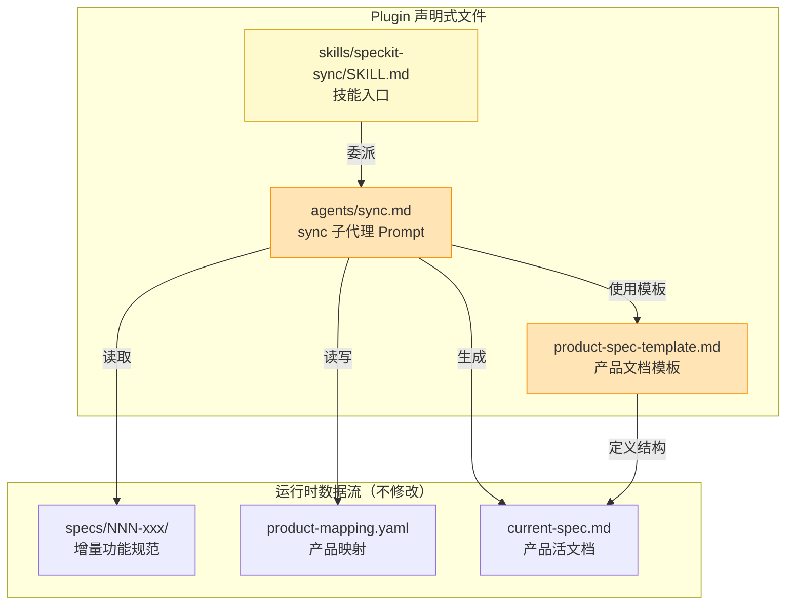

# Implementation Plan: 优化 Sync 产品文档质量与结构

**Branch**: `feature/optimize-sync-product-doc` | **Date**: 2026-02-15 | **Spec**: [spec.md](./spec.md)
**Input**: Feature specification from `specs/features/optimize-sync-product-doc/spec.md`

## Summary

将 sync 命令的产品文档模板从 7 章节扩展至 14 章节（覆盖行业标准 PRD 结构），同步更新 sync 子代理 prompt 以支持新章节的智能聚合，并微调 SKILL.md 的输出报告格式以包含文档质量评估。本次修改仅涉及 3 个声明式文件（Markdown + YAML），无编译型代码变更。

## Technical Context

**Language/Version**: Markdown (文档模板) + YAML (配置元数据)，无编译型语言
**Primary Dependencies**: 无运行时依赖。文件运行在 Claude Code 沙箱中，由 LLM 解释执行
**Storage**: 文件系统（`plugins/spec-driver/` 目录下的声明式文件）
**Testing**: 手动验证——运行 `/spec-driver:speckit-sync` 后检查生成的 `current-spec.md` 章节完整性
**Target Platform**: Claude Code Plugin 环境
**Project Type**: Plugin 声明式配置（非编译型项目）
**Performance Goals**: N/A（无运行时性能指标）
**Constraints**: 模板向后兼容（现有 7 章节不得删除）、双语规范（中文散文 + 英文标识符）
**Scale/Scope**: 3 个文件、约 400 行净增量

## Constitution Check

*GATE: Must pass before implementation.*

| 原则 | 适用性 | 评估 | 说明 |
|------|--------|------|------|
| I. AST 精确性优先 | **不适用** | PASS | 本次修改不涉及代码分析或 AST 解析，纯文档模板改动 |
| II. 混合分析流水线 | **不适用** | PASS | 不涉及源代码到 LLM 的分析流程 |
| III. 诚实标注不确定性 | **适用** | PASS | 模板和 prompt 设计中明确要求：信息不足时标注 `[待补充]` 而非虚构内容，与此原则完全一致 |
| IV. 只读安全性 | **适用** | PASS | sync 子代理的写操作仅限于 `specs/products/` 目录，模板本身不涉及源代码修改 |
| V. 纯 Node.js 生态 | **不适用** | PASS | 本次修改不引入任何运行时依赖 |
| VI. 双语文档规范 | **适用** | PASS | 模板所有占位符使用中文，代码标识符保持英文，章节标题中文，完全遵循双语规范 |

**Constitution Check 结论**: 全部 PASS，无 VIOLATION。本次修改属于声明式文件优化，与 Constitution 的技术约束高度正交，风险极低。

## Project Structure

### Documentation (this feature)

```text
specs/features/optimize-sync-product-doc/
├── spec.md              # 需求规范（已存在）
└── plan.md              # 本文件（技术规划）
```

> 注：由于本次修改全部为 Markdown/YAML 声明式文件，不涉及编译型代码，因此省略 research.md、data-model.md、contracts/、quickstart.md 等制品。技术决策直接记录在本文件的「技术决策记录」章节中。

### Source Code (修改目标)

```text
plugins/spec-driver/
├── templates/
│   └── product-spec-template.md    # [修改] 96 行 → 约 250 行，新增 7 个章节
├── agents/
│   └── sync.md                     # [修改] 187 行 → 约 320 行，新增聚合指导
└── skills/
    └── speckit-sync/
        └── SKILL.md                # [微调] 137 行 → 约 150 行，新增质量报告字段
```

**Structure Decision**: 不新增任何文件或目录，仅原地修改 3 个现有文件。修改在源码仓库 `/Users/connorlu/Desktop/.workspace2.nosync/reverse-spec/plugins/spec-driver/` 下进行。

---

## Architecture

### 修改架构总览



### 数据流不变式

sync 命令的三阶段流程（扫描 → 聚合 → 生成）保持不变。本次修改仅影响:
1. **模板层**: 输出文档的章节结构（从 7 → 14 章节）
2. **Prompt 层**: 子代理的聚合指导逻辑（新增章节的信息提取规则）
3. **报告层**: 聚合完成报告的格式（新增质量评估字段）

---

## 文件修改策略

### File 1: `product-spec-template.md` — 模板扩展

**路径**: `plugins/spec-driver/templates/product-spec-template.md`
**当前状态**: 96 行，7 个顶级章节
**目标状态**: 约 250 行，14 个顶级章节

#### 章节结构设计（行业标准顺序）

按 spec.md 中确定的排序策略（概述 → 目标 → 用户 → 范围 → 功能 → 非功能 → 架构 → 设计决策 → 限制 → 风险 → 废弃 → 变更 → 术语 → 附录），最终章节列表如下:

| 序号 | 章节标题 | 状态 | 对应 FR | 来源 |
|------|---------|------|---------|------|
| 1 | 产品概述 | **保留** | FR-010 | 原有章节，保持不变 |
| 2 | 目标与成功指标 | **新增** | FR-001 | 产品级 KPI、基线值、目标值 |
| 3 | 用户画像与场景 | **新增** | FR-002 | 目标用户、痛点、核心场景 |
| 4 | 范围与边界 | **新增** | FR-005 | 范围内 vs 范围外边界 |
| 5 | 当前功能全集 | **保留** | FR-010 | 原有章节，保持不变 |
| 6 | 非功能需求 | **新增** | FR-003 | 性能/安全/可扩展性/可用性/兼容性 |
| 7 | 当前技术架构 | **保留(调整)** | FR-008/FR-010 | 迁移「关键设计决策」至新章节，保留交叉引用 |
| 8 | 设计原则与决策记录 | **新增** | FR-007/FR-008 | 产品设计原则 + 类 ADR 格式决策记录 |
| 9 | 已知限制与技术债 | **保留** | FR-010 | 原有章节，保持不变 |
| 10 | 假设与风险 | **新增** | FR-004 | 关键假设列表 + 风险矩阵 |
| 11 | 被废弃的功能 | **保留** | FR-010 | 原有章节，保持不变 |
| 12 | 变更历史 | **保留** | FR-010 | 原有章节，保持不变 |
| 13 | 术语表 | **新增** | FR-006 | 术语-定义-来源表格 |
| 14 | 附录：增量 spec 索引 | **保留** | FR-010 | 原有章节，保持不变 |

#### 修改细节

**A. 新增章节占位符设计**

每个新增章节需包含:
- 中文章节标题（二级标题 `##`）
- 结构化占位符（表格或列表形式）
- 聚合指导注释（HTML 注释，供 sync 子代理参考）

**章节 2 — 目标与成功指标** (FR-001):
```markdown
## 目标与成功指标

### 产品愿景
{PRODUCT_VISION}

### 成功指标

| 指标 | 基线值 | 当前值 | 目标值 | 来源 spec |
|------|--------|--------|--------|----------|
| {指标名} | {基线} | {当前} | {目标} | {NNN-xxx} |

<!-- 聚合指导: 从各 spec 的 Success Criteria 和 Measurable Outcomes 中提取 -->
```

**章节 3 — 用户画像与场景** (FR-002):
```markdown
## 用户画像与场景

### 目标用户

| 用户角色 | 描述 | 核心痛点 | 使用频率 |
|---------|------|---------|---------|
| {角色名} | {描述} | {痛点} | {频率} |

### 核心使用场景

1. **{场景名}**: {场景描述}
   - **触发条件**: {触发}
   - **期望结果**: {结果}
   - **来源**: specs/{NNN-xxx}

<!-- 聚合指导: 从 User Stories 中提取用户角色和场景，合并同类用户 -->
```

**章节 4 — 范围与边界** (FR-005):
```markdown
## 范围与边界

### 范围内

- {功能/能力描述}（来源: {NNN-xxx}）

### 范围外

- {明确排除的功能/能力}（来源: {NNN-xxx}）

<!-- 聚合指导: 从各 spec 的 Constraints & Boundaries 章节提取，合并去重 -->
```

**章节 6 — 非功能需求** (FR-003):
```markdown
## 非功能需求

### 性能

| 指标 | 要求 | 来源 spec |
|------|------|----------|
| {指标} | {要求描述} | {NNN-xxx} |

### 安全

- {安全要求}（来源: {NNN-xxx}）

### 可扩展性

- {可扩展性要求}（来源: {NNN-xxx}）

### 可用性

- {可用性要求}（来源: {NNN-xxx}）

### 兼容性

- {兼容性要求}（来源: {NNN-xxx}）

<!-- 聚合指导: 从各 spec 的非功能需求、Constraints、Edge Cases 中提取，按类别归组 -->
<!-- 容错: 若某类别无信息，标注 [待补充: 增量 spec 中未明确此维度] -->
```

**章节 8 — 设计原则与决策记录** (FR-007/FR-008):
```markdown
## 设计原则与决策记录

### 设计原则

1. **{原则名}**: {原则描述}（来源: {NNN-xxx}）

### 关键决策记录

| 决策 | 上下文 | 理由 | 替代方案 | 来源 spec |
|------|--------|------|---------|----------|
| {决策描述} | {决策背景} | {选择理由} | {被拒绝的方案} | {NNN-xxx} |

<!-- 聚合指导: 从各 plan.md 的架构决策和 Complexity Tracking 中提取 -->
```

**章节 10 — 假设与风险** (FR-004):
```markdown
## 假设与风险

### 关键假设

| 假设 | 依据 | 影响（若假设不成立） | 来源 spec |
|------|------|-------------------|----------|
| {假设描述} | {依据} | {影响} | {NNN-xxx} |

### 风险矩阵

| 风险 | 概率 | 影响 | 缓解措施 | 来源 spec |
|------|------|------|---------|----------|
| {风险描述} | 高/中/低 | 高/中/低 | {措施} | {NNN-xxx} |

<!-- 聚合指导: 从各 spec 的 Dependencies & Impacts、Edge Cases、Constraints 推断 -->
```

**章节 13 — 术语表** (FR-006):
```markdown
## 术语表

| 术语 | 定义 | 来源 spec |
|------|------|----------|
| {术语} | {定义} | {NNN-xxx} |

<!-- 聚合指导: 从各 spec 中提取反复出现的领域术语，统一定义 -->
<!-- 真实性优先: 仅收录增量 spec 中实际出现的术语，信息不足时允许少于 5 个 -->
```

**B. 现有章节调整**

**章节 7 — 当前技术架构** (FR-008):
- 移除 `**关键设计决策**` 子节
- 替换为交叉引用: `> 关键设计决策已迁移至【设计原则与决策记录】章节，详见下方。`
- 保留技术栈和项目结构内容不变

**C. 章节重新排序**

将现有 7 章节按新顺序排列，在适当位置插入新章节。向后兼容性保证:
- 原有章节的标题文本不变（仅位置移动）
- 原有占位符不删除，仅允许增强

---

### File 2: `agents/sync.md` — 子代理 Prompt 优化

**路径**: `plugins/spec-driver/agents/sync.md`
**当前状态**: 187 行，覆盖 6 个章节的聚合逻辑
**目标状态**: 约 320 行，覆盖 14 个章节的聚合逻辑 + 质量评估

#### 修改区域

**区域 A: 新增「新增章节聚合指导」段落** (FR-011)

在「4. 生成产品级活文档」步骤中，扩展聚合逻辑以覆盖所有 14 个章节:

```text
对每个产品，按以下逻辑生成 current-spec.md：

1. **产品概述**：综合所有 spec 的描述，提炼产品当前定位
2. **目标与成功指标**：[新增] 从各 spec 的 Success Criteria / Measurable Outcomes 提取产品级 KPI
3. **用户画像与场景**：[新增] 从 User Stories 提取用户角色，合并同类用户，汇总核心场景
4. **范围与边界**：[新增] 从各 spec 的 Constraints & Boundaries 提取，合并"范围内"和"范围外"列表
5. **当前功能全集**：合并所有已实现的 User Stories 和 FR（去重、合并、更新）
6. **非功能需求**：[新增] 从各 spec 的约束条件、Edge Cases、性能目标中提取，按性能/安全/可扩展性/可用性/兼容性归组
7. **当前技术架构**：从最新的 plan.md 提取（如有重构，以重构后为准）；设计决策交叉引用至第 8 章
8. **设计原则与决策记录**：[新增] 从 plan.md 的 Complexity Tracking 和架构决策提取，使用 ADR 格式
9. **已知限制与技术债**：从各 spec 的边界情况和非功能需求汇总
10. **假设与风险**：[新增] 从 Dependencies & Impacts、Edge Cases、Constraints 推断假设和风险
11. **被废弃的功能**：被后续 spec 取代或移除的功能（注明取代者）
12. **变更历史**：每个增量 spec 的一行摘要
13. **术语表**：[新增] 从全部 spec 提取领域术语，统一定义
14. **附录：增量 spec 索引**：链接到原文件
```

**区域 B: 新增「信息推断规则」段落** (FR-012)

在执行流程之后、约束之前，新增以下段落:

```markdown
## 信息推断规则

当增量 spec 中无显式信息可填充某章节时，按以下规则推断:

| 目标章节 | 推断来源 | 推断方法 |
|---------|---------|---------|
| 用户画像与场景 | User Stories 的 "作为...我希望..." 句式 | 提取角色名作为用户画像，提取"我希望"后的内容作为场景 |
| 非功能需求 | Edge Cases、Constraints、plan.md 的 Performance Goals | 将约束条件映射为非功能需求类别 |
| 假设与风险 | Dependencies & Impacts、"注意事项" | 依赖项视为隐含假设，影响范围视为潜在风险 |
| 设计原则与决策记录 | plan.md 的 Complexity Tracking、Architecture 章节 | 提取"选择 X 而非 Y"模式的决策 |
| 术语表 | 全文高频术语扫描 | 出现 >=3 次且非通用词的术语纳入术语表 |
| 范围与边界 | Constraints & Boundaries 的"范围内/范围外" | 直接提取，合并去重 |
| 目标与成功指标 | Success Criteria、Measurable Outcomes | 直接提取并归类为产品级 KPI |

推断内容必须带有 [推断] 标记（遵循 Constitution 原则 III）。
无法推断的章节标注 [待补充: 增量 spec 中缺少此类信息]。
```

**区域 C: 新增「内容质量标准」段落** (FR-013)

```markdown
## 内容质量标准

每个章节的最低内容要求:

| 章节 | 最低要求 | 容错策略 |
|------|---------|---------|
| 产品概述 | 不少于 3 行有效描述 | 必填——信息充分 |
| 目标与成功指标 | 至少 1 个可量化指标 | 若无则标注 [待补充] |
| 用户画像与场景 | 至少 1 个用户角色 + 1 个场景 | 从 User Stories 推断 |
| 范围与边界 | 至少列出 2 项范围内 + 1 项范围外 | 从 Constraints 推断 |
| 当前功能全集 | 覆盖所有活跃 FR | 必填——数据充分 |
| 非功能需求 | 建议覆盖性能和兼容性维度 | 维度无信息时标注 [待补充]，不臆造 |
| 当前技术架构 | 技术栈 + 项目结构 | 从 plan.md 提取 |
| 设计原则与决策记录 | 至少 1 条设计决策 | 从 plan.md 提取 |
| 已知限制与技术债 | 覆盖所有未解决项 | 无则注明"暂无已知限制" |
| 假设与风险 | 至少 1 个假设或风险 | 从依赖项推断 |
| 被废弃的功能 | 覆盖所有废弃记录 | 无则注明"暂无废弃功能" |
| 变更历史 | 覆盖所有归属 spec | 必填——数据充分 |
| 术语表 | 收录实际出现的术语（真实性优先，允许少于 5 个） | 信息不足时标注 [待补充] |
| 附录 | 覆盖所有归属 spec | 必填——数据充分 |
```

**区域 D: 新增「质量评估」输出结构** (FR-014)

在「输出」章节的返回格式中新增:

```text
## 文档质量评估

| 章节 | 填充状态 | 备注 |
|------|---------|------|
| {章节名} | 完整 / 部分 / 待补充 / 不适用 | {说明} |

**总体评分**: {完整章节数}/{总章节数} 章节完整
**建议操作**: {若有待补充章节，给出补充建议}
```

**区域 E: 产品映射维护逻辑更新** (FR-015)

在「2. 产品归属判定」中新增自动修正逻辑:

```text
产品名自动修正规则:
  - 若 product-mapping.yaml 中存在 "speckitdriver" 条目:
    → 自动重命名为 "spec-driver"
    → 更新描述以反映 v3.0.0 版本信息
    → 写回 product-mapping.yaml
  - 扫描时自动检测未列入映射的 spec 编号（如 013、014）:
    → 通过内容分析推断归属
    → 追加到对应产品的 specs 列表
```

---

### File 3: `SKILL.md` — 输出报告微调

**路径**: `plugins/spec-driver/skills/speckit-sync/SKILL.md`
**当前状态**: 137 行
**目标状态**: 约 150 行

#### 修改区域

**唯一修改**: 在聚合完成报告模板中新增「文档质量」字段 (FR-016)

将报告模板从:
```text
══════════════════════════════════════════
  Spec Driver - 产品规范聚合完成
══════════════════════════════════════════

扫描 spec 数: {总数}
产品数: {产品数}

聚合结果:
  ...

产品映射: specs/products/product-mapping.yaml
══════════════════════════════════════════
```

扩展为:
```text
══════════════════════════════════════════
  Spec Driver - 产品规范聚合完成
══════════════════════════════════════════

扫描 spec 数: {总数}
产品数: {产品数}

聚合结果:
  ...

文档质量:
  {产品 A}: {完整章节数}/{总章节数} 章节完整
    待补充: {待补充章节名列表}
  {产品 B}: {完整章节数}/{总章节数} 章节完整

产品映射: specs/products/product-mapping.yaml
══════════════════════════════════════════
```

---

## 技术决策记录

> 以下决策替代独立的 research.md 制品，直接记录在 plan.md 中（因本次修改无编译型代码，无需独立决策文档）。

### Decision 1: 章节排序采用行业标准文档流

- **决策**: 按「概述 → 目标 → 用户 → 范围 → 功能 → 非功能 → 架构 → 设计决策 → 限制 → 风险 → 废弃 → 变更 → 术语 → 附录」排序
- **理由**: 符合 PRD / Technical Spec 最佳实践，从战略 → 战术 → 实施 → 追溯的阅读顺序，便于不同角色快速定位关注章节
- **替代方案**: 按原有顺序在末尾追加新章节——被拒绝，因为会破坏阅读逻辑（如「用户画像」出现在「废弃功能」之后不合理）

### Decision 2: 术语表采用"真实性优先"策略

- **决策**: 允许术语表在增量 spec 信息不足时少于 5 个术语，标注 `[待补充]`
- **理由**: 与 Constitution 原则 III（诚实标注不确定性）一致，避免 LLM 臆造非产品专有术语
- **替代方案 A**: 严格执行 5 个术语下限——被拒绝，因为可能引入通用领域冗余术语，降低术语表的实用价值
- **替代方案 B**: 分层要求（>=3 个 spec 时 5 个，<3 个时 3 个）——被拒绝，增加判断逻辑复杂度但收益有限
- **来源**: 用户在 spec clarification 阶段明确选择选项 B

### Decision 3: 设计决策迁移后保留交叉引用

- **决策**: 将「关键设计决策」从技术架构章节迁移至新的「设计原则与决策记录」章节，原位置保留交叉引用链接
- **理由**: 避免信息孤岛，同时消除信息重复。读者从技术架构章节可快速导航至设计决策详情
- **替代方案**: 两处都保留完整内容——被拒绝，违反单一信息源原则，增加维护负担

### Decision 4: 新章节聚合采用推断 + 标注策略

- **决策**: sync 子代理对新章节信息优先从增量 spec 直接提取，缺失时从上下文推断（带 `[推断]` 标记），无法推断时标注 `[待补充]`
- **理由**: 三级容错策略（提取 → 推断 → 标注）在最大化信息利用率和诚实性之间取得平衡
- **替代方案**: 仅直接提取，不推断——被拒绝，会导致新章节大量为空，削弱文档价值

### Decision 5: product-mapping.yaml 产品名自动修正

- **决策**: sync 子代理在加载映射时自动检测旧产品名（`speckitdriver`）并替换为 `spec-driver`，写回文件
- **理由**: 减少人工维护成本，与代码库当前状态（v3.0.0 已重命名）保持一致
- **替代方案**: 要求用户手动修改——被拒绝，不符合自动化工具的设计理念

### Decision 6: 非功能需求维度为建议性而非强制

- **决策**: FR-013 中「至少覆盖性能和兼容性」为建议性要求，若增量 spec 无对应信息则标注 `[待补充]` 而非臆造
- **理由**: 与 Edge Cases 中「标注待补充而非虚构」的原则一致，避免 LLM 生成与产品无关的非功能需求
- **替代方案**: 强制要求所有维度——被拒绝，早期产品（spec 数少）无法提供充分信息

---

## 实施风险与缓解

| 风险 | 概率 | 影响 | 缓解措施 |
|------|------|------|---------|
| 模板章节增加导致 LLM token 消耗显著增长 | 中 | 低 | 模板使用精简占位符，实际生成内容量取决于增量 spec 丰富度 |
| 新章节聚合质量不稳定（LLM 推断偏差） | 中 | 中 | prompt 中明确推断规则和标注要求，质量评估字段提供反馈 |
| 已有产品文档被新格式覆盖后信息丢失 | 低 | 中 | sync 命令是幂等重新生成，信息来源为增量 spec 而非旧文档 |
| SKILL.md 报告格式变更影响下游解析 | 低 | 低 | 仅追加字段，不修改现有字段结构 |

---

## Complexity Tracking

> 本次修改属于声明式文件优化，复杂度整体较低。以下记录偏离最简方案的决策。

| 偏离点 | 为何需要 | 被拒绝的更简单方案 |
|--------|---------|------------------|
| 新增 7 个模板章节而非仅补 2-3 个最紧缺的 | 一次性达到行业标准，避免多次迭代 | 仅补「术语表」和「非功能需求」——覆盖不够全面，短期后仍需扩展 |
| sync prompt 新增「信息推断规则」表 | 确保 LLM 有清晰的推断路径，减少随意臆造 | 不提供推断规则，让 LLM 自由发挥——质量不可控 |
| 三级容错策略（提取 → 推断 → 标注） | 在信息利用率和诚实性之间取最佳平衡 | 仅提取不推断——新章节大面积为空 |

---

## FR 覆盖矩阵

> 验证所有功能需求均被技术计划覆盖。

| FR 编号 | 描述 | 覆盖文件 | 覆盖方式 |
|---------|------|---------|---------|
| FR-001 | 新增「目标与成功指标」章节 | product-spec-template.md | 新增章节 2 |
| FR-002 | 新增「用户画像与场景」章节 | product-spec-template.md | 新增章节 3 |
| FR-003 | 新增「非功能需求」章节 | product-spec-template.md | 新增章节 6 |
| FR-004 | 新增「假设与风险」章节 | product-spec-template.md | 新增章节 10 |
| FR-005 | 新增「范围与边界」章节 | product-spec-template.md | 新增章节 4 |
| FR-006 | 新增「术语表」章节 | product-spec-template.md | 新增章节 13 |
| FR-007 | 新增「设计原则与决策记录」章节 | product-spec-template.md | 新增章节 8 |
| FR-008 | 迁移设计决策 + 交叉引用 | product-spec-template.md | 修改章节 7，新增章节 8 |
| FR-009 | 占位符使用中文 | product-spec-template.md | 全部占位符中文 |
| FR-010 | 现有章节向后兼容 | product-spec-template.md | 保留不删除，仅重排和增强 |
| FR-011 | 新增章节聚合指导 | agents/sync.md | 区域 A |
| FR-012 | 信息推断规则 | agents/sync.md | 区域 B |
| FR-013 | 内容质量标准 | agents/sync.md | 区域 C |
| FR-014 | 质量评估输出 | agents/sync.md | 区域 D |
| FR-015 | 产品映射维护更新 | agents/sync.md | 区域 E |
| FR-016 | 报告新增质量字段 | SKILL.md | 唯一修改点 |
