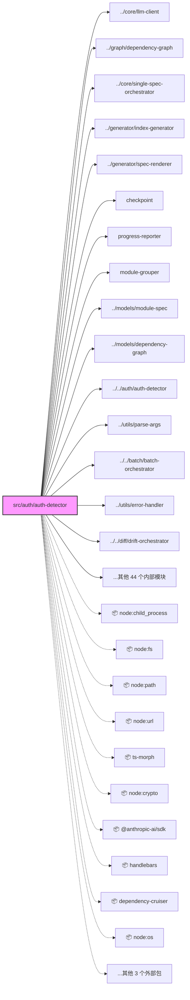

# src

## 1. 意图

[推断: LLM 不可用] 本模块位于 /Users/connorlu/Desktop/.workspace2.nosync/reverse-spec/src/auth/auth-detector.ts，包含 194 个导出符号。

## 2. 接口定义

- `function detectAuth(): AuthDetectionResult`

- `async function verifyAuth(): Promise<AuthDetectionResult>`

- `interface AuthMethod`

- `interface AuthDetectionResult`

- `function getDefaultCLIProxyConfig(): CLIProxyConfig`

- `function callLLMviaCli(prompt: string, config: Partial<CLIProxyConfig> = {}): Promise<LLMResponse>`

- `interface CLIProxyConfig`

- `async function runBatch(projectRoot: string, options: BatchOptions = {}): Promise<BatchResult>`

- `interface BatchOptions`

- `interface BatchResult`

- `function loadCheckpoint(checkpointPath: string): BatchState | null`

- `function saveCheckpoint(state: BatchState, checkpointPath: string): void`

- `function clearCheckpoint(checkpointPath: string): void`

- `const DEFAULT_CHECKPOINT_PATH`

- `function groupFilesToModules(graph: DependencyGraph, options: GroupingOptions = {}): ModuleGroupResult`

- `interface ModuleGroup`

- `interface ModuleGroupResult`

- `interface GroupingOptions`

- `function createReporter(total: number): ProgressReporter`

- `function writeSummaryLog(summary: BatchSummary, outputPath: string): void`

- `interface BatchSummary`

- `interface ProgressReporter`

- `async function runAuthStatus(command: CLICommand): Promise<void>`

- `async function runBatchCommand(command: CLICommand, version: string): Promise<void>`

- `async function runDiff(command: CLICommand, version: string): Promise<void>`

- `async function runGenerate(command: CLICommand, version: string): Promise<void>`

- `function runInit(command: CLICommand): void`

- `async function runMcpServer(): Promise<void>`

- `async function runPrepare(command: CLICommand, version: string): Promise<void>`

- `function validateTargetPath(target: string): boolean`

- `function checkApiKey(): boolean`

- `function checkAuth(): boolean`

- `function handleError(err: unknown): number`

- `function printError(message: string): void`

- `function printWarning(message: string): void`

- `const EXIT_CODES`

- `function parseArgs(argv: string[]): ParseResult`

- `interface CLICommand`

- `interface ParseError`

- `export type ParseResult`

- `function resetProject(): void`

- `async function analyzeFile(filePath: string, options: AnalyzeOptions = {}): Promise<CodeSkeleton>`

- `async function analyzeFiles(filePaths: string[], options: BatchAnalyzeOptions = {}): Promise<CodeSkeleton[]>`

- `interface AnalyzeOptions`

- `interface BatchAnalyzeOptions extends AnalyzeOptions`

- `class FileNotFoundError extends Error`

- `class UnsupportedFileError extends Error`

- `async function assembleContext(skeleton: CodeSkeleton, options: AssemblyOptions = {}): Promise<AssembledContext>`

- `interface AssemblyOptions`

- `interface AssembledContext`

- `function getTimeoutForModel(model: string): number`

- `async function callLLM(context: AssembledContext, config?: Partial<LLMConfig>, onRetry?: RetryCallback): Promise<LLMResponse>`

- `function parseLLMResponse(raw: string): ParsedSpecSections`

- `function buildSystemPrompt(mode: 'spec-generation' | 'semantic-diff'): string`

- `interface LLMConfig`

- `interface LLMResponse`

- `interface UncertaintyMarker`

- `interface ParsedSpecSections`

- `class LLMUnavailableError extends Error`

- `class LLMRateLimitError extends Error`

- `class LLMResponseError extends Error`

- `class LLMTimeoutError extends Error`

- `interface RetryEvent`

- `export type RetryCallback`

- `function redact(content: string, filePath?: string): RedactionResult`

- `async function prepareContext(targetPath: string, options: GenerateSpecOptions = {}): Promise<PrepareResult>`

- `async function generateSpec(targetPath: string, options: GenerateSpecOptions = {}): Promise<GenerateSpecResult>`

- `interface GenerateSpecOptions`

- `interface GenerateSpecResult`

- `interface PrepareResult`

- `function estimateFast(text: string): number`

- `async function countAccurate(text: string): Promise<number>`

- `function fitsInBudget(text: string, budget: number): boolean`

- `function clearCache(): void`

- `async function analyzeFallback(filePath: string): Promise<CodeSkeleton>`

- `function loadBaselineSkeleton(specContent: string): CodeSkeleton`

- `async function detectDrift(specPath: string, sourcePath: string, options: DriftOptions = {}): Promise<DriftReport>`

- `interface DriftOptions`

- `function filterNoise(items: DriftItem[], oldContent: string, newContent: string): FilterResult`

- `interface FilterResult`

- `async function evaluateBehaviorChange(oldCode: string, newCode: string, specDescription: string): Promise<DriftItem | null>`

- `function compareSkeletons(oldSkeleton: CodeSkeleton, newSkeleton: CodeSkeleton): DriftItem[]`

- `function generateFrontmatter(data: FrontmatterInput): SpecFrontmatter`

- `interface FrontmatterInput`

- `function generateIndex(specs: ModuleSpec[], graph: DependencyGraph): ArchitectureIndex`

- `function generateClassDiagram(skeleton: CodeSkeleton): string`

- `function generateDependencyDiagram(skeleton: CodeSkeleton, skeletons?: CodeSkeleton[]): string | null`

- `function initRenderer(): void`

- `function renderSpec(moduleSpec: ModuleSpec): string`

- `function renderIndex(data: Record<string, unknown>): string`

- `function renderDriftReport(data: Record<string, unknown>): string`

- `function resetRenderer(): void`

- `async function buildGraph(projectRoot: string, options: GraphOptions = {}): Promise<DependencyGraph>`

- `interface GraphOptions`

- `class ProjectNotFoundError extends Error`

- `class NoDependencyCruiserError extends Error`

- `function renderDependencyGraph(graph: DependencyGraph, options: RenderOptions = {}): string`

- `interface RenderOptions`

- `function detectSCCs(graph: DependencyGraph): SCC[]`

- `function topologicalSort(graph: DependencyGraph): TopologicalResult`

- `interface TopologicalResult`

- `function installSkills(options: InstallOptions): InstallSummary`

- `function removeSkills(options: RemoveOptions): InstallSummary`

- `function resolveTargetDir(mode: 'project' | 'global'): string`

- `function formatSummary(summary: InstallSummary): string`

- `interface SkillDefinition`

- `interface InstallOptions`

- `interface RemoveOptions`

- `interface InstallResult`

- `interface InstallSummary`

- `const SKILL_DEFINITIONS: readonly SkillDefinition[]`

- `async function startMcpServer(): Promise<void>`

- `function createMcpServer(): McpServer`

- `const ExportKindSchema`

- `export type ExportKind`

- `const MemberKindSchema`

- `export type MemberKind`

- `const VisibilitySchema`

- `export type Visibility`

- `const ParserUsedSchema`

- `export type ParserUsed`

- `const LanguageSchema`

- `export type Language`

- `const MemberInfoSchema`

- `export type MemberInfo`

- `const ExportSymbolSchema`

- `export type ExportSymbol`

- `const ImportReferenceSchema`

- `export type ImportReference`

- `const ParseErrorSchema`

- `export type ParseError`

- `const CodeSkeletonSchema`

- `export type CodeSkeleton`

- `const ImportTypeSchema`

- `export type ImportType`

- `const GraphNodeSchema`

- `export type GraphNode`

- `const DependencyEdgeSchema`

- `export type DependencyEdge`

- `const SCCSchema`

- `export type SCC`

- `const DependencyGraphSchema`

- `export type DependencyGraph`

- `const SeveritySchema`

- `export type Severity`

- `const DriftCategorySchema`

- `export type DriftCategory`

- `const ChangeTypeSchema`

- `export type ChangeType`

- `const DetectedBySchema`

- `export type DetectedBy`

- `const DriftItemSchema`

- `export type DriftItem`

- `const DriftSummarySchema`

- `export type DriftSummary`

- `const SpecFrontmatterSchema`

- `export type SpecFrontmatter`

- `const SpecSectionsSchema`

- `export type SpecSections`

- `const MermaidDiagramSchema`

- `export type MermaidDiagram`

- `const FileEntrySchema`

- `export type FileEntry`

- `const ModuleSpecSchema`

- `export type ModuleSpec`

- `const IndexFrontmatterSchema`

- `export type IndexFrontmatter`

- `const ModuleMapEntrySchema`

- `export type ModuleMapEntry`

- `const TechStackEntrySchema`

- `export type TechStackEntry`

- `const ArchitectureIndexSchema`

- `export type ArchitectureIndex`

- `const DriftReportSchema`

- `export type DriftReport`

- `const CompletedModuleSchema`

- `export type CompletedModule`

- `const FailedModuleSchema`

- `export type FailedModule`

- `const BatchStateSchema`

- `export type BatchState`

- `const SecretDetectionSchema`

- `export type SecretDetection`

- `const RedactionResultSchema`

- `export type RedactionResult`

- `export type StageId`

- `interface StageProgress`

- `export type StageProgressCallback`

- `function splitIntoChunks(content: string, maxLinesPerChunk: number = CHUNK_THRESHOLD): Chunk[]`

- `const CHUNK_THRESHOLD`

- `interface Chunk`

- `function scanFiles(targetDir: string, options?: ScanOptions): ScanResult`

- `interface ScanOptions`

- `interface ScanResult`

### 模块类图

```mermaid
classDiagram
  class AuthMethod {
    <<interface>>
    +type: 'api-key'  'cli-proxy'
    +available: boolean
    +details: string
  }
  class AuthDetectionResult {
    <<interface>>
    +methods: AuthMethod
    +preferred: AuthMethod  null
    +diagnostics: string
  }
  class CLIProxyConfig {
    <<interface>>
    +model: string
    +timeout: number
    +maxConcurrency: number
    +cliPath: string
  }
  class BatchOptions {
    <<interface>>
    +force: boolean
    +onProgress: completed: number, total: number = void
    +maxRetries: number
    +checkpointPath: string
    +grouping: GroupingOptions
  }
  class BatchResult {
    <<interface>>
    +totalModules: number
    +successful: string
    +failed: FailedModule
    +skipped: string
    +degraded: string
    +duration: number
    +indexGenerated: boolean
    +summaryLogPath: string
  }
  class ModuleGroup {
    <<interface>>
    +name: string
    +dirPath: string
    +files: string
  }
  class ModuleGroupResult {
    <<interface>>
    +groups: ModuleGroup
    +moduleOrder: string
    +moduleEdges: Array from: string; to: string 
  }
  class GroupingOptions {
    <<interface>>
    +basePrefix: string
    +depth: number
    +rootModuleName: string
  }
  class BatchSummary {
    <<interface>>
    +totalModules: number
    +successful: number
    +failed: number
    +skipped: number
    +degraded: number
    +duration: number
    +modules: Array
    path: string;
    status: 'success'  'failed'  'skipped'  'degraded';
    duration?: number;
  
  }
  class ProgressReporter {
    <<interface>>
    +startmodulePath: string: void
    +stagemodulePath: string, progress: StageProgress: void
    +completemodulePath: string, status: 'success'  'failed'  'skipped'  'degraded': void
    +finish: BatchSummary
  }
  class CLICommand {
    <<interface>>
    +subcommand: 'generate'  'batch'  'diff'  'init'  'prepare'  'auth-status'  'mcp-server'
    +target: string
    +specFile: string
    +deep: boolean
    +force: boolean
    +outputDir: string
    +version: boolean
    +help: boolean
    +global: boolean
    +remove: boolean
    +verify: boolean
  }
  class ParseError {
    <<interface>>
    +type: 'invalid_subcommand'  'missing_target'  'missing_args'  'invalid_option'
    +message: string
  }
  class AnalyzeOptions {
    <<interface>>
    +includePrivate: boolean
    +maxDepth: number
  }
  class BatchAnalyzeOptions {
    <<interface>>
    +concurrency: number
    +onProgress: completed: number, total: number = void
  }
  class FileNotFoundError {
    +constructorfilePath: string
  }
  class UnsupportedFileError {
    +constructorfilePath: string
  }
  class AssemblyOptions {
    <<interface>>
    +dependencySpecs: string
    +codeSnippets: string
    +maxTokens: number
    +templateInstructions: string
  }
  class AssembledContext {
    <<interface>>
    +prompt: string
    +tokenCount: number
    +breakdown: 
    skeleton: number;
    dependencies: number;
    snippets: number;
    instructions: number;
  
    +truncated: boolean
    +truncatedParts: string
  }
  class LLMConfig {
    <<interface>>
    +model: string
    +apiKey: string
    +maxTokensResponse: number
    +temperature: number
    +timeout: number
  }
  class LLMResponse {
    <<interface>>
    +content: string
    +model: string
    +inputTokens: number
    +outputTokens: number
    +duration: number
  }
  class UncertaintyMarker {
    <<interface>>
    +type: '推断'  '不明确'  'SYNTAX ERROR'
    +section: string
    +rationale: string
  }
  class ParsedSpecSections {
    <<interface>>
    +sections: SpecSections
    +uncertaintyMarkers: UncertaintyMarker
    +parseWarnings: string
  }
  class LLMUnavailableError {
    +constructormessage: string
  }
  class LLMRateLimitError {
    +constructormessage: string
  }
  class LLMResponseError {
    +constructormessage: string, public statusCode?: number
  }
  class LLMTimeoutError {
    +constructormessage: string
  }
  class RetryEvent {
    <<interface>>
    +attempt: number
    +maxAttempts: number
    +errorType: 'timeout'  'rate-limit'  'server-error'
    +delay: number
  }
  class GenerateSpecOptions {
    <<interface>>
    +deep: boolean
    +outputDir: string
    +existingVersion: string
    +projectRoot: string
    +onStageProgress: StageProgressCallback
  }
  class GenerateSpecResult {
    <<interface>>
    +specPath: string
    +skeleton: CodeSkeleton
    +tokenUsage: number
    +confidence: 'high'  'medium'  'low'
    +warnings: string
    +moduleSpec: ModuleSpec
  }
  class PrepareResult {
    <<interface>>
    +skeletons: CodeSkeleton
    +mergedSkeleton: CodeSkeleton
    +context: AssembledContext
    +codeSnippets: string
    +filePaths: string
  }
  class DriftOptions {
    <<interface>>
    +skipSemantic: boolean
    +outputDir: string
  }
  class FilterResult {
    <<interface>>
    +substantive: DriftItem
    +filtered: number
    +filterReasons: Mapstring, string
  }
  class FrontmatterInput {
    <<interface>>
    +sourceTarget: string
    +relatedFiles: string
    +confidence: 'high'  'medium'  'low'
    +skeletonHash: string
    +existingVersion: string
  }
  class GraphOptions {
    <<interface>>
    +includeOnly: string
    +excludePatterns: string
    +tsConfigPath: string
  }
  class ProjectNotFoundError {
    +constructorprojectRoot: string
  }
  class NoDependencyCruiserError {
    +constructor
  }
  class RenderOptions {
    <<interface>>
    +collapseDirectories: boolean
    +highlightCycles: boolean
    +maxNodes: number
  }
  class TopologicalResult {
    <<interface>>
    +order: string
    +levels: Mapstring, number
    +hasCycles: boolean
    +cycleGroups: string
  }
  class SkillDefinition {
    <<interface>>
    +name: string
    +content: string
  }
  class InstallOptions {
    <<interface>>
    +targetDir: string
    +mode: 'project'  'global'
  }
  class RemoveOptions {
    <<interface>>
    +targetDir: string
    +mode: 'project'  'global'
  }
  class InstallResult {
    <<interface>>
    +skillName: string
    +status: 'installed'  'updated'  'removed'  'skipped'  'failed'
    +targetPath: string
    +error: string
  }
  class InstallSummary {
    <<interface>>
    +mode: 'project'  'global'
    +action: 'install'  'remove'
    +results: InstallResult
    +targetBasePath: string
  }
  class StageProgress {
    <<interface>>
    +stage: StageId
    +message: string
    +duration: number
  }
  class Chunk {
    <<interface>>
    +index: number
    +totalChunks: number
    +content: string
    +startLine: number
    +endLine: number
    +lineCount: number
    +symbols: string
  }
  class ScanOptions {
    <<interface>>
    +projectRoot: string
    +extraIgnorePatterns: string
  }
  class ScanResult {
    <<interface>>
    +files: string
    +totalScanned: number
    +ignored: number
  }

  AuthDetectionResult *-- AuthMethod
  BatchOptions *-- GroupingOptions
  BatchResult *-- FailedModule
  ModuleGroupResult *-- ModuleGroup
  AnalyzeOptions <|-- BatchAnalyzeOptions
  Error <|-- FileNotFoundError
  Error <|-- UnsupportedFileError
  ParsedSpecSections *-- SpecSections
  ParsedSpecSections *-- UncertaintyMarker
  Error <|-- LLMUnavailableError
  Error <|-- LLMRateLimitError
  Error <|-- LLMResponseError
  Error <|-- LLMTimeoutError
  GenerateSpecOptions *-- StageProgressCallback
  GenerateSpecResult *-- CodeSkeleton
  GenerateSpecResult *-- ModuleSpec
  PrepareResult *-- CodeSkeleton
  PrepareResult *-- AssembledContext
  FilterResult *-- DriftItem
  Error <|-- ProjectNotFoundError
  Error <|-- NoDependencyCruiserError
  InstallSummary *-- InstallResult
  StageProgress *-- StageId
```

### 依赖关系图

## 3. 业务逻辑

[推断: LLM 不可用] 无法分析业务逻辑。

## 4. 数据结构

- `interface AuthMethod`

- `interface AuthDetectionResult`

- `interface CLIProxyConfig`

- `interface BatchOptions`

- `interface BatchResult`

- `interface ModuleGroup`

- `interface ModuleGroupResult`

- `interface GroupingOptions`

- `interface BatchSummary`

- `interface ProgressReporter`

- `interface CLICommand`

- `interface ParseError`

- `export type ParseResult`

- `interface AnalyzeOptions`

- `interface BatchAnalyzeOptions extends AnalyzeOptions`

- `interface AssemblyOptions`

- `interface AssembledContext`

- `interface LLMConfig`

- `interface LLMResponse`

- `interface UncertaintyMarker`

- `interface ParsedSpecSections`

- `interface RetryEvent`

- `export type RetryCallback`

- `interface GenerateSpecOptions`

- `interface GenerateSpecResult`

- `interface PrepareResult`

- `interface DriftOptions`

- `interface FilterResult`

- `interface FrontmatterInput`

- `interface GraphOptions`

- `interface RenderOptions`

- `interface TopologicalResult`

- `interface SkillDefinition`

- `interface InstallOptions`

- `interface RemoveOptions`

- `interface InstallResult`

- `interface InstallSummary`

- `export type ExportKind`

- `export type MemberKind`

- `export type Visibility`

- `export type ParserUsed`

- `export type Language`

- `export type MemberInfo`

- `export type ExportSymbol`

- `export type ImportReference`

- `export type ParseError`

- `export type CodeSkeleton`

- `export type ImportType`

- `export type GraphNode`

- `export type DependencyEdge`

- `export type SCC`

- `export type DependencyGraph`

- `export type Severity`

- `export type DriftCategory`

- `export type ChangeType`

- `export type DetectedBy`

- `export type DriftItem`

- `export type DriftSummary`

- `export type SpecFrontmatter`

- `export type SpecSections`

- `export type MermaidDiagram`

- `export type FileEntry`

- `export type ModuleSpec`

- `export type IndexFrontmatter`

- `export type ModuleMapEntry`

- `export type TechStackEntry`

- `export type ArchitectureIndex`

- `export type DriftReport`

- `export type CompletedModule`

- `export type FailedModule`

- `export type BatchState`

- `export type SecretDetection`

- `export type RedactionResult`

- `export type StageId`

- `interface StageProgress`

- `export type StageProgressCallback`

- `interface Chunk`

- `interface ScanOptions`

- `interface ScanResult`

## 5. 约束条件

[推断: LLM 不可用] 无法分析约束条件。

## 6. 边界条件

[推断: LLM 不可用] 无法分析边界条件。

## 7. 技术债务

[推断: LLM 不可用] 无法分析技术债务。

## 8. 测试覆盖

[推断: LLM 不可用] 无法分析测试覆盖。

## 9. 依赖关系

- `node:child_process`

- `node:fs`

- `node:path`

- `node:child_process`

- `../core/llm-client.js`

- `../core/llm-client.js`

- `node:fs`

- `node:path`

- `../graph/dependency-graph.js`

- `../core/single-spec-orchestrator.js`

- `../generator/index-generator.js`

- `../generator/spec-renderer.js`

- `./checkpoint.js`

- `./progress-reporter.js`

- `./module-grouper.js`

- `../models/module-spec.js`

- `node:fs`

- `node:path`

- `../models/module-spec.js`

- `../models/dependency-graph.js`

- `node:fs`

- `../models/module-spec.js`

- `../../auth/auth-detector.js`

- `../../auth/auth-detector.js`

- `../utils/parse-args.js`

- `../../batch/batch-orchestrator.js`

- `../utils/error-handler.js`

- `../utils/parse-args.js`

- `node:path`

- `../../diff/drift-orchestrator.js`

- `../utils/error-handler.js`

- `../utils/parse-args.js`

- `node:path`

- `../../core/single-spec-orchestrator.js`

- `../utils/error-handler.js`

- `../utils/parse-args.js`

- `../utils/parse-args.js`

- `../../installer/skill-installer.js`

- `../../mcp/index.js`

- `node:path`

- `../../core/single-spec-orchestrator.js`

- `../utils/error-handler.js`

- `../utils/parse-args.js`

- `../../models/code-skeleton.js`

- `../../core/context-assembler.js`

- `node:fs`

- `node:path`

- `node:url`

- `./utils/parse-args.js`

- `./utils/error-handler.js`

- `./commands/generate.js`

- `./commands/batch.js`

- `./commands/diff.js`

- `./commands/init.js`

- `./commands/prepare.js`

- `./commands/auth-status.js`

- `./commands/mcp-server.js`

- `node:fs`

- `node:path`

- `../../auth/auth-detector.js`

- `ts-morph`

- `node:crypto`

- `../models/code-skeleton.js`

- `./tree-sitter-fallback.js`

- `../models/code-skeleton.js`

- `./token-counter.js`

- `@anthropic-ai/sdk`

- `../models/module-spec.js`

- `./context-assembler.js`

- `../auth/auth-detector.js`

- `../auth/cli-proxy.js`

- `node:crypto`

- `../models/module-spec.js`

- `node:fs`

- `node:path`

- `node:crypto`

- `../models/code-skeleton.js`

- `../models/module-spec.js`

- `../utils/file-scanner.js`

- `./ast-analyzer.js`

- `./secret-redactor.js`

- `./context-assembler.js`

- `./llm-client.js`

- `../generator/frontmatter.js`

- `../generator/spec-renderer.js`

- `../generator/mermaid-class-diagram.js`

- `../generator/mermaid-dependency-graph.js`

- `../utils/chunk-splitter.js`

- `node:crypto`

- `node:fs`

- `node:crypto`

- `../models/code-skeleton.js`

- `node:fs`

- `node:path`

- `../models/code-skeleton.js`

- `../models/drift-item.js`

- `../models/module-spec.js`

- `../core/ast-analyzer.js`

- `../utils/file-scanner.js`

- `./structural-diff.js`

- `./noise-filter.js`

- `./semantic-diff.js`

- `../generator/spec-renderer.js`

- `../models/drift-item.js`

- `../core/llm-client.js`

- `../core/context-assembler.js`

- `../models/drift-item.js`

- `../models/code-skeleton.js`

- `../models/code-skeleton.js`

- `../models/drift-item.js`

- `../models/module-spec.js`

- `../models/module-spec.js`

- `../models/module-spec.js`

- `../models/dependency-graph.js`

- `../models/code-skeleton.js`

- `../models/code-skeleton.js`

- `handlebars`

- `node:fs`

- `node:path`

- `node:url`

- `../models/module-spec.js`

- `dependency-cruiser`

- `node:path`

- `node:fs`

- `../models/dependency-graph.js`

- `./topological-sort.js`

- `./mermaid-renderer.js`

- `../models/dependency-graph.js`

- `../models/dependency-graph.js`

- `node:fs`

- `node:path`

- `node:os`

- `./skill-templates.js`

- `./skill-installer.js`

- `@modelcontextprotocol/sdk/server/stdio.js`

- `./server.js`

- `@modelcontextprotocol/sdk/server/mcp.js`

- `zod`

- `node:fs`

- `node:path`

- `node:url`

- `../core/single-spec-orchestrator.js`

- `../batch/batch-orchestrator.js`

- `../diff/drift-orchestrator.js`

- `zod`

- `zod`

- `zod`

- `zod`

- `./code-skeleton.js`

- `./drift-item.js`

- `../installer/skill-installer.js`

- `../installer/skill-installer.js`

- `node:fs`

- `node:path`

---

## 附录：文件清单

| 文件 | 行数 | 主要用途 |
|------|------|----------|
| `src/auth/auth-detector.ts` | 268 | 导出 detectAuth, verifyAuth, AuthMethod, AuthDetectionResult |
| `src/auth/cli-proxy.ts` | 274 | 导出 getDefaultCLIProxyConfig, callLLMviaCli, CLIProxyConfig |
| `src/batch/batch-orchestrator.ts` | 262 | 导出 runBatch, BatchOptions, BatchResult |
| `src/batch/checkpoint.ts` | 81 | 导出 loadCheckpoint, saveCheckpoint, clearCheckpoint, DEFAULT_CHECKPOINT_PATH |
| `src/batch/module-grouper.ts` | 227 | 导出 groupFilesToModules, ModuleGroup, ModuleGroupResult, GroupingOptions |
| `src/batch/progress-reporter.ts` | 149 | 导出 createReporter, writeSummaryLog, BatchSummary, ProgressReporter |
| `src/cli/commands/auth-status.ts` | 51 | 导出 runAuthStatus |
| `src/cli/commands/batch.ts` | 45 | 导出 runBatchCommand |
| `src/cli/commands/diff.ts` | 64 | 导出 runDiff |
| `src/cli/commands/generate.ts` | 54 | 导出 runGenerate |
| `src/cli/commands/init.ts` | 41 | 导出 runInit |
| `src/cli/commands/mcp-server.ts` | 14 | 导出 runMcpServer |
| `src/cli/commands/prepare.ts` | 175 | 导出 runPrepare |
| `src/cli/index.ts` | 115 | 内部模块 |
| `src/cli/utils/error-handler.ts` | 100 | 导出 validateTargetPath, checkApiKey, checkAuth, handleError, printError, printWarning, EXIT_CODES |
| `src/cli/utils/parse-args.ts` | 266 | 导出 parseArgs, CLICommand, ParseError, ParseResult |
| `src/core/ast-analyzer.ts` | 489 | 导出 resetProject, analyzeFile, analyzeFiles, AnalyzeOptions, BatchAnalyzeOptions, FileNotFoundError, UnsupportedFileError |
| `src/core/context-assembler.ts` | 228 | 导出 assembleContext, AssemblyOptions, AssembledContext |
| `src/core/llm-client.ts` | 601 | 导出 getTimeoutForModel, callLLM, parseLLMResponse, buildSystemPrompt, LLMConfig, LLMResponse, UncertaintyMarker, ParsedSpecSections, LLMUnavailableError, LLMRateLimitError, LLMResponseError, LLMTimeoutError, RetryEvent, RetryCallback |
| `src/core/secret-redactor.ts` | 220 | 导出 redact |
| `src/core/single-spec-orchestrator.ts` | 439 | 导出 prepareContext, generateSpec, GenerateSpecOptions, GenerateSpecResult, PrepareResult |
| `src/core/token-counter.ts` | 143 | 导出 estimateFast, countAccurate, fitsInBudget, clearCache |
| `src/core/tree-sitter-fallback.ts` | 180 | 导出 analyzeFallback |
| `src/diff/drift-orchestrator.ts` | 306 | 导出 loadBaselineSkeleton, detectDrift, DriftOptions |
| `src/diff/noise-filter.ts` | 102 | 导出 filterNoise, FilterResult |
| `src/diff/semantic-diff.ts` | 103 | 导出 evaluateBehaviorChange |
| `src/diff/structural-diff.ts` | 209 | 导出 compareSkeletons |
| `src/generator/frontmatter.ts` | 50 | 导出 generateFrontmatter, FrontmatterInput |
| `src/generator/index-generator.ts` | 106 | 导出 generateIndex |
| `src/generator/mermaid-class-diagram.ts` | 147 | 导出 generateClassDiagram |
| `src/generator/mermaid-dependency-graph.ts` | 104 | 导出 generateDependencyDiagram |
| `src/generator/spec-renderer.ts` | 131 | 导出 initRenderer, renderSpec, renderIndex, renderDriftReport, resetRenderer |
| `src/graph/dependency-graph.ts` | 237 | 导出 buildGraph, GraphOptions, ProjectNotFoundError, NoDependencyCruiserError |
| `src/graph/mermaid-renderer.ts` | 174 | 导出 renderDependencyGraph, RenderOptions |
| `src/graph/topological-sort.ts` | 211 | 导出 detectSCCs, topologicalSort, TopologicalResult |
| `src/installer/skill-installer.ts` | 252 | 导出 installSkills, removeSkills, resolveTargetDir, formatSummary, SkillDefinition, InstallOptions, RemoveOptions, InstallResult, InstallSummary |
| `src/installer/skill-templates.ts` | 189 | 导出 SKILL_DEFINITIONS |
| `src/mcp/index.ts` | 23 | 导出 startMcpServer |
| `src/mcp/server.ts` | 168 | 导出 createMcpServer |
| `src/models/code-skeleton.ts` | 106 | 导出 ExportKindSchema, ExportKind, MemberKindSchema, MemberKind, VisibilitySchema, Visibility, ParserUsedSchema, ParserUsed, LanguageSchema, Language, MemberInfoSchema, MemberInfo, ExportSymbolSchema, ExportSymbol, ImportReferenceSchema, ImportReference, ParseErrorSchema, ParseError, CodeSkeletonSchema, CodeSkeleton |
| `src/models/dependency-graph.ts` | 55 | 导出 ImportTypeSchema, ImportType, GraphNodeSchema, GraphNode, DependencyEdgeSchema, DependencyEdge, SCCSchema, SCC, DependencyGraphSchema, DependencyGraph |
| `src/models/drift-item.ts` | 54 | 导出 SeveritySchema, Severity, DriftCategorySchema, DriftCategory, ChangeTypeSchema, ChangeType, DetectedBySchema, DetectedBy, DriftItemSchema, DriftItem, DriftSummarySchema, DriftSummary |
| `src/models/module-spec.ts` | 211 | 导出 SpecFrontmatterSchema, SpecFrontmatter, SpecSectionsSchema, SpecSections, MermaidDiagramSchema, MermaidDiagram, FileEntrySchema, FileEntry, ModuleSpecSchema, ModuleSpec, IndexFrontmatterSchema, IndexFrontmatter, ModuleMapEntrySchema, ModuleMapEntry, TechStackEntrySchema, TechStackEntry, ArchitectureIndexSchema, ArchitectureIndex, DriftReportSchema, DriftReport, CompletedModuleSchema, CompletedModule, FailedModuleSchema, FailedModule, BatchStateSchema, BatchState, SecretDetectionSchema, SecretDetection, RedactionResultSchema, RedactionResult, StageId, StageProgress, StageProgressCallback |
| `src/scripts/postinstall.ts` | 37 | 内部模块 |
| `src/scripts/preuninstall.ts` | 35 | 内部模块 |
| `src/utils/chunk-splitter.ts` | 155 | 导出 splitIntoChunks, CHUNK_THRESHOLD, Chunk |
| `src/utils/file-scanner.ts` | 233 | 导出 scanFiles, ScanOptions, ScanResult |

<!-- baseline-skeleton: {"filePath":"src/auth/auth-detector.ts","language":"typescript","loc":7884,"exports":[{"name":"detectAuth","kind":"function","signature":"function detectAuth(): AuthDetectionResult","jsDoc":"/**\n * 检测当前环境可用的认证方式\n *\n * 优先级：API Key > CLI Proxy\n *\n * @returns 认证检测结果\n */","isDefault":false,"startLine":127,"endLine":191},{"name":"verifyAuth","kind":"function","signature":"async function verifyAuth(): Promise<AuthDetectionResult>","jsDoc":"/**\n * 在线验证认证方式（--verify 模式）\n *\n * 实际测试连接，确认认证凭证有效\n *\n * @returns 验证后的认证结果\n */","isDefault":false,"startLine":200,"endLine":267},{"name":"AuthMethod","kind":"interface","signature":"interface AuthMethod","jsDoc":"/** 认证方式 */","isDefault":false,"startLine":15,"endLine":22,"members":[{"name":"type","kind":"property","signature":"type: 'api-key' | 'cli-proxy'","jsDoc":"/** 认证类型 */","isStatic":false},{"name":"available","kind":"property","signature":"available: boolean","jsDoc":"/** 是否可用 */","isStatic":false},{"name":"details","kind":"property","signature":"details: string","jsDoc":"/** 描述信息（如 API Key 前缀、CLI 版本） */","isStatic":false}]},{"name":"AuthDetectionResult","kind":"interface","signature":"interface AuthDetectionResult","jsDoc":"/** 认证检测结果 */","isDefault":false,"startLine":25,"endLine":32,"members":[{"name":"methods","kind":"property","signature":"methods: AuthMethod[]","jsDoc":"/** 检测到的所有认证方式（按优先级排序） */","isStatic":false},{"name":"preferred","kind":"property","signature":"preferred: AuthMethod | null","jsDoc":"/** 最高优先级的可用方式，无可用时为 null */","isStatic":false},{"name":"diagnostics","kind":"property","signature":"diagnostics: string[]","jsDoc":"/** 诊断信息（用于 auth-status 和错误提示） */","isStatic":false}]},{"name":"getDefaultCLIProxyConfig","kind":"function","signature":"function getDefaultCLIProxyConfig(): CLIProxyConfig","jsDoc":"/** 获取默认 CLI 代理配置 */","isDefault":false,"startLine":60,"endLine":67},{"name":"callLLMviaCli","kind":"function","signature":"function callLLMviaCli(prompt: string, config: Partial<CLIProxyConfig> = {}): Promise<LLMResponse>","jsDoc":"/**\n * 通过 Claude CLI 子进程调用 LLM\n *\n * 流程：\n * 1. spawn claude --print --output-format stream-json --model <model>\n * 2. 通过 stdin 写入 prompt\n * 3. 解析 stdout 的 JSON stream 输出\n * 4. 构造 LLMResponse\n *\n * @param prompt - 完整的 prompt 文本（含系统提示 + 用户内容）\n * @param config - CLI 代理配置\n * @returns 与 SDK 调用相同格式的 LLMResponse\n * @throws LLMTimeoutError, LLMResponseError, LLMUnavailableError\n */","isDefault":false,"startLine":87,"endLine":194},{"name":"CLIProxyConfig","kind":"interface","signature":"interface CLIProxyConfig","jsDoc":"/** CLI 代理配置 */","isDefault":false,"startLine":21,"endLine":30,"members":[{"name":"model","kind":"property","signature":"model: string","jsDoc":"/** Claude 模型 ID */","isStatic":false},{"name":"timeout","kind":"property","signature":"timeout: number","jsDoc":"/** 超时时间（毫秒，默认 120000） */","isStatic":false},{"name":"maxConcurrency","kind":"property","signature":"maxConcurrency: number","jsDoc":"/** batch 模式最大并发进程数（默认 3） */","isStatic":false},{"name":"cliPath","kind":"property","signature":"cliPath: string","jsDoc":"/** Claude CLI 可执行文件路径（undefined 则自动检测） */","isStatic":false}]},{"name":"runBatch","kind":"function","signature":"async function runBatch(projectRoot: string, options: BatchOptions = {}): Promise<BatchResult>","jsDoc":"/**\n * 按模块级拓扑顺序编排全项目 Spec 生成\n *\n * @param projectRoot - 项目根目录\n * @param options - 批量选项\n * @returns 批量结果\n */","isDefault":false,"startLine":61,"endLine":261},{"name":"BatchOptions","kind":"interface","signature":"interface BatchOptions","jsDoc":null,"isDefault":false,"startLine":26,"endLine":37,"members":[{"name":"force","kind":"property","signature":"force: boolean","jsDoc":"/** 即使 spec 已存在也重新生成 */","isStatic":false},{"name":"onProgress","kind":"property","signature":"onProgress: (completed: number, total: number) => void","jsDoc":"/** 进度回调 */","isStatic":false},{"name":"maxRetries","kind":"property","signature":"maxRetries: number","jsDoc":"/** 每个模块的 LLM 最大重试次数（默认 3） */","isStatic":false},{"name":"checkpointPath","kind":"property","signature":"checkpointPath: string","jsDoc":"/** 检查点文件路径 */","isStatic":false},{"name":"grouping","kind":"property","signature":"grouping: GroupingOptions","jsDoc":"/** 模块分组选项 */","isStatic":false}]},{"name":"BatchResult","kind":"interface","signature":"interface BatchResult","jsDoc":null,"isDefault":false,"startLine":39,"endLine":48,"members":[{"name":"totalModules","kind":"property","signature":"totalModules: number","jsDoc":null,"isStatic":false},{"name":"successful","kind":"property","signature":"successful: string[]","jsDoc":null,"isStatic":false},{"name":"failed","kind":"property","signature":"failed: FailedModule[]","jsDoc":null,"isStatic":false},{"name":"skipped","kind":"property","signature":"skipped: string[]","jsDoc":null,"isStatic":false},{"name":"degraded","kind":"property","signature":"degraded: string[]","jsDoc":null,"isStatic":false},{"name":"duration","kind":"property","signature":"duration: number","jsDoc":null,"isStatic":false},{"name":"indexGenerated","kind":"property","signature":"indexGenerated: boolean","jsDoc":null,"isStatic":false},{"name":"summaryLogPath","kind":"property","signature":"summaryLogPath: string","jsDoc":null,"isStatic":false}]},{"name":"loadCheckpoint","kind":"function","signature":"function loadCheckpoint(checkpointPath: string): BatchState | null","jsDoc":"/**\n * 加载已有检查点以恢复执行\n *\n * @param checkpointPath - 检查点文件路径\n * @returns BatchState 或 null（未找到）\n */","isDefault":false,"startLine":19,"endLine":36},{"name":"saveCheckpoint","kind":"function","signature":"function saveCheckpoint(state: BatchState, checkpointPath: string): void","jsDoc":"/**\n * 原子写入检查点状态\n * 先写临时文件再重命名，防止写入中断导致数据损坏\n *\n * @param state - 当前批处理状态\n * @param checkpointPath - 检查点文件路径\n */","isDefault":false,"startLine":45,"endLine":61},{"name":"clearCheckpoint","kind":"function","signature":"function clearCheckpoint(checkpointPath: string): void","jsDoc":"/**\n * 批处理成功完成后删除检查点\n *\n * @param checkpointPath - 检查点文件路径\n */","isDefault":false,"startLine":68,"endLine":80},{"name":"DEFAULT_CHECKPOINT_PATH","kind":"const","signature":"const DEFAULT_CHECKPOINT_PATH","jsDoc":null,"isDefault":false,"startLine":11,"endLine":11},{"name":"groupFilesToModules","kind":"function","signature":"function groupFilesToModules(graph: DependencyGraph, options: GroupingOptions = {}): ModuleGroupResult","jsDoc":"/**\n * 将文件级依赖图聚合为模块级分组\n *\n * 分组规则：\n * 1. 以 basePrefix（默认 'src/'）开头的文件，按其后第 depth 级目录分组\n * 2. basePrefix 根目录下的散文件归入 rootModuleName 模块\n * 3. 无 src/ 目录时按项目根目录下第一级目录分组\n */","isDefault":false,"startLine":53,"endLine":115},{"name":"ModuleGroup","kind":"interface","signature":"interface ModuleGroup","jsDoc":"/** 模块分组 */","isDefault":false,"startLine":12,"endLine":19,"members":[{"name":"name","kind":"property","signature":"name: string","jsDoc":"/** 模块名称（如 'agents'、'config'、'root'） */","isStatic":false},{"name":"dirPath","kind":"property","signature":"dirPath: string","jsDoc":"/** 模块对应的目录路径（相对于项目根，如 'src/agents'） */","isStatic":false},{"name":"files","kind":"property","signature":"files: string[]","jsDoc":"/** 模块内包含的文件路径 */","isStatic":false}]},{"name":"ModuleGroupResult","kind":"interface","signature":"interface ModuleGroupResult","jsDoc":"/** 分组结果 */","isDefault":false,"startLine":22,"endLine":29,"members":[{"name":"groups","kind":"property","signature":"groups: ModuleGroup[]","jsDoc":"/** 按模块分组的结果 */","isStatic":false},{"name":"moduleOrder","kind":"property","signature":"moduleOrder: string[]","jsDoc":"/** 模块级拓扑排序（叶子模块优先） */","isStatic":false},{"name":"moduleEdges","kind":"property","signature":"moduleEdges: Array<{ from: string; to: string }>","jsDoc":"/** 模块间的聚合依赖边 */","isStatic":false}]},{"name":"GroupingOptions","kind":"interface","signature":"interface GroupingOptions","jsDoc":"/** 分组选项 */","isDefault":false,"startLine":32,"endLine":39,"members":[{"name":"basePrefix","kind":"property","signature":"basePrefix: string","jsDoc":"/** 分组策略的基准目录前缀（默认自动检测） */","isStatic":false},{"name":"depth","kind":"property","signature":"depth: number","jsDoc":"/** 分组深度（basePrefix 之后取几级目录，默认 1） */","isStatic":false},{"name":"rootModuleName","kind":"property","signature":"rootModuleName: string","jsDoc":"/** 根目录散文件的模块名（默认 'root'） */","isStatic":false}]},{"name":"createReporter","kind":"function","signature":"function createReporter(total: number): ProgressReporter","jsDoc":"/**\n * 创建终端进度报告器\n *\n * @param total - 模块总数\n * @returns ProgressReporter\n */","isDefault":false,"startLine":43,"endLine":108},{"name":"writeSummaryLog","kind":"function","signature":"function writeSummaryLog(summary: BatchSummary, outputPath: string): void","jsDoc":"/**\n * 写入批处理摘要日志（FR-015）\n *\n * @param summary - 批处理摘要\n * @param outputPath - 输出路径（specs/ 目录下）\n */","isDefault":false,"startLine":116,"endLine":148},{"name":"BatchSummary","kind":"interface","signature":"interface BatchSummary","jsDoc":null,"isDefault":false,"startLine":9,"endLine":21,"members":[{"name":"totalModules","kind":"property","signature":"totalModules: number","jsDoc":null,"isStatic":false},{"name":"successful","kind":"property","signature":"successful: number","jsDoc":null,"isStatic":false},{"name":"failed","kind":"property","signature":"failed: number","jsDoc":null,"isStatic":false},{"name":"skipped","kind":"property","signature":"skipped: number","jsDoc":null,"isStatic":false},{"name":"degraded","kind":"property","signature":"degraded: number","jsDoc":null,"isStatic":false},{"name":"duration","kind":"property","signature":"duration: number","jsDoc":null,"isStatic":false},{"name":"modules","kind":"property","signature":"modules: Array<{\n    path: string;\n    status: 'success' | 'failed' | 'skipped' | 'degraded';\n    duration?: number;\n  }>","jsDoc":null,"isStatic":false}]},{"name":"ProgressReporter","kind":"interface","signature":"interface ProgressReporter","jsDoc":null,"isDefault":false,"startLine":23,"endLine":35,"members":[{"name":"start","kind":"method","signature":"start(modulePath: string): void","jsDoc":"/** 开始处理某模块 */","isStatic":false},{"name":"stage","kind":"method","signature":"stage(modulePath: string, progress: StageProgress): void","jsDoc":"/** 报告模块内阶段进度 */","isStatic":false},{"name":"complete","kind":"method","signature":"complete(modulePath: string, status: 'success' | 'failed' | 'skipped' | 'degraded'): void","jsDoc":"/** 完成某模块处理 */","isStatic":false},{"name":"finish","kind":"method","signature":"finish(): BatchSummary","jsDoc":"/** 生成最终摘要 */","isStatic":false}]},{"name":"runAuthStatus","kind":"function","signature":"async function runAuthStatus(command: CLICommand): Promise<void>","jsDoc":"/**\n * 执行 auth-status 子命令\n */","isDefault":false,"startLine":13,"endLine":36},{"name":"runBatchCommand","kind":"function","signature":"async function runBatchCommand(command: CLICommand, version: string): Promise<void>","jsDoc":"/**\n * 执行 batch 子命令\n */","isDefault":false,"startLine":13,"endLine":44},{"name":"runDiff","kind":"function","signature":"async function runDiff(command: CLICommand, version: string): Promise<void>","jsDoc":"/**\n * 执行 diff 子命令\n */","isDefault":false,"startLine":19,"endLine":63},{"name":"runGenerate","kind":"function","signature":"async function runGenerate(command: CLICommand, version: string): Promise<void>","jsDoc":"/**\n * 执行 generate 子命令\n */","isDefault":false,"startLine":19,"endLine":53},{"name":"runInit","kind":"function","signature":"function runInit(command: CLICommand): void","jsDoc":"/**\n * 执行 init 命令\n */","isDefault":false,"startLine":17,"endLine":40},{"name":"runMcpServer","kind":"function","signature":"async function runMcpServer(): Promise<void>","jsDoc":"/**\n * 执行 mcp-server 子命令\n */","isDefault":false,"startLine":11,"endLine":13},{"name":"runPrepare","kind":"function","signature":"async function runPrepare(command: CLICommand, version: string): Promise<void>","jsDoc":"/**\n * 执行 prepare 子命令\n * 进度信息输出到 stderr，结构化数据输出到 stdout\n */","isDefault":false,"startLine":23,"endLine":60},{"name":"validateTargetPath","kind":"function","signature":"function validateTargetPath(target: string): boolean","jsDoc":"/**\n * 验证目标路径是否存在\n * @returns 如果路径不存在则输出错误信息并返回 false\n */","isDefault":false,"startLine":21,"endLine":28},{"name":"checkApiKey","kind":"function","signature":"function checkApiKey(): boolean","jsDoc":"/**\n * 检查 ANTHROPIC_API_KEY 环境变量\n * @deprecated 使用 checkAuth() 替代，支持 API Key 和 CLI 代理两种认证方式\n * @returns 如果缺失则输出错误信息并返回 false\n */","isDefault":false,"startLine":35,"endLine":44},{"name":"checkAuth","kind":"function","signature":"function checkAuth(): boolean","jsDoc":"/**\n * 检查是否有可用的认证方式（API Key 或 Claude CLI）\n * @returns 如果无可用方式则输出错误信息并返回 false\n */","isDefault":false,"startLine":50,"endLine":61},{"name":"handleError","kind":"function","signature":"function handleError(err: unknown): number","jsDoc":"/**\n * 处理运行时错误，输出友好信息\n */","isDefault":false,"startLine":66,"endLine":85},{"name":"printError","kind":"function","signature":"function printError(message: string): void","jsDoc":"/**\n * 输出错误信息到 stderr\n */","isDefault":false,"startLine":90,"endLine":92},{"name":"printWarning","kind":"function","signature":"function printWarning(message: string): void","jsDoc":"/**\n * 输出警告信息\n */","isDefault":false,"startLine":97,"endLine":99},{"name":"EXIT_CODES","kind":"const","signature":"const EXIT_CODES","jsDoc":null,"isDefault":false,"startLine":11,"endLine":15},{"name":"parseArgs","kind":"function","signature":"function parseArgs(argv: string[]): ParseResult","jsDoc":"/**\n * 解析 CLI 参数\n * @param argv process.argv.slice(2) 后的参数数组\n */","isDefault":false,"startLine":39,"endLine":244},{"name":"CLICommand","kind":"interface","signature":"interface CLICommand","jsDoc":"/**\n * CLI 参数解析器\n * 解析 process.argv，输出 CLICommand 对象\n */\n/** CLI 命令结构 */","isDefault":false,"startLine":7,"endLine":22,"members":[{"name":"subcommand","kind":"property","signature":"subcommand: 'generate' | 'batch' | 'diff' | 'init' | 'prepare' | 'auth-status' | 'mcp-server'","jsDoc":null,"isStatic":false},{"name":"target","kind":"property","signature":"target: string","jsDoc":null,"isStatic":false},{"name":"specFile","kind":"property","signature":"specFile: string","jsDoc":null,"isStatic":false},{"name":"deep","kind":"property","signature":"deep: boolean","jsDoc":null,"isStatic":false},{"name":"force","kind":"property","signature":"force: boolean","jsDoc":null,"isStatic":false},{"name":"outputDir","kind":"property","signature":"outputDir: string","jsDoc":null,"isStatic":false},{"name":"version","kind":"property","signature":"version: boolean","jsDoc":null,"isStatic":false},{"name":"help","kind":"property","signature":"help: boolean","jsDoc":null,"isStatic":false},{"name":"global","kind":"property","signature":"global: boolean","jsDoc":"/** --global 选项（仅 init 子命令） */","isStatic":false},{"name":"remove","kind":"property","signature":"remove: boolean","jsDoc":"/** --remove 选项（仅 init 子命令） */","isStatic":false},{"name":"verify","kind":"property","signature":"verify: boolean","jsDoc":"/** --verify 选项（仅 auth-status 子命令） */","isStatic":false}]},{"name":"ParseError","kind":"interface","signature":"interface ParseError","jsDoc":"/** 解析错误 */","isDefault":false,"startLine":25,"endLine":28,"members":[{"name":"type","kind":"property","signature":"type: 'invalid_subcommand' | 'missing_target' | 'missing_args' | 'invalid_option'","jsDoc":null,"isStatic":false},{"name":"message","kind":"property","signature":"message: string","jsDoc":null,"isStatic":false}]},{"name":"ParseResult","kind":"type","signature":"export type ParseResult","jsDoc":"/** 解析结果 */","isDefault":false,"startLine":31,"endLine":33},{"name":"resetProject","kind":"function","signature":"function resetProject(): void","jsDoc":"/** 重置共享 Project（测试用） */","isDefault":false,"startLine":84,"endLine":86},{"name":"analyzeFile","kind":"function","signature":"async function analyzeFile(filePath: string, options: AnalyzeOptions = {}): Promise<CodeSkeleton>","jsDoc":"/**\n * 解析单个 TypeScript/JavaScript 文件并返回 CodeSkeleton\n *\n * @param filePath - 源文件路径\n * @param options - 分析选项\n * @returns CodeSkeleton\n * @throws FileNotFoundError, UnsupportedFileError\n */","isDefault":false,"startLine":408,"endLine":464},{"name":"analyzeFiles","kind":"function","signature":"async function analyzeFiles(filePaths: string[], options: BatchAnalyzeOptions = {}): Promise<CodeSkeleton[]>","jsDoc":"/**\n * 使用单个 Project 实例对多个文件进行批量分析\n * 每个文件处理后调用 file.forget() 进行内存管理\n *\n * @param filePaths - 文件路径数组\n * @param options - 批量分析选项\n * @returns CodeSkeleton[] 与输入顺序一致\n */","isDefault":false,"startLine":474,"endLine":488},{"name":"AnalyzeOptions","kind":"interface","signature":"interface AnalyzeOptions","jsDoc":null,"isDefault":false,"startLine":23,"endLine":28,"members":[{"name":"includePrivate","kind":"property","signature":"includePrivate: boolean","jsDoc":"/** 包含非导出符号（默认 false） */","isStatic":false},{"name":"maxDepth","kind":"property","signature":"maxDepth: number","jsDoc":"/** 类继承层级最大解析深度（默认 5） */","isStatic":false}]},{"name":"BatchAnalyzeOptions","kind":"interface","signature":"interface BatchAnalyzeOptions extends AnalyzeOptions","jsDoc":null,"isDefault":false,"startLine":30,"endLine":35,"members":[{"name":"concurrency","kind":"property","signature":"concurrency: number","jsDoc":"/** 最大并发数（默认 50） */","isStatic":false},{"name":"onProgress","kind":"property","signature":"onProgress: (completed: number, total: number) => void","jsDoc":"/** 进度回调 */","isStatic":false}]},{"name":"FileNotFoundError","kind":"class","signature":"class FileNotFoundError extends Error","jsDoc":null,"isDefault":false,"startLine":41,"endLine":46,"members":[{"name":"constructor","kind":"constructor","signature":"constructor(filePath: string)","jsDoc":null,"visibility":"public","isStatic":false}]},{"name":"UnsupportedFileError","kind":"class","signature":"class UnsupportedFileError extends Error","jsDoc":null,"isDefault":false,"startLine":48,"endLine":53,"members":[{"name":"constructor","kind":"constructor","signature":"constructor(filePath: string)","jsDoc":null,"visibility":"public","isStatic":false}]},{"name":"assembleContext","kind":"function","signature":"async function assembleContext(skeleton: CodeSkeleton, options: AssemblyOptions = {}): Promise<AssembledContext>","jsDoc":"/**\n * 在 token 预算内组装 LLM 上下文\n *\n * @param skeleton - 目标模块的 CodeSkeleton\n * @param options - 组装选项\n * @returns 组装后的上下文\n */","isDefault":false,"startLine":136,"endLine":227},{"name":"AssemblyOptions","kind":"interface","signature":"interface AssemblyOptions","jsDoc":null,"isDefault":false,"startLine":14,"endLine":23,"members":[{"name":"dependencySpecs","kind":"property","signature":"dependencySpecs: string[]","jsDoc":"/** 已生成的依赖规格摘要数组 */","isStatic":false},{"name":"codeSnippets","kind":"property","signature":"codeSnippets: string[]","jsDoc":"/** 用于深度分析的复杂函数体代码片段 */","isStatic":false},{"name":"maxTokens","kind":"property","signature":"maxTokens: number","jsDoc":"/** token 预算（默认 100_000） */","isStatic":false},{"name":"templateInstructions","kind":"property","signature":"templateInstructions: string","jsDoc":"/** LLM 系统提示词模板 */","isStatic":false}]},{"name":"AssembledContext","kind":"interface","signature":"interface AssembledContext","jsDoc":null,"isDefault":false,"startLine":25,"endLine":41,"members":[{"name":"prompt","kind":"property","signature":"prompt: string","jsDoc":"/** 组装后的完整 prompt */","isStatic":false},{"name":"tokenCount","kind":"property","signature":"tokenCount: number","jsDoc":"/** token 计数 */","isStatic":false},{"name":"breakdown","kind":"property","signature":"breakdown: {\n    skeleton: number;\n    dependencies: number;\n    snippets: number;\n    instructions: number;\n  }","jsDoc":"/** 各部分 token 分布 */","isStatic":false},{"name":"truncated","kind":"property","signature":"truncated: boolean","jsDoc":"/** 是否有部分被裁剪 */","isStatic":false},{"name":"truncatedParts","kind":"property","signature":"truncatedParts: string[]","jsDoc":"/** 被裁剪的部分 */","isStatic":false}]},{"name":"getTimeoutForModel","kind":"function","signature":"function getTimeoutForModel(model: string): number","jsDoc":"/**\n * 根据模型名称返回合理的超时时间\n *\n * 基于实测数据：\n * - Opus: spec 生成通常 >120s，需要更长超时\n * - Sonnet: spec 生成通常 ~90s\n * - Haiku: 响应极快\n * - 未知模型: 保守默认值\n */","isDefault":false,"startLine":123,"endLine":129},{"name":"callLLM","kind":"function","signature":"async function callLLM(context: AssembledContext, config?: Partial<LLMConfig>, onRetry?: RetryCallback): Promise<LLMResponse>","jsDoc":"/**\n * 将组装好的上下文发送至 Claude API\n *\n * 策略模式：根据认证检测结果自动选择调用方式\n * - API Key 可用 → 通过 Anthropic SDK 直接调用\n * - CLI 代理可用 → 通过 spawn Claude CLI 子进程间接调用\n *\n * @param context - assembleContext() 的输出\n * @param config - 可选的配置覆盖\n * @param onRetry - 可选的重试事件回调\n * @returns LLM 响应\n * @throws LLMUnavailableError, LLMRateLimitError, LLMResponseError, LLMTimeoutError\n */","isDefault":false,"startLine":201,"endLine":221},{"name":"parseLLMResponse","kind":"function","signature":"function parseLLMResponse(raw: string): ParsedSpecSections","jsDoc":"/**\n * 解析 LLM 原始响应为结构化的规格章节\n *\n * @param raw - LLM 原始响应文本\n * @returns 解析后的结构化章节\n */","isDefault":false,"startLine":394,"endLine":466},{"name":"buildSystemPrompt","kind":"function","signature":"function buildSystemPrompt(mode: 'spec-generation' | 'semantic-diff'): string","jsDoc":"/**\n * 返回给定操作模式的系统提示词\n *\n * @param mode - 操作模式\n * @returns 系统提示词文本\n */","isDefault":false,"startLine":478,"endLine":600},{"name":"LLMConfig","kind":"interface","signature":"interface LLMConfig","jsDoc":null,"isDefault":false,"startLine":17,"endLine":28,"members":[{"name":"model","kind":"property","signature":"model: string","jsDoc":"/** 模型 ID（默认 'claude-sonnet-4-5-20250929'，可通过 REVERSE_SPEC_MODEL 环境变量覆盖） */","isStatic":false},{"name":"apiKey","kind":"property","signature":"apiKey: string","jsDoc":"/** API Key（默认从 ANTHROPIC_API_KEY 环境变量获取） */","isStatic":false},{"name":"maxTokensResponse","kind":"property","signature":"maxTokensResponse: number","jsDoc":"/** 响应最大 token 数（默认 8192） */","isStatic":false},{"name":"temperature","kind":"property","signature":"temperature: number","jsDoc":"/** 温度（默认 0.3，低温用于事实性提取） */","isStatic":false},{"name":"timeout","kind":"property","signature":"timeout: number","jsDoc":"/** 超时时间（毫秒，默认根据模型动态计算：Sonnet 120s, Opus 300s, Haiku 60s） */","isStatic":false}]},{"name":"LLMResponse","kind":"interface","signature":"interface LLMResponse","jsDoc":null,"isDefault":false,"startLine":30,"endLine":41,"members":[{"name":"content","kind":"property","signature":"content: string","jsDoc":"/** LLM 原始文本响应 */","isStatic":false},{"name":"model","kind":"property","signature":"model: string","jsDoc":"/** 实际使用的模型 */","isStatic":false},{"name":"inputTokens","kind":"property","signature":"inputTokens: number","jsDoc":"/** 发送的 token 数 */","isStatic":false},{"name":"outputTokens","kind":"property","signature":"outputTokens: number","jsDoc":"/** 接收的 token 数 */","isStatic":false},{"name":"duration","kind":"property","signature":"duration: number","jsDoc":"/** 请求耗时（毫秒） */","isStatic":false}]},{"name":"UncertaintyMarker","kind":"interface","signature":"interface UncertaintyMarker","jsDoc":null,"isDefault":false,"startLine":47,"endLine":51,"members":[{"name":"type","kind":"property","signature":"type: '推断' | '不明确' | 'SYNTAX ERROR'","jsDoc":null,"isStatic":false},{"name":"section","kind":"property","signature":"section: string","jsDoc":null,"isStatic":false},{"name":"rationale","kind":"property","signature":"rationale: string","jsDoc":null,"isStatic":false}]},{"name":"ParsedSpecSections","kind":"interface","signature":"interface ParsedSpecSections","jsDoc":null,"isDefault":false,"startLine":53,"endLine":57,"members":[{"name":"sections","kind":"property","signature":"sections: SpecSections","jsDoc":null,"isStatic":false},{"name":"uncertaintyMarkers","kind":"property","signature":"uncertaintyMarkers: UncertaintyMarker[]","jsDoc":null,"isStatic":false},{"name":"parseWarnings","kind":"property","signature":"parseWarnings: string[]","jsDoc":null,"isStatic":false}]},{"name":"LLMUnavailableError","kind":"class","signature":"class LLMUnavailableError extends Error","jsDoc":null,"isDefault":false,"startLine":63,"endLine":68,"members":[{"name":"constructor","kind":"constructor","signature":"constructor(message: string)","jsDoc":null,"visibility":"public","isStatic":false}]},{"name":"LLMRateLimitError","kind":"class","signature":"class LLMRateLimitError extends Error","jsDoc":null,"isDefault":false,"startLine":70,"endLine":75,"members":[{"name":"constructor","kind":"constructor","signature":"constructor(message: string)","jsDoc":null,"visibility":"public","isStatic":false}]},{"name":"LLMResponseError","kind":"class","signature":"class LLMResponseError extends Error","jsDoc":null,"isDefault":false,"startLine":77,"endLine":82,"members":[{"name":"constructor","kind":"constructor","signature":"constructor(message: string, public statusCode?: number)","jsDoc":null,"visibility":"public","isStatic":false}]},{"name":"LLMTimeoutError","kind":"class","signature":"class LLMTimeoutError extends Error","jsDoc":null,"isDefault":false,"startLine":84,"endLine":89,"members":[{"name":"constructor","kind":"constructor","signature":"constructor(message: string)","jsDoc":null,"visibility":"public","isStatic":false}]},{"name":"RetryEvent","kind":"interface","signature":"interface RetryEvent","jsDoc":"/** LLM 重试事件 */","isDefault":false,"startLine":96,"endLine":105,"members":[{"name":"attempt","kind":"property","signature":"attempt: number","jsDoc":"/** 当前尝试次数（从 1 开始） */","isStatic":false},{"name":"maxAttempts","kind":"property","signature":"maxAttempts: number","jsDoc":"/** 最大尝试次数 */","isStatic":false},{"name":"errorType","kind":"property","signature":"errorType: 'timeout' | 'rate-limit' | 'server-error'","jsDoc":"/** 触发重试的错误类型 */","isStatic":false},{"name":"delay","kind":"property","signature":"delay: number","jsDoc":"/** 下一次尝试前的等待时间（毫秒） */","isStatic":false}]},{"name":"RetryCallback","kind":"type","signature":"export type RetryCallback","jsDoc":"/** 重试事件回调 */","isDefault":false,"startLine":108,"endLine":108},{"name":"redact","kind":"function","signature":"function redact(content: string, filePath?: string): RedactionResult","jsDoc":"/**\n * 扫描内容中的敏感信息并替换为语义占位符\n *\n * @param content - 待扫描的源代码字符串\n * @param filePath - 可选的文件路径，用于上下文感知过滤\n * @returns RedactionResult\n */","isDefault":false,"startLine":164,"endLine":219},{"name":"prepareContext","kind":"function","signature":"async function prepareContext(targetPath: string, options: GenerateSpecOptions = {}): Promise<PrepareResult>","jsDoc":"/**\n * 预处理 + 上下文组装（阶段 1-2）\n * 不调用 LLM，不需要 API key。\n * 供 prepare 子命令和 generateSpec 共用。\n *\n * @param targetPath - 待分析的目录或文件路径\n * @param options - 生成选项\n * @returns 预处理结果\n */","isDefault":false,"startLine":146,"endLine":223},{"name":"generateSpec","kind":"function","signature":"async function generateSpec(targetPath: string, options: GenerateSpecOptions = {}): Promise<GenerateSpecResult>","jsDoc":"/**\n * 单模块 Spec 生成端到端编排\n *\n * 流水线步骤：\n * 1-4. prepareContext()（预处理 + 上下文组装）\n * 5. 调用 Claude API\n * 6. 解析 + 验证 LLM 响应\n * 7. 注入不确定性标记\n * 8. Handlebars 渲染 → specs/*.spec.md\n * 9. 基线骨架序列化\n *\n * @param targetPath - 待分析的目录或文件路径\n * @param options - 生成选项\n * @returns 生成结果\n */","isDefault":false,"startLine":240,"endLine":381},{"name":"GenerateSpecOptions","kind":"interface","signature":"interface GenerateSpecOptions","jsDoc":null,"isDefault":false,"startLine":26,"endLine":37,"members":[{"name":"deep","kind":"property","signature":"deep: boolean","jsDoc":"/** 在上下文组装中包含函数体（默认 false） */","isStatic":false},{"name":"outputDir","kind":"property","signature":"outputDir: string","jsDoc":"/** 输出目录（默认 'specs/'） */","isStatic":false},{"name":"existingVersion","kind":"property","signature":"existingVersion: string","jsDoc":"/** 已有版本号（用于增量更新） */","isStatic":false},{"name":"projectRoot","kind":"property","signature":"projectRoot: string","jsDoc":"/** 项目根目录（用于文件扫描） */","isStatic":false},{"name":"onStageProgress","kind":"property","signature":"onStageProgress: StageProgressCallback","jsDoc":"/** 阶段进度回调（可选） */","isStatic":false}]},{"name":"GenerateSpecResult","kind":"interface","signature":"interface GenerateSpecResult","jsDoc":null,"isDefault":false,"startLine":39,"endLine":52,"members":[{"name":"specPath","kind":"property","signature":"specPath: string","jsDoc":"/** 写入的 spec 文件路径 */","isStatic":false},{"name":"skeleton","kind":"property","signature":"skeleton: CodeSkeleton","jsDoc":"/** 提取的骨架 */","isStatic":false},{"name":"tokenUsage","kind":"property","signature":"tokenUsage: number","jsDoc":"/** LLM token 消耗 */","isStatic":false},{"name":"confidence","kind":"property","signature":"confidence: 'high' | 'medium' | 'low'","jsDoc":"/** 置信度等级 */","isStatic":false},{"name":"warnings","kind":"property","signature":"warnings: string[]","jsDoc":"/** 非致命警告 */","isStatic":false},{"name":"moduleSpec","kind":"property","signature":"moduleSpec: ModuleSpec","jsDoc":"/** 完整的 ModuleSpec 对象（用于索引生成） */","isStatic":false}]},{"name":"PrepareResult","kind":"interface","signature":"interface PrepareResult","jsDoc":"/** prepare 子命令的返回结果（阶段 1-2，不含 LLM 调用） */","isDefault":false,"startLine":55,"endLine":66,"members":[{"name":"skeletons","kind":"property","signature":"skeletons: CodeSkeleton[]","jsDoc":"/** 各文件的 CodeSkeleton */","isStatic":false},{"name":"mergedSkeleton","kind":"property","signature":"mergedSkeleton: CodeSkeleton","jsDoc":"/** 合并后的代表性骨架 */","isStatic":false},{"name":"context","kind":"property","signature":"context: AssembledContext","jsDoc":"/** 组装后的 LLM 上下文 */","isStatic":false},{"name":"codeSnippets","kind":"property","signature":"codeSnippets: string[]","jsDoc":"/** 脱敏后的代码片段（仅 deep 模式） */","isStatic":false},{"name":"filePaths","kind":"property","signature":"filePaths: string[]","jsDoc":"/** 扫描到的文件路径 */","isStatic":false}]},{"name":"estimateFast","kind":"function","signature":"function estimateFast(text: string): number","jsDoc":"/**\n * 快速 token 估算（基于字符）\n * 约 0.01ms，±15% 精度，支持 CJK 字符\n *\n * @param text - 待估算文本\n * @returns 估算的 token 数\n */","isDefault":false,"startLine":52,"endLine":58},{"name":"countAccurate","kind":"function","signature":"async function countAccurate(text: string): Promise<number>","jsDoc":"/**\n * 精确 token 计数（带缓存）\n * 首次调用约 1-5ms，后续从缓存读取\n *\n * 注：当前使用基于词的估算作为\"精确\"方法\n * 后续可替换为 @anthropic-ai/tokenizer 或 tiktoken\n *\n * @param text - 待计数文本\n * @returns 精确的 token 数\n */","isDefault":false,"startLine":70,"endLine":91},{"name":"fitsInBudget","kind":"function","signature":"function fitsInBudget(text: string, budget: number): boolean","jsDoc":"/**\n * 快速预算检查\n * 使用快速估算 + 15% 安全余量\n *\n * @param text - 待检查文本\n * @param budget - token 预算\n * @returns 是否在预算内\n */","isDefault":false,"startLine":131,"endLine":135},{"name":"clearCache","kind":"function","signature":"function clearCache(): void","jsDoc":"/**\n * 清空缓存（测试用）\n */","isDefault":false,"startLine":140,"endLine":142},{"name":"analyzeFallback","kind":"function","signature":"async function analyzeFallback(filePath: string): Promise<CodeSkeleton>","jsDoc":"/**\n * 容错解析文件\n * 使用正则模式提取基本结构信息\n *\n * @param filePath - 文件路径\n * @returns 部分填充的 CodeSkeleton，parserUsed 为 'tree-sitter'\n */","isDefault":false,"startLine":142,"endLine":179},{"name":"loadBaselineSkeleton","kind":"function","signature":"function loadBaselineSkeleton(specContent: string): CodeSkeleton","jsDoc":"/**\n * 从现有 spec 文件内容中提取序列化的基线 CodeSkeleton\n *\n * @param specContent - spec 文件的原始文本内容\n * @returns CodeSkeleton，parserUsed 指示来源\n */","isDefault":false,"startLine":39,"endLine":55},{"name":"detectDrift","kind":"function","signature":"async function detectDrift(specPath: string, sourcePath: string, options: DriftOptions = {}): Promise<DriftReport>","jsDoc":"/**\n * 端到端漂移检测编排器\n *\n * @param specPath - 现有 spec 文件路径\n * @param sourcePath - 当前源代码文件或目录路径\n * @param options - 漂移检测选项\n * @returns 完整的 DriftReport\n */","isDefault":false,"startLine":126,"endLine":220},{"name":"DriftOptions","kind":"interface","signature":"interface DriftOptions","jsDoc":null,"isDefault":false,"startLine":22,"endLine":27,"members":[{"name":"skipSemantic","kind":"property","signature":"skipSemantic: boolean","jsDoc":"/** 跳过 LLM 语义评估，仅进行结构差异检测 */","isStatic":false},{"name":"outputDir","kind":"property","signature":"outputDir: string","jsDoc":"/** 自定义输出目录（默认：drift-logs/） */","isStatic":false}]},{"name":"filterNoise","kind":"function","signature":"function filterNoise(items: DriftItem[], oldContent: string, newContent: string): FilterResult","jsDoc":"/**\n * 从漂移结果中移除非实质性变更\n *\n * @param items - 原始漂移项\n * @param oldContent - 旧版源代码\n * @param newContent - 新版源代码\n * @returns 过滤结果\n */","isDefault":false,"startLine":60,"endLine":101},{"name":"FilterResult","kind":"interface","signature":"interface FilterResult","jsDoc":null,"isDefault":false,"startLine":8,"endLine":15,"members":[{"name":"substantive","kind":"property","signature":"substantive: DriftItem[]","jsDoc":"/** 需要报告的有意义变更 */","isStatic":false},{"name":"filtered","kind":"property","signature":"filtered: number","jsDoc":"/** 被移除的噪声项计数 */","isStatic":false},{"name":"filterReasons","kind":"property","signature":"filterReasons: Map<string, string>","jsDoc":"/** itemId → 过滤原因 */","isStatic":false}]},{"name":"evaluateBehaviorChange","kind":"function","signature":"async function evaluateBehaviorChange(oldCode: string, newCode: string, specDescription: string): Promise<DriftItem | null>","jsDoc":"/**\n * 委托 LLM 评估函数体变更是否导致行为漂移\n *\n * @param oldCode - 之前的函数体\n * @param newCode - 当前的函数体\n * @param specDescription - 规格中的相关描述\n * @returns DriftItem（如检测到漂移），否则 null\n */","isDefault":false,"startLine":19,"endLine":102},{"name":"compareSkeletons","kind":"function","signature":"function compareSkeletons(oldSkeleton: CodeSkeleton, newSkeleton: CodeSkeleton): DriftItem[]","jsDoc":"/**\n * 比较两个 CodeSkeleton，识别导出符号中的结构差异\n *\n * @param oldSkeleton - 基线骨架（spec 生成时）\n * @param newSkeleton - 当前源代码骨架\n * @returns DriftItem[]\n */","isDefault":false,"startLine":22,"endLine":133},{"name":"generateFrontmatter","kind":"function","signature":"function generateFrontmatter(data: FrontmatterInput): SpecFrontmatter","jsDoc":"/**\n * 生成 YAML Frontmatter 数据\n *\n * @param data - Frontmatter 输入\n * @returns SpecFrontmatter\n */","isDefault":false,"startLine":38,"endLine":49},{"name":"FrontmatterInput","kind":"interface","signature":"interface FrontmatterInput","jsDoc":null,"isDefault":false,"startLine":7,"endLine":18,"members":[{"name":"sourceTarget","kind":"property","signature":"sourceTarget: string","jsDoc":"/** 源目标路径 */","isStatic":false},{"name":"relatedFiles","kind":"property","signature":"relatedFiles: string[]","jsDoc":"/** 相关文件路径列表 */","isStatic":false},{"name":"confidence","kind":"property","signature":"confidence: 'high' | 'medium' | 'low'","jsDoc":"/** 置信度等级 */","isStatic":false},{"name":"skeletonHash","kind":"property","signature":"skeletonHash: string","jsDoc":"/** baseline CodeSkeleton 的 SHA-256 哈希 */","isStatic":false},{"name":"existingVersion","kind":"property","signature":"existingVersion: string","jsDoc":"/** 已有版本号（如 'v3'），用于自动递增 */","isStatic":false}]},{"name":"generateIndex","kind":"function","signature":"function generateIndex(specs: ModuleSpec[], graph: DependencyGraph): ArchitectureIndex","jsDoc":"/**\n * 生成项目级架构索引\n *\n * @param specs - 所有已生成的 ModuleSpec\n * @param graph - 项目 DependencyGraph\n * @returns ArchitectureIndex\n */","isDefault":false,"startLine":65,"endLine":105},{"name":"generateClassDiagram","kind":"function","signature":"function generateClassDiagram(skeleton: CodeSkeleton): string","jsDoc":"/**\n * 从 CodeSkeleton 生成 Mermaid classDiagram 源码\n *\n * @param skeleton - AST 提取的 CodeSkeleton\n * @returns Mermaid classDiagram 源码字符串\n */","isDefault":false,"startLine":121,"endLine":146},{"name":"generateDependencyDiagram","kind":"function","signature":"function generateDependencyDiagram(skeleton: CodeSkeleton, skeletons?: CodeSkeleton[]): string | null","jsDoc":"/**\n * 从 CodeSkeleton 生成 Mermaid 依赖关系图\n * 展示模块的内部/外部依赖关系\n *\n * @param skeleton - 合并后的 CodeSkeleton\n * @param skeletons - 原始各文件的 CodeSkeleton（可选，用于展示文件间关系）\n * @returns Mermaid graph 源码，或 null（无依赖时）\n */","isDefault":false,"startLine":15,"endLine":86},{"name":"initRenderer","kind":"function","signature":"function initRenderer(): void","jsDoc":"/**\n * 一次性初始化：编译模板、注册 Helpers\n * 必须在首次调用 renderSpec() 之前执行\n */","isDefault":false,"startLine":57,"endLine":82},{"name":"renderSpec","kind":"function","signature":"function renderSpec(moduleSpec: ModuleSpec): string","jsDoc":"/**\n * 使用 Handlebars 模板将 ModuleSpec 渲染为 Markdown\n *\n * @param moduleSpec - 完整的 ModuleSpec 数据\n * @returns 包含 YAML frontmatter + 9 章节 + Mermaid + 基线骨架的完整 Markdown\n */","isDefault":false,"startLine":90,"endLine":102},{"name":"renderIndex","kind":"function","signature":"function renderIndex(data: Record<string, unknown>): string","jsDoc":"/**\n * 渲染架构索引\n */","isDefault":false,"startLine":107,"endLine":112},{"name":"renderDriftReport","kind":"function","signature":"function renderDriftReport(data: Record<string, unknown>): string","jsDoc":"/**\n * 渲染漂移报告\n */","isDefault":false,"startLine":117,"endLine":122},{"name":"resetRenderer","kind":"function","signature":"function resetRenderer(): void","jsDoc":"/** 重置初始化状态（测试用） */","isDefault":false,"startLine":125,"endLine":130},{"name":"buildGraph","kind":"function","signature":"async function buildGraph(projectRoot: string, options: GraphOptions = {}): Promise<DependencyGraph>","jsDoc":"/**\n * 使用 dependency-cruiser 构建项目级依赖关系图\n *\n * @param projectRoot - 项目根目录\n * @param options - 构建选项\n * @returns DependencyGraph\n */","isDefault":false,"startLine":55,"endLine":236},{"name":"GraphOptions","kind":"interface","signature":"interface GraphOptions","jsDoc":null,"isDefault":false,"startLine":21,"endLine":28,"members":[{"name":"includeOnly","kind":"property","signature":"includeOnly: string","jsDoc":"/** 用于过滤分析文件的 Glob 模式（默认 '^src/'） */","isStatic":false},{"name":"excludePatterns","kind":"property","signature":"excludePatterns: string[]","jsDoc":"/** 排除模式 */","isStatic":false},{"name":"tsConfigPath","kind":"property","signature":"tsConfigPath: string","jsDoc":"/** tsconfig.json 路径 */","isStatic":false}]},{"name":"ProjectNotFoundError","kind":"class","signature":"class ProjectNotFoundError extends Error","jsDoc":null,"isDefault":false,"startLine":30,"endLine":35,"members":[{"name":"constructor","kind":"constructor","signature":"constructor(projectRoot: string)","jsDoc":null,"visibility":"public","isStatic":false}]},{"name":"NoDependencyCruiserError","kind":"class","signature":"class NoDependencyCruiserError extends Error","jsDoc":null,"isDefault":false,"startLine":37,"endLine":42,"members":[{"name":"constructor","kind":"constructor","signature":"constructor()","jsDoc":null,"visibility":"public","isStatic":false}]},{"name":"renderDependencyGraph","kind":"function","signature":"function renderDependencyGraph(graph: DependencyGraph, options: RenderOptions = {}): string","jsDoc":"/**\n * 为依赖关系图生成 Mermaid graph TD 源码\n *\n * @param graph - 依赖关系图\n * @param options - 渲染选项\n * @returns Mermaid graph TD 源码\n */","isDefault":false,"startLine":61,"endLine":173},{"name":"RenderOptions","kind":"interface","signature":"interface RenderOptions","jsDoc":null,"isDefault":false,"startLine":7,"endLine":14,"members":[{"name":"collapseDirectories","kind":"property","signature":"collapseDirectories: boolean","jsDoc":"/** 按目录分组（默认：模块数 > 20 时） */","isStatic":false},{"name":"highlightCycles","kind":"property","signature":"highlightCycles: boolean","jsDoc":"/** 高亮循环依赖（默认 true） */","isStatic":false},{"name":"maxNodes","kind":"property","signature":"maxNodes: number","jsDoc":"/** 最大节点数（默认 50） */","isStatic":false}]},{"name":"detectSCCs","kind":"function","signature":"function detectSCCs(graph: DependencyGraph): SCC[]","jsDoc":"/**\n * 基于 Tarjan 算法的强连通分量检测\n *\n * @param graph - 依赖关系图\n * @returns 所有 SCC（单模块 SCC 的 modules.length === 1）\n */","isDefault":false,"startLine":32,"endLine":95},{"name":"topologicalSort","kind":"function","signature":"function topologicalSort(graph: DependencyGraph): TopologicalResult","jsDoc":"/**\n * 使用 Kahn 算法计算处理顺序\n * 循环依赖被折叠为 SCC 后作为整体处理\n *\n * @param graph - 依赖关系图\n * @returns 拓扑排序结果\n */","isDefault":false,"startLine":108,"endLine":210},{"name":"TopologicalResult","kind":"interface","signature":"interface TopologicalResult","jsDoc":null,"isDefault":false,"startLine":11,"endLine":20,"members":[{"name":"order","kind":"property","signature":"order: string[]","jsDoc":"/** 按依赖顺序排列的文件路径（叶子节点优先） */","isStatic":false},{"name":"levels","kind":"property","signature":"levels: Map<string, number>","jsDoc":"/** 模块 → 拓扑层级 */","isStatic":false},{"name":"hasCycles","kind":"property","signature":"hasCycles: boolean","jsDoc":"/** 是否存在循环依赖 */","isStatic":false},{"name":"cycleGroups","kind":"property","signature":"cycleGroups: string[][]","jsDoc":"/** 大小 > 1 的 SCC */","isStatic":false}]},{"name":"installSkills","kind":"function","signature":"function installSkills(options: InstallOptions): InstallSummary","jsDoc":"/**\n * 将 Skill Pack 安装到指定目标位置\n * 单个 skill 失败不中断其他 skill 的安装\n */","isDefault":false,"startLine":61,"endLine":101},{"name":"removeSkills","kind":"function","signature":"function removeSkills(options: RemoveOptions): InstallSummary","jsDoc":"/**\n * 从指定目标位置移除已安装的 skill\n * 单个 skill 删除失败不中断其他\n */","isDefault":false,"startLine":107,"endLine":146},{"name":"resolveTargetDir","kind":"function","signature":"function resolveTargetDir(mode: 'project' | 'global'): string","jsDoc":"/**\n * 解析安装目标目录的绝对路径\n */","isDefault":false,"startLine":151,"endLine":156},{"name":"formatSummary","kind":"function","signature":"function formatSummary(summary: InstallSummary): string","jsDoc":"/**\n * 格式化安装/移除结果为用户友好的中文输出\n */","isDefault":false,"startLine":161,"endLine":229},{"name":"SkillDefinition","kind":"interface","signature":"interface SkillDefinition","jsDoc":"/** 可安装的 skill 单元 */","isDefault":false,"startLine":16,"endLine":19,"members":[{"name":"name","kind":"property","signature":"name: string","jsDoc":null,"isStatic":false},{"name":"content","kind":"property","signature":"content: string","jsDoc":null,"isStatic":false}]},{"name":"InstallOptions","kind":"interface","signature":"interface InstallOptions","jsDoc":"/** 安装选项 */","isDefault":false,"startLine":22,"endLine":27,"members":[{"name":"targetDir","kind":"property","signature":"targetDir: string","jsDoc":"/** 安装目标基础路径（如 /path/to/project/.claude/skills/） */","isStatic":false},{"name":"mode","kind":"property","signature":"mode: 'project' | 'global'","jsDoc":"/** 安装模式标记（影响日志输出） */","isStatic":false}]},{"name":"RemoveOptions","kind":"interface","signature":"interface RemoveOptions","jsDoc":"/** 移除选项 */","isDefault":false,"startLine":30,"endLine":35,"members":[{"name":"targetDir","kind":"property","signature":"targetDir: string","jsDoc":"/** 目标基础路径 */","isStatic":false},{"name":"mode","kind":"property","signature":"mode: 'project' | 'global'","jsDoc":"/** 移除模式标记 */","isStatic":false}]},{"name":"InstallResult","kind":"interface","signature":"interface InstallResult","jsDoc":"/** 单个 skill 的安装/移除结果 */","isDefault":false,"startLine":38,"endLine":43,"members":[{"name":"skillName","kind":"property","signature":"skillName: string","jsDoc":null,"isStatic":false},{"name":"status","kind":"property","signature":"status: 'installed' | 'updated' | 'removed' | 'skipped' | 'failed'","jsDoc":null,"isStatic":false},{"name":"targetPath","kind":"property","signature":"targetPath: string","jsDoc":null,"isStatic":false},{"name":"error","kind":"property","signature":"error: string","jsDoc":null,"isStatic":false}]},{"name":"InstallSummary","kind":"interface","signature":"interface InstallSummary","jsDoc":"/** 一次完整安装/移除操作的汇总 */","isDefault":false,"startLine":46,"endLine":51,"members":[{"name":"mode","kind":"property","signature":"mode: 'project' | 'global'","jsDoc":null,"isStatic":false},{"name":"action","kind":"property","signature":"action: 'install' | 'remove'","jsDoc":null,"isStatic":false},{"name":"results","kind":"property","signature":"results: InstallResult[]","jsDoc":null,"isStatic":false},{"name":"targetBasePath","kind":"property","signature":"targetBasePath: string","jsDoc":null,"isStatic":false}]},{"name":"SKILL_DEFINITIONS","kind":"const","signature":"const SKILL_DEFINITIONS: readonly SkillDefinition[]","jsDoc":null,"isDefault":false,"startLine":184,"endLine":188},{"name":"startMcpServer","kind":"function","signature":"async function startMcpServer(): Promise<void>","jsDoc":"/**\n * 启动 MCP Server（stdio 传输模式）\n */","isDefault":false,"startLine":13,"endLine":22},{"name":"createMcpServer","kind":"function","signature":"function createMcpServer(): McpServer","jsDoc":"/**\n * 创建并配置 MCP Server 实例\n */","isDefault":false,"startLine":23,"endLine":167},{"name":"ExportKindSchema","kind":"const","signature":"const ExportKindSchema","jsDoc":null,"isDefault":false,"startLine":9,"endLine":17},{"name":"ExportKind","kind":"type","signature":"export type ExportKind","jsDoc":null,"isDefault":false,"startLine":18,"endLine":18},{"name":"MemberKindSchema","kind":"const","signature":"const MemberKindSchema","jsDoc":null,"isDefault":false,"startLine":20,"endLine":26},{"name":"MemberKind","kind":"type","signature":"export type MemberKind","jsDoc":null,"isDefault":false,"startLine":27,"endLine":27},{"name":"VisibilitySchema","kind":"const","signature":"const VisibilitySchema","jsDoc":null,"isDefault":false,"startLine":29,"endLine":29},{"name":"Visibility","kind":"type","signature":"export type Visibility","jsDoc":null,"isDefault":false,"startLine":30,"endLine":30},{"name":"ParserUsedSchema","kind":"const","signature":"const ParserUsedSchema","jsDoc":null,"isDefault":false,"startLine":32,"endLine":37},{"name":"ParserUsed","kind":"type","signature":"export type ParserUsed","jsDoc":null,"isDefault":false,"startLine":38,"endLine":38},{"name":"LanguageSchema","kind":"const","signature":"const LanguageSchema","jsDoc":null,"isDefault":false,"startLine":40,"endLine":40},{"name":"Language","kind":"type","signature":"export type Language","jsDoc":null,"isDefault":false,"startLine":41,"endLine":41},{"name":"MemberInfoSchema","kind":"const","signature":"const MemberInfoSchema","jsDoc":null,"isDefault":false,"startLine":46,"endLine":54},{"name":"MemberInfo","kind":"type","signature":"export type MemberInfo","jsDoc":null,"isDefault":false,"startLine":55,"endLine":55},{"name":"ExportSymbolSchema","kind":"const","signature":"const ExportSymbolSchema","jsDoc":null,"isDefault":false,"startLine":58,"endLine":68},{"name":"ExportSymbol","kind":"type","signature":"export type ExportSymbol","jsDoc":null,"isDefault":false,"startLine":69,"endLine":69},{"name":"ImportReferenceSchema","kind":"const","signature":"const ImportReferenceSchema","jsDoc":null,"isDefault":false,"startLine":72,"endLine":79},{"name":"ImportReference","kind":"type","signature":"export type ImportReference","jsDoc":null,"isDefault":false,"startLine":80,"endLine":80},{"name":"ParseErrorSchema","kind":"const","signature":"const ParseErrorSchema","jsDoc":null,"isDefault":false,"startLine":83,"endLine":88},{"name":"ParseError","kind":"type","signature":"export type ParseError","jsDoc":null,"isDefault":false,"startLine":89,"endLine":89},{"name":"CodeSkeletonSchema","kind":"const","signature":"const CodeSkeletonSchema","jsDoc":null,"isDefault":false,"startLine":94,"endLine":104},{"name":"CodeSkeleton","kind":"type","signature":"export type CodeSkeleton","jsDoc":null,"isDefault":false,"startLine":105,"endLine":105},{"name":"ImportTypeSchema","kind":"const","signature":"const ImportTypeSchema","jsDoc":null,"isDefault":false,"startLine":9,"endLine":9},{"name":"ImportType","kind":"type","signature":"export type ImportType","jsDoc":null,"isDefault":false,"startLine":10,"endLine":10},{"name":"GraphNodeSchema","kind":"const","signature":"const GraphNodeSchema","jsDoc":null,"isDefault":false,"startLine":15,"endLine":21},{"name":"GraphNode","kind":"type","signature":"export type GraphNode","jsDoc":null,"isDefault":false,"startLine":22,"endLine":22},{"name":"DependencyEdgeSchema","kind":"const","signature":"const DependencyEdgeSchema","jsDoc":null,"isDefault":false,"startLine":25,"endLine":30},{"name":"DependencyEdge","kind":"type","signature":"export type DependencyEdge","jsDoc":null,"isDefault":false,"startLine":31,"endLine":31},{"name":"SCCSchema","kind":"const","signature":"const SCCSchema","jsDoc":null,"isDefault":false,"startLine":34,"endLine":37},{"name":"SCC","kind":"type","signature":"export type SCC","jsDoc":null,"isDefault":false,"startLine":38,"endLine":38},{"name":"DependencyGraphSchema","kind":"const","signature":"const DependencyGraphSchema","jsDoc":null,"isDefault":false,"startLine":43,"endLine":53},{"name":"DependencyGraph","kind":"type","signature":"export type DependencyGraph","jsDoc":null,"isDefault":false,"startLine":54,"endLine":54},{"name":"SeveritySchema","kind":"const","signature":"const SeveritySchema","jsDoc":null,"isDefault":false,"startLine":9,"endLine":9},{"name":"Severity","kind":"type","signature":"export type Severity","jsDoc":null,"isDefault":false,"startLine":10,"endLine":10},{"name":"DriftCategorySchema","kind":"const","signature":"const DriftCategorySchema","jsDoc":null,"isDefault":false,"startLine":12,"endLine":12},{"name":"DriftCategory","kind":"type","signature":"export type DriftCategory","jsDoc":null,"isDefault":false,"startLine":13,"endLine":13},{"name":"ChangeTypeSchema","kind":"const","signature":"const ChangeTypeSchema","jsDoc":null,"isDefault":false,"startLine":15,"endLine":15},{"name":"ChangeType","kind":"type","signature":"export type ChangeType","jsDoc":null,"isDefault":false,"startLine":16,"endLine":16},{"name":"DetectedBySchema","kind":"const","signature":"const DetectedBySchema","jsDoc":null,"isDefault":false,"startLine":18,"endLine":18},{"name":"DetectedBy","kind":"type","signature":"export type DetectedBy","jsDoc":null,"isDefault":false,"startLine":19,"endLine":19},{"name":"DriftItemSchema","kind":"const","signature":"const DriftItemSchema","jsDoc":null,"isDefault":false,"startLine":24,"endLine":40},{"name":"DriftItem","kind":"type","signature":"export type DriftItem","jsDoc":null,"isDefault":false,"startLine":41,"endLine":41},{"name":"DriftSummarySchema","kind":"const","signature":"const DriftSummarySchema","jsDoc":null,"isDefault":false,"startLine":44,"endLine":52},{"name":"DriftSummary","kind":"type","signature":"export type DriftSummary","jsDoc":null,"isDefault":false,"startLine":53,"endLine":53},{"name":"SpecFrontmatterSchema","kind":"const","signature":"const SpecFrontmatterSchema","jsDoc":null,"isDefault":false,"startLine":14,"endLine":23},{"name":"SpecFrontmatter","kind":"type","signature":"export type SpecFrontmatter","jsDoc":null,"isDefault":false,"startLine":24,"endLine":24},{"name":"SpecSectionsSchema","kind":"const","signature":"const SpecSectionsSchema","jsDoc":null,"isDefault":false,"startLine":27,"endLine":37},{"name":"SpecSections","kind":"type","signature":"export type SpecSections","jsDoc":null,"isDefault":false,"startLine":38,"endLine":38},{"name":"MermaidDiagramSchema","kind":"const","signature":"const MermaidDiagramSchema","jsDoc":null,"isDefault":false,"startLine":41,"endLine":45},{"name":"MermaidDiagram","kind":"type","signature":"export type MermaidDiagram","jsDoc":null,"isDefault":false,"startLine":46,"endLine":46},{"name":"FileEntrySchema","kind":"const","signature":"const FileEntrySchema","jsDoc":null,"isDefault":false,"startLine":49,"endLine":53},{"name":"FileEntry","kind":"type","signature":"export type FileEntry","jsDoc":null,"isDefault":false,"startLine":54,"endLine":54},{"name":"ModuleSpecSchema","kind":"const","signature":"const ModuleSpecSchema","jsDoc":null,"isDefault":false,"startLine":57,"endLine":64},{"name":"ModuleSpec","kind":"type","signature":"export type ModuleSpec","jsDoc":null,"isDefault":false,"startLine":65,"endLine":65},{"name":"IndexFrontmatterSchema","kind":"const","signature":"const IndexFrontmatterSchema","jsDoc":null,"isDefault":false,"startLine":72,"endLine":79},{"name":"IndexFrontmatter","kind":"type","signature":"export type IndexFrontmatter","jsDoc":null,"isDefault":false,"startLine":80,"endLine":80},{"name":"ModuleMapEntrySchema","kind":"const","signature":"const ModuleMapEntrySchema","jsDoc":null,"isDefault":false,"startLine":83,"endLine":89},{"name":"ModuleMapEntry","kind":"type","signature":"export type ModuleMapEntry","jsDoc":null,"isDefault":false,"startLine":90,"endLine":90},{"name":"TechStackEntrySchema","kind":"const","signature":"const TechStackEntrySchema","jsDoc":null,"isDefault":false,"startLine":93,"endLine":98},{"name":"TechStackEntry","kind":"type","signature":"export type TechStackEntry","jsDoc":null,"isDefault":false,"startLine":99,"endLine":99},{"name":"ArchitectureIndexSchema","kind":"const","signature":"const ArchitectureIndexSchema","jsDoc":null,"isDefault":false,"startLine":102,"endLine":111},{"name":"ArchitectureIndex","kind":"type","signature":"export type ArchitectureIndex","jsDoc":null,"isDefault":false,"startLine":112,"endLine":112},{"name":"DriftReportSchema","kind":"const","signature":"const DriftReportSchema","jsDoc":null,"isDefault":false,"startLine":119,"endLine":129},{"name":"DriftReport","kind":"type","signature":"export type DriftReport","jsDoc":null,"isDefault":false,"startLine":130,"endLine":130},{"name":"CompletedModuleSchema","kind":"const","signature":"const CompletedModuleSchema","jsDoc":null,"isDefault":false,"startLine":137,"endLine":142},{"name":"CompletedModule","kind":"type","signature":"export type CompletedModule","jsDoc":null,"isDefault":false,"startLine":143,"endLine":143},{"name":"FailedModuleSchema","kind":"const","signature":"const FailedModuleSchema","jsDoc":null,"isDefault":false,"startLine":146,"endLine":152},{"name":"FailedModule","kind":"type","signature":"export type FailedModule","jsDoc":null,"isDefault":false,"startLine":153,"endLine":153},{"name":"BatchStateSchema","kind":"const","signature":"const BatchStateSchema","jsDoc":null,"isDefault":false,"startLine":156,"endLine":167},{"name":"BatchState","kind":"type","signature":"export type BatchState","jsDoc":null,"isDefault":false,"startLine":168,"endLine":168},{"name":"SecretDetectionSchema","kind":"const","signature":"const SecretDetectionSchema","jsDoc":null,"isDefault":false,"startLine":175,"endLine":180},{"name":"SecretDetection","kind":"type","signature":"export type SecretDetection","jsDoc":null,"isDefault":false,"startLine":181,"endLine":181},{"name":"RedactionResultSchema","kind":"const","signature":"const RedactionResultSchema","jsDoc":null,"isDefault":false,"startLine":184,"endLine":189},{"name":"RedactionResult","kind":"type","signature":"export type RedactionResult","jsDoc":null,"isDefault":false,"startLine":190,"endLine":190},{"name":"StageId","kind":"type","signature":"export type StageId","jsDoc":"/** 处理阶段标识符 */","isDefault":false,"startLine":197,"endLine":197},{"name":"StageProgress","kind":"interface","signature":"interface StageProgress","jsDoc":"/** 阶段进度事件 */","isDefault":false,"startLine":200,"endLine":207,"members":[{"name":"stage","kind":"property","signature":"stage: StageId","jsDoc":"/** 阶段标识符 */","isStatic":false},{"name":"message","kind":"property","signature":"message: string","jsDoc":"/** 阶段中文描述 */","isStatic":false},{"name":"duration","kind":"property","signature":"duration: number","jsDoc":"/** 阶段耗时（毫秒，仅完成时有值） */","isStatic":false}]},{"name":"StageProgressCallback","kind":"type","signature":"export type StageProgressCallback","jsDoc":"/** 阶段进度回调 */","isDefault":false,"startLine":210,"endLine":210},{"name":"splitIntoChunks","kind":"function","signature":"function splitIntoChunks(content: string, maxLinesPerChunk: number = CHUNK_THRESHOLD): Chunk[]","jsDoc":"/**\n * 将文件内容按函数边界分块\n *\n * @param content - 文件完整内容\n * @param maxLinesPerChunk - 每个分块的目标最大行数（默认与阈值相同）\n * @returns 分块数组，如果文件不超过阈值则返回单元素数组\n */","isDefault":false,"startLine":93,"endLine":154},{"name":"CHUNK_THRESHOLD","kind":"const","signature":"const CHUNK_THRESHOLD","jsDoc":null,"isDefault":false,"startLine":7,"endLine":7},{"name":"Chunk","kind":"interface","signature":"interface Chunk","jsDoc":"/** 单个分块 */","isDefault":false,"startLine":10,"endLine":25,"members":[{"name":"index","kind":"property","signature":"index: number","jsDoc":"/** 分块索引（从 0 开始） */","isStatic":false},{"name":"totalChunks","kind":"property","signature":"totalChunks: number","jsDoc":"/** 总分块数 */","isStatic":false},{"name":"content","kind":"property","signature":"content: string","jsDoc":"/** 分块内容 */","isStatic":false},{"name":"startLine","kind":"property","signature":"startLine: number","jsDoc":"/** 起始行号（1-based） */","isStatic":false},{"name":"endLine","kind":"property","signature":"endLine: number","jsDoc":"/** 结束行号（1-based） */","isStatic":false},{"name":"lineCount","kind":"property","signature":"lineCount: number","jsDoc":"/** 行数 */","isStatic":false},{"name":"symbols","kind":"property","signature":"symbols: string[]","jsDoc":"/** 分块中包含的顶层函数/类名称 */","isStatic":false}]},{"name":"scanFiles","kind":"function","signature":"function scanFiles(targetDir: string, options?: ScanOptions): ScanResult","jsDoc":"/**\n * 扫描目录中的 TS/JS 文件\n *\n * @param targetDir - 扫描的目标目录\n * @param options - 扫描选项\n * @returns 排序后的文件路径列表和统计信息\n */","isDefault":false,"startLine":192,"endLine":232},{"name":"ScanOptions","kind":"interface","signature":"interface ScanOptions","jsDoc":null,"isDefault":false,"startLine":22,"endLine":27,"members":[{"name":"projectRoot","kind":"property","signature":"projectRoot: string","jsDoc":"/** 项目根目录（用于查找 .gitignore） */","isStatic":false},{"name":"extraIgnorePatterns","kind":"property","signature":"extraIgnorePatterns: string[]","jsDoc":"/** 额外的忽略模式 */","isStatic":false}]},{"name":"ScanResult","kind":"interface","signature":"interface ScanResult","jsDoc":null,"isDefault":false,"startLine":29,"endLine":36,"members":[{"name":"files","kind":"property","signature":"files: string[]","jsDoc":"/** 发现的文件路径列表（相对于扫描目录，排序后） */","isStatic":false},{"name":"totalScanned","kind":"property","signature":"totalScanned: number","jsDoc":"/** 扫描的总文件数（含被忽略的） */","isStatic":false},{"name":"ignored","kind":"property","signature":"ignored: number","jsDoc":"/** 被忽略的文件数 */","isStatic":false}]}],"imports":[{"moduleSpecifier":"node:child_process","isRelative":false,"resolvedPath":null,"namedImports":["execSync"],"defaultImport":null,"isTypeOnly":false},{"moduleSpecifier":"node:fs","isRelative":false,"resolvedPath":null,"namedImports":["existsSync"],"defaultImport":null,"isTypeOnly":false},{"moduleSpecifier":"node:path","isRelative":false,"resolvedPath":null,"namedImports":["join"],"defaultImport":null,"isTypeOnly":false},{"moduleSpecifier":"node:child_process","isRelative":false,"resolvedPath":null,"namedImports":["spawn"],"defaultImport":null,"isTypeOnly":false},{"moduleSpecifier":"../core/llm-client.js","isRelative":true,"resolvedPath":null,"namedImports":["LLMResponse"],"defaultImport":null,"isTypeOnly":true},{"moduleSpecifier":"../core/llm-client.js","isRelative":true,"resolvedPath":null,"namedImports":["LLMTimeoutError","LLMResponseError","LLMUnavailableError","getTimeoutForModel"],"defaultImport":null,"isTypeOnly":false},{"moduleSpecifier":"node:fs","isRelative":false,"resolvedPath":null,"defaultImport":null,"isTypeOnly":false},{"moduleSpecifier":"node:path","isRelative":false,"resolvedPath":null,"defaultImport":null,"isTypeOnly":false},{"moduleSpecifier":"../graph/dependency-graph.js","isRelative":true,"resolvedPath":null,"namedImports":["buildGraph"],"defaultImport":null,"isTypeOnly":false},{"moduleSpecifier":"../core/single-spec-orchestrator.js","isRelative":true,"resolvedPath":null,"namedImports":["generateSpec","GenerateSpecOptions"],"defaultImport":null,"isTypeOnly":false},{"moduleSpecifier":"../generator/index-generator.js","isRelative":true,"resolvedPath":null,"namedImports":["generateIndex"],"defaultImport":null,"isTypeOnly":false},{"moduleSpecifier":"../generator/spec-renderer.js","isRelative":true,"resolvedPath":null,"namedImports":["renderIndex","initRenderer"],"defaultImport":null,"isTypeOnly":false},{"moduleSpecifier":"./checkpoint.js","isRelative":true,"resolvedPath":null,"namedImports":["loadCheckpoint","saveCheckpoint","clearCheckpoint","DEFAULT_CHECKPOINT_PATH"],"defaultImport":null,"isTypeOnly":false},{"moduleSpecifier":"./progress-reporter.js","isRelative":true,"resolvedPath":null,"namedImports":["createReporter","writeSummaryLog"],"defaultImport":null,"isTypeOnly":false},{"moduleSpecifier":"./module-grouper.js","isRelative":true,"resolvedPath":null,"namedImports":["groupFilesToModules","GroupingOptions"],"defaultImport":null,"isTypeOnly":false},{"moduleSpecifier":"../models/module-spec.js","isRelative":true,"resolvedPath":null,"namedImports":["BatchState","FailedModule","ModuleSpec"],"defaultImport":null,"isTypeOnly":true},{"moduleSpecifier":"node:fs","isRelative":false,"resolvedPath":null,"defaultImport":null,"isTypeOnly":false},{"moduleSpecifier":"node:path","isRelative":false,"resolvedPath":null,"defaultImport":null,"isTypeOnly":false},{"moduleSpecifier":"../models/module-spec.js","isRelative":true,"resolvedPath":null,"namedImports":["BatchStateSchema","BatchState"],"defaultImport":null,"isTypeOnly":false},{"moduleSpecifier":"../models/dependency-graph.js","isRelative":true,"resolvedPath":null,"namedImports":["DependencyGraph"],"defaultImport":null,"isTypeOnly":true},{"moduleSpecifier":"node:fs","isRelative":false,"resolvedPath":null,"defaultImport":null,"isTypeOnly":false},{"moduleSpecifier":"../models/module-spec.js","isRelative":true,"resolvedPath":null,"namedImports":["StageProgress"],"defaultImport":null,"isTypeOnly":true},{"moduleSpecifier":"../../auth/auth-detector.js","isRelative":true,"resolvedPath":null,"namedImports":["detectAuth","verifyAuth"],"defaultImport":null,"isTypeOnly":false},{"moduleSpecifier":"../../auth/auth-detector.js","isRelative":true,"resolvedPath":null,"namedImports":["AuthMethod"],"defaultImport":null,"isTypeOnly":true},{"moduleSpecifier":"../utils/parse-args.js","isRelative":true,"resolvedPath":null,"namedImports":["CLICommand"],"defaultImport":null,"isTypeOnly":true},{"moduleSpecifier":"../../batch/batch-orchestrator.js","isRelative":true,"resolvedPath":null,"namedImports":["runBatch"],"defaultImport":null,"isTypeOnly":false},{"moduleSpecifier":"../utils/error-handler.js","isRelative":true,"resolvedPath":null,"namedImports":["checkAuth","handleError","EXIT_CODES"],"defaultImport":null,"isTypeOnly":false},{"moduleSpecifier":"../utils/parse-args.js","isRelative":true,"resolvedPath":null,"namedImports":["CLICommand"],"defaultImport":null,"isTypeOnly":true},{"moduleSpecifier":"node:path","isRelative":false,"resolvedPath":null,"namedImports":["resolve"],"defaultImport":null,"isTypeOnly":false},{"moduleSpecifier":"../../diff/drift-orchestrator.js","isRelative":true,"resolvedPath":null,"namedImports":["detectDrift"],"defaultImport":null,"isTypeOnly":false},{"moduleSpecifier":"../utils/error-handler.js","isRelative":true,"resolvedPath":null,"namedImports":["validateTargetPath","checkAuth","handleError","EXIT_CODES"],"defaultImport":null,"isTypeOnly":false},{"moduleSpecifier":"../utils/parse-args.js","isRelative":true,"resolvedPath":null,"namedImports":["CLICommand"],"defaultImport":null,"isTypeOnly":true},{"moduleSpecifier":"node:path","isRelative":false,"resolvedPath":null,"namedImports":["resolve"],"defaultImport":null,"isTypeOnly":false},{"moduleSpecifier":"../../core/single-spec-orchestrator.js","isRelative":true,"resolvedPath":null,"namedImports":["generateSpec"],"defaultImport":null,"isTypeOnly":false},{"moduleSpecifier":"../utils/error-handler.js","isRelative":true,"resolvedPath":null,"namedImports":["validateTargetPath","checkAuth","handleError","EXIT_CODES"],"defaultImport":null,"isTypeOnly":false},{"moduleSpecifier":"../utils/parse-args.js","isRelative":true,"resolvedPath":null,"namedImports":["CLICommand"],"defaultImport":null,"isTypeOnly":true},{"moduleSpecifier":"../utils/parse-args.js","isRelative":true,"resolvedPath":null,"namedImports":["CLICommand"],"defaultImport":null,"isTypeOnly":true},{"moduleSpecifier":"../../installer/skill-installer.js","isRelative":true,"resolvedPath":null,"namedImports":["installSkills","removeSkills","resolveTargetDir","formatSummary"],"defaultImport":null,"isTypeOnly":false},{"moduleSpecifier":"../../mcp/index.js","isRelative":true,"resolvedPath":null,"namedImports":["startMcpServer"],"defaultImport":null,"isTypeOnly":false},{"moduleSpecifier":"node:path","isRelative":false,"resolvedPath":null,"namedImports":["resolve","relative"],"defaultImport":null,"isTypeOnly":false},{"moduleSpecifier":"../../core/single-spec-orchestrator.js","isRelative":true,"resolvedPath":null,"namedImports":["prepareContext"],"defaultImport":null,"isTypeOnly":false},{"moduleSpecifier":"../utils/error-handler.js","isRelative":true,"resolvedPath":null,"namedImports":["validateTargetPath","handleError","EXIT_CODES"],"defaultImport":null,"isTypeOnly":false},{"moduleSpecifier":"../utils/parse-args.js","isRelative":true,"resolvedPath":null,"namedImports":["CLICommand"],"defaultImport":null,"isTypeOnly":true},{"moduleSpecifier":"../../models/code-skeleton.js","isRelative":true,"resolvedPath":null,"namedImports":["CodeSkeleton"],"defaultImport":null,"isTypeOnly":true},{"moduleSpecifier":"../../core/context-assembler.js","isRelative":true,"resolvedPath":null,"namedImports":["AssembledContext"],"defaultImport":null,"isTypeOnly":true},{"moduleSpecifier":"node:fs","isRelative":false,"resolvedPath":null,"namedImports":["readFileSync"],"defaultImport":null,"isTypeOnly":false},{"moduleSpecifier":"node:path","isRelative":false,"resolvedPath":null,"namedImports":["resolve","dirname"],"defaultImport":null,"isTypeOnly":false},{"moduleSpecifier":"node:url","isRelative":false,"resolvedPath":null,"namedImports":["fileURLToPath"],"defaultImport":null,"isTypeOnly":false},{"moduleSpecifier":"./utils/parse-args.js","isRelative":true,"resolvedPath":null,"namedImports":["parseArgs"],"defaultImport":null,"isTypeOnly":false},{"moduleSpecifier":"./utils/error-handler.js","isRelative":true,"resolvedPath":null,"namedImports":["printError"],"defaultImport":null,"isTypeOnly":false},{"moduleSpecifier":"./commands/generate.js","isRelative":true,"resolvedPath":null,"namedImports":["runGenerate"],"defaultImport":null,"isTypeOnly":false},{"moduleSpecifier":"./commands/batch.js","isRelative":true,"resolvedPath":null,"namedImports":["runBatchCommand"],"defaultImport":null,"isTypeOnly":false},{"moduleSpecifier":"./commands/diff.js","isRelative":true,"resolvedPath":null,"namedImports":["runDiff"],"defaultImport":null,"isTypeOnly":false},{"moduleSpecifier":"./commands/init.js","isRelative":true,"resolvedPath":null,"namedImports":["runInit"],"defaultImport":null,"isTypeOnly":false},{"moduleSpecifier":"./commands/prepare.js","isRelative":true,"resolvedPath":null,"namedImports":["runPrepare"],"defaultImport":null,"isTypeOnly":false},{"moduleSpecifier":"./commands/auth-status.js","isRelative":true,"resolvedPath":null,"namedImports":["runAuthStatus"],"defaultImport":null,"isTypeOnly":false},{"moduleSpecifier":"./commands/mcp-server.js","isRelative":true,"resolvedPath":null,"namedImports":["runMcpServer"],"defaultImport":null,"isTypeOnly":false},{"moduleSpecifier":"node:fs","isRelative":false,"resolvedPath":null,"namedImports":["existsSync"],"defaultImport":null,"isTypeOnly":false},{"moduleSpecifier":"node:path","isRelative":false,"resolvedPath":null,"namedImports":["resolve"],"defaultImport":null,"isTypeOnly":false},{"moduleSpecifier":"../../auth/auth-detector.js","isRelative":true,"resolvedPath":null,"namedImports":["detectAuth"],"defaultImport":null,"isTypeOnly":false},{"moduleSpecifier":"ts-morph","isRelative":false,"resolvedPath":null,"namedImports":["Project","SourceFile","SyntaxKind","Node"],"defaultImport":null,"isTypeOnly":false},{"moduleSpecifier":"node:crypto","isRelative":false,"resolvedPath":null,"namedImports":["createHash"],"defaultImport":null,"isTypeOnly":false},{"moduleSpecifier":"../models/code-skeleton.js","isRelative":true,"resolvedPath":null,"namedImports":["CodeSkeleton","ExportSymbol","ExportKind","ImportReference","MemberInfo","Language","Visibility"],"defaultImport":null,"isTypeOnly":true},{"moduleSpecifier":"./tree-sitter-fallback.js","isRelative":true,"resolvedPath":null,"namedImports":["analyzeFallback"],"defaultImport":null,"isTypeOnly":false},{"moduleSpecifier":"../models/code-skeleton.js","isRelative":true,"resolvedPath":null,"namedImports":["CodeSkeleton"],"defaultImport":null,"isTypeOnly":true},{"moduleSpecifier":"./token-counter.js","isRelative":true,"resolvedPath":null,"namedImports":["estimateFast"],"defaultImport":null,"isTypeOnly":false},{"moduleSpecifier":"@anthropic-ai/sdk","isRelative":false,"resolvedPath":null,"defaultImport":"Anthropic","isTypeOnly":false},{"moduleSpecifier":"../models/module-spec.js","isRelative":true,"resolvedPath":null,"namedImports":["SpecSections"],"defaultImport":null,"isTypeOnly":true},{"moduleSpecifier":"./context-assembler.js","isRelative":true,"resolvedPath":null,"namedImports":["AssembledContext"],"defaultImport":null,"isTypeOnly":true},{"moduleSpecifier":"../auth/auth-detector.js","isRelative":true,"resolvedPath":null,"namedImports":["detectAuth"],"defaultImport":null,"isTypeOnly":false},{"moduleSpecifier":"../auth/cli-proxy.js","isRelative":true,"resolvedPath":null,"namedImports":["callLLMviaCli"],"defaultImport":null,"isTypeOnly":false},{"moduleSpecifier":"node:crypto","isRelative":false,"resolvedPath":null,"namedImports":["createHash"],"defaultImport":null,"isTypeOnly":false},{"moduleSpecifier":"../models/module-spec.js","isRelative":true,"resolvedPath":null,"namedImports":["RedactionResult","SecretDetection"],"defaultImport":null,"isTypeOnly":true},{"moduleSpecifier":"node:fs","isRelative":false,"resolvedPath":null,"defaultImport":null,"isTypeOnly":false},{"moduleSpecifier":"node:path","isRelative":false,"resolvedPath":null,"defaultImport":null,"isTypeOnly":false},{"moduleSpecifier":"node:crypto","isRelative":false,"resolvedPath":null,"namedImports":["createHash"],"defaultImport":null,"isTypeOnly":false},{"moduleSpecifier":"../models/code-skeleton.js","isRelative":true,"resolvedPath":null,"namedImports":["CodeSkeleton"],"defaultImport":null,"isTypeOnly":true},{"moduleSpecifier":"../models/module-spec.js","isRelative":true,"resolvedPath":null,"namedImports":["ModuleSpec","SpecSections","StageProgressCallback"],"defaultImport":null,"isTypeOnly":true},{"moduleSpecifier":"../utils/file-scanner.js","isRelative":true,"resolvedPath":null,"namedImports":["scanFiles"],"defaultImport":null,"isTypeOnly":false},{"moduleSpecifier":"./ast-analyzer.js","isRelative":true,"resolvedPath":null,"namedImports":["analyzeFile","analyzeFiles"],"defaultImport":null,"isTypeOnly":false},{"moduleSpecifier":"./secret-redactor.js","isRelative":true,"resolvedPath":null,"namedImports":["redact"],"defaultImport":null,"isTypeOnly":false},{"moduleSpecifier":"./context-assembler.js","isRelative":true,"resolvedPath":null,"namedImports":["assembleContext","AssembledContext"],"defaultImport":null,"isTypeOnly":false},{"moduleSpecifier":"./llm-client.js","isRelative":true,"resolvedPath":null,"namedImports":["callLLM","parseLLMResponse","LLMResponse","RetryCallback","LLMUnavailableError"],"defaultImport":null,"isTypeOnly":false},{"moduleSpecifier":"../generator/frontmatter.js","isRelative":true,"resolvedPath":null,"namedImports":["generateFrontmatter"],"defaultImport":null,"isTypeOnly":false},{"moduleSpecifier":"../generator/spec-renderer.js","isRelative":true,"resolvedPath":null,"namedImports":["renderSpec","initRenderer"],"defaultImport":null,"isTypeOnly":false},{"moduleSpecifier":"../generator/mermaid-class-diagram.js","isRelative":true,"resolvedPath":null,"namedImports":["generateClassDiagram"],"defaultImport":null,"isTypeOnly":false},{"moduleSpecifier":"../generator/mermaid-dependency-graph.js","isRelative":true,"resolvedPath":null,"namedImports":["generateDependencyDiagram"],"defaultImport":null,"isTypeOnly":false},{"moduleSpecifier":"../utils/chunk-splitter.js","isRelative":true,"resolvedPath":null,"namedImports":["splitIntoChunks","CHUNK_THRESHOLD"],"defaultImport":null,"isTypeOnly":false},{"moduleSpecifier":"node:crypto","isRelative":false,"resolvedPath":null,"namedImports":["createHash"],"defaultImport":null,"isTypeOnly":false},{"moduleSpecifier":"node:fs","isRelative":false,"resolvedPath":null,"defaultImport":null,"isTypeOnly":false},{"moduleSpecifier":"node:crypto","isRelative":false,"resolvedPath":null,"namedImports":["createHash"],"defaultImport":null,"isTypeOnly":false},{"moduleSpecifier":"../models/code-skeleton.js","isRelative":true,"resolvedPath":null,"namedImports":["CodeSkeleton","ExportSymbol","ImportReference","ParseError","Language"],"defaultImport":null,"isTypeOnly":true},{"moduleSpecifier":"node:fs","isRelative":false,"resolvedPath":null,"defaultImport":null,"isTypeOnly":false},{"moduleSpecifier":"node:path","isRelative":false,"resolvedPath":null,"defaultImport":null,"isTypeOnly":false},{"moduleSpecifier":"../models/code-skeleton.js","isRelative":true,"resolvedPath":null,"namedImports":["CodeSkeletonSchema","CodeSkeleton"],"defaultImport":null,"isTypeOnly":false},{"moduleSpecifier":"../models/drift-item.js","isRelative":true,"resolvedPath":null,"namedImports":["DriftItem"],"defaultImport":null,"isTypeOnly":true},{"moduleSpecifier":"../models/module-spec.js","isRelative":true,"resolvedPath":null,"namedImports":["DriftReport"],"defaultImport":null,"isTypeOnly":true},{"moduleSpecifier":"../core/ast-analyzer.js","isRelative":true,"resolvedPath":null,"namedImports":["analyzeFile","analyzeFiles"],"defaultImport":null,"isTypeOnly":false},{"moduleSpecifier":"../utils/file-scanner.js","isRelative":true,"resolvedPath":null,"namedImports":["scanFiles"],"defaultImport":null,"isTypeOnly":false},{"moduleSpecifier":"./structural-diff.js","isRelative":true,"resolvedPath":null,"namedImports":["compareSkeletons"],"defaultImport":null,"isTypeOnly":false},{"moduleSpecifier":"./noise-filter.js","isRelative":true,"resolvedPath":null,"namedImports":["filterNoise"],"defaultImport":null,"isTypeOnly":false},{"moduleSpecifier":"./semantic-diff.js","isRelative":true,"resolvedPath":null,"namedImports":["evaluateBehaviorChange"],"defaultImport":null,"isTypeOnly":false},{"moduleSpecifier":"../generator/spec-renderer.js","isRelative":true,"resolvedPath":null,"namedImports":["renderDriftReport","initRenderer"],"defaultImport":null,"isTypeOnly":false},{"moduleSpecifier":"../models/drift-item.js","isRelative":true,"resolvedPath":null,"namedImports":["DriftItem"],"defaultImport":null,"isTypeOnly":true},{"moduleSpecifier":"../core/llm-client.js","isRelative":true,"resolvedPath":null,"namedImports":["callLLM","buildSystemPrompt","LLMConfig"],"defaultImport":null,"isTypeOnly":false},{"moduleSpecifier":"../core/context-assembler.js","isRelative":true,"resolvedPath":null,"namedImports":["assembleContext"],"defaultImport":null,"isTypeOnly":false},{"moduleSpecifier":"../models/drift-item.js","isRelative":true,"resolvedPath":null,"namedImports":["DriftItem"],"defaultImport":null,"isTypeOnly":true},{"moduleSpecifier":"../models/code-skeleton.js","isRelative":true,"resolvedPath":null,"namedImports":["CodeSkeleton"],"defaultImport":null,"isTypeOnly":true},{"moduleSpecifier":"../models/code-skeleton.js","isRelative":true,"resolvedPath":null,"namedImports":["CodeSkeleton","ExportSymbol"],"defaultImport":null,"isTypeOnly":true},{"moduleSpecifier":"../models/drift-item.js","isRelative":true,"resolvedPath":null,"namedImports":["DriftItem","Severity","DriftCategory","ChangeType"],"defaultImport":null,"isTypeOnly":true},{"moduleSpecifier":"../models/module-spec.js","isRelative":true,"resolvedPath":null,"namedImports":["SpecFrontmatter"],"defaultImport":null,"isTypeOnly":true},{"moduleSpecifier":"../models/module-spec.js","isRelative":true,"resolvedPath":null,"namedImports":["ArchitectureIndex","ModuleMapEntry","TechStackEntry","IndexFrontmatter"],"defaultImport":null,"isTypeOnly":true},{"moduleSpecifier":"../models/module-spec.js","isRelative":true,"resolvedPath":null,"namedImports":["ModuleSpec"],"defaultImport":null,"isTypeOnly":true},{"moduleSpecifier":"../models/dependency-graph.js","isRelative":true,"resolvedPath":null,"namedImports":["DependencyGraph"],"defaultImport":null,"isTypeOnly":true},{"moduleSpecifier":"../models/code-skeleton.js","isRelative":true,"resolvedPath":null,"namedImports":["CodeSkeleton","ExportSymbol"],"defaultImport":null,"isTypeOnly":true},{"moduleSpecifier":"../models/code-skeleton.js","isRelative":true,"resolvedPath":null,"namedImports":["CodeSkeleton"],"defaultImport":null,"isTypeOnly":true},{"moduleSpecifier":"handlebars","isRelative":false,"resolvedPath":null,"defaultImport":"Handlebars","isTypeOnly":false},{"moduleSpecifier":"node:fs","isRelative":false,"resolvedPath":null,"defaultImport":null,"isTypeOnly":false},{"moduleSpecifier":"node:path","isRelative":false,"resolvedPath":null,"defaultImport":null,"isTypeOnly":false},{"moduleSpecifier":"node:url","isRelative":false,"resolvedPath":null,"namedImports":["fileURLToPath"],"defaultImport":null,"isTypeOnly":false},{"moduleSpecifier":"../models/module-spec.js","isRelative":true,"resolvedPath":null,"namedImports":["ModuleSpec"],"defaultImport":null,"isTypeOnly":true},{"moduleSpecifier":"dependency-cruiser","isRelative":false,"resolvedPath":null,"namedImports":["cruise"],"defaultImport":null,"isTypeOnly":false},{"moduleSpecifier":"node:path","isRelative":false,"resolvedPath":null,"defaultImport":null,"isTypeOnly":false},{"moduleSpecifier":"node:fs","isRelative":false,"resolvedPath":null,"defaultImport":null,"isTypeOnly":false},{"moduleSpecifier":"../models/dependency-graph.js","isRelative":true,"resolvedPath":null,"namedImports":["DependencyGraph","GraphNode","DependencyEdge"],"defaultImport":null,"isTypeOnly":true},{"moduleSpecifier":"./topological-sort.js","isRelative":true,"resolvedPath":null,"namedImports":["detectSCCs","topologicalSort"],"defaultImport":null,"isTypeOnly":false},{"moduleSpecifier":"./mermaid-renderer.js","isRelative":true,"resolvedPath":null,"namedImports":["renderDependencyGraph"],"defaultImport":null,"isTypeOnly":false},{"moduleSpecifier":"../models/dependency-graph.js","isRelative":true,"resolvedPath":null,"namedImports":["DependencyGraph"],"defaultImport":null,"isTypeOnly":true},{"moduleSpecifier":"../models/dependency-graph.js","isRelative":true,"resolvedPath":null,"namedImports":["DependencyGraph","SCC"],"defaultImport":null,"isTypeOnly":true},{"moduleSpecifier":"node:fs","isRelative":false,"resolvedPath":null,"namedImports":["mkdirSync","writeFileSync","existsSync","rmSync"],"defaultImport":null,"isTypeOnly":false},{"moduleSpecifier":"node:path","isRelative":false,"resolvedPath":null,"namedImports":["join"],"defaultImport":null,"isTypeOnly":false},{"moduleSpecifier":"node:os","isRelative":false,"resolvedPath":null,"namedImports":["homedir"],"defaultImport":null,"isTypeOnly":false},{"moduleSpecifier":"./skill-templates.js","isRelative":true,"resolvedPath":null,"namedImports":["SKILL_DEFINITIONS"],"defaultImport":null,"isTypeOnly":false},{"moduleSpecifier":"./skill-installer.js","isRelative":true,"resolvedPath":null,"namedImports":["SkillDefinition"],"defaultImport":null,"isTypeOnly":true},{"moduleSpecifier":"@modelcontextprotocol/sdk/server/stdio.js","isRelative":false,"resolvedPath":null,"namedImports":["StdioServerTransport"],"defaultImport":null,"isTypeOnly":false},{"moduleSpecifier":"./server.js","isRelative":true,"resolvedPath":null,"namedImports":["createMcpServer"],"defaultImport":null,"isTypeOnly":false},{"moduleSpecifier":"@modelcontextprotocol/sdk/server/mcp.js","isRelative":false,"resolvedPath":null,"namedImports":["McpServer"],"defaultImport":null,"isTypeOnly":false},{"moduleSpecifier":"zod","isRelative":false,"resolvedPath":null,"namedImports":["z"],"defaultImport":null,"isTypeOnly":false},{"moduleSpecifier":"node:fs","isRelative":false,"resolvedPath":null,"namedImports":["readFileSync"],"defaultImport":null,"isTypeOnly":false},{"moduleSpecifier":"node:path","isRelative":false,"resolvedPath":null,"namedImports":["resolve","dirname"],"defaultImport":null,"isTypeOnly":false},{"moduleSpecifier":"node:url","isRelative":false,"resolvedPath":null,"namedImports":["fileURLToPath"],"defaultImport":null,"isTypeOnly":false},{"moduleSpecifier":"../core/single-spec-orchestrator.js","isRelative":true,"resolvedPath":null,"namedImports":["prepareContext","generateSpec"],"defaultImport":null,"isTypeOnly":false},{"moduleSpecifier":"../batch/batch-orchestrator.js","isRelative":true,"resolvedPath":null,"namedImports":["runBatch"],"defaultImport":null,"isTypeOnly":false},{"moduleSpecifier":"../diff/drift-orchestrator.js","isRelative":true,"resolvedPath":null,"namedImports":["detectDrift"],"defaultImport":null,"isTypeOnly":false},{"moduleSpecifier":"zod","isRelative":false,"resolvedPath":null,"namedImports":["z"],"defaultImport":null,"isTypeOnly":false},{"moduleSpecifier":"zod","isRelative":false,"resolvedPath":null,"namedImports":["z"],"defaultImport":null,"isTypeOnly":false},{"moduleSpecifier":"zod","isRelative":false,"resolvedPath":null,"namedImports":["z"],"defaultImport":null,"isTypeOnly":false},{"moduleSpecifier":"zod","isRelative":false,"resolvedPath":null,"namedImports":["z"],"defaultImport":null,"isTypeOnly":false},{"moduleSpecifier":"./code-skeleton.js","isRelative":true,"resolvedPath":null,"namedImports":["CodeSkeletonSchema"],"defaultImport":null,"isTypeOnly":false},{"moduleSpecifier":"./drift-item.js","isRelative":true,"resolvedPath":null,"namedImports":["DriftItemSchema","DriftSummarySchema"],"defaultImport":null,"isTypeOnly":false},{"moduleSpecifier":"../installer/skill-installer.js","isRelative":true,"resolvedPath":null,"namedImports":["installSkills","resolveTargetDir"],"defaultImport":null,"isTypeOnly":false},{"moduleSpecifier":"../installer/skill-installer.js","isRelative":true,"resolvedPath":null,"namedImports":["removeSkills","resolveTargetDir"],"defaultImport":null,"isTypeOnly":false},{"moduleSpecifier":"node:fs","isRelative":false,"resolvedPath":null,"defaultImport":null,"isTypeOnly":false},{"moduleSpecifier":"node:path","isRelative":false,"resolvedPath":null,"defaultImport":null,"isTypeOnly":false}],"hash":"cb2cff93bab4a4806cb961c265fba25dadb6b83021c191aabe471f9436666b5a","analyzedAt":"2026-02-15T09:30:17.936Z","parserUsed":"ts-morph"} -->
